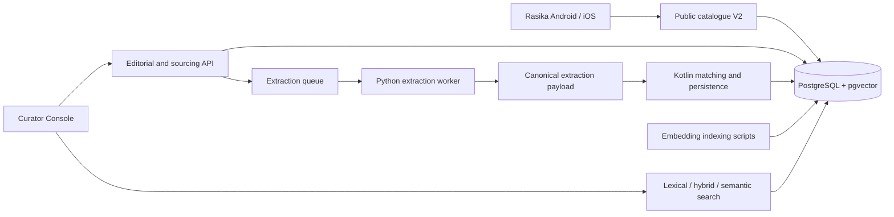

| Metadata | Value |
|:---|:---|
| **Status** | Active |
| **Version** | 2.1.0 |
| **Last Updated** | 2026-09-10 |
| **Author** | Sangeetha Grantha Team |

# Sangeetha Grantha

*A living catalogue of Carnatic compositions, with the sources behind the music.*

---

Sangeetha Grantha brings composition metadata, multilingual lyrics, musical structure, and source evidence into one editorially managed catalogue. It helps listeners find a composition, students read a particular rendition of its text, and curators establish what the catalogue can responsibly publish.

The project has two working applications: **Rasika**, a shared Kotlin app for Android and iOS, and the **Curator Console**, a React application for catalogue editing and ingestion. They share a Kotlin API and PostgreSQL database.

[Set up locally](./application_documentation/00-onboarding/getting-started.md) · [Browse the documentation](./application_documentation/README.md) · [See feature status](./application_documentation/01-requirements/features/README.md)

## Discover and read with Rasika

- **Home** puts search first, followed by available discovery content or a selection from the collection.
- **Explore** searches compositions, ragas, and composers. Apply exact raga and composer filters, browse further pages, and open entity pages to discover related works.
- **The reader** presents a stored lyric variant with its script, source reference, and section labels. Switching variants preserves the previous text until the replacement loads. Ordered raga associations preserve Ragamalika structure.
- **Library** stores bookmarks on the device. **Settings** offers System, Light, and Dark appearance.
- Large-text layouts and reduced-motion behavior are implemented. Native journey tests exist; device execution and TalkBack/VoiceOver proof remain release gates.

Rasika currently reads `/v2/catalogue`. It includes published compositions whose musical form is not yet established, without displaying a guessed form badge. Broader metadata directories, collections, recents, and later editorial Home features remain planned. See the [Rasika experience](./application_documentation/05-frontend/mobile/rasika-discovery-experience.md) and [release evidence](./application_documentation/10-implementations/track-140-rasika-discovery.md).

## Build and curate the catalogue

The Curator Console supports composition editing, section and lyric variants, notation, reference data, import review, and an audit history. Its sourcing workspace brings source registration, extraction monitoring, evidence, structural verification, and quality summaries together.

Search offers three modes: lexical matching for familiar titles and phrases, semantic retrieval for meaning, and hybrid retrieval combining both. Semantic and hybrid search use a separately populated embedding index; a fresh database does not contain indexed compositions.

The ingestion pipeline accepts source manifests and extraction requests, processes supported HTML/PDF sources in Python, and passes canonical extraction payloads to Kotlin for matching and persistence. Ambiguous raga identities go to curator resolution. Accepted changes can retain section-level provenance through the versioned canon.

Start with the [curator guide](./application_documentation/05-frontend/admin-web/ui-specs.md), [ingestion guide](./application_documentation/01-requirements/features/bulk-import/02-implementation/technical-implementation-guide.md), or [search guide](./application_documentation/03-api/search.md).

## How the parts fit together



Public catalogue DTOs expose a deliberate subset of editorial data. The catalogue V1 contract excludes `UNESTABLISHED`; V2 supports it. Successful catalogue reads use `Cache-Control: no-store`. Admin mutations require authorization and audit logging. Flyway owns schema evolution; source corrections belong in extraction, reingestion, and curation workflows.

| Area | Location | Responsibility |
|:---|:---|:---|
| Shared domain | [modules/shared/domain](./modules/shared/domain) | Serializable API contracts and domain types |
| Rasika | [presentation](./modules/shared/presentation), [mobile-data](./modules/shared/mobile-data), [native hosts](./modules/mobile) | Shared UI, V2 client, local storage, Android/iOS integration |
| Backend | [modules/backend](./modules/backend) | Ktor services, Exposed repositories, test infrastructure |
| Curator Console | [sangita-admin-web](./modules/frontend/sangita-admin-web) | React, TypeScript, Vite, Tailwind, TanStack Query |
| Database | [database/migrations](./database/migrations) | Versioned schema and repeatable reference seeds |
| Extraction | [worker](./tools/krithi-extract-enrich-worker/README.md) | Parsing, enrichment, extraction queue, embedding tools |
| Delivery | [Makefile](./Makefile), [Compose](./compose.yaml), [CI](./.github/workflows/ci.yml) | Local services, builds, and verification |

Pinned and resolved dependencies are listed in [Current Versions](./application_documentation/00-meta/current-versions.md).

## Run locally

Install mise and Docker, then follow the [setup guide](./application_documentation/00-onboarding/getting-started.md) to prepare the local environment files before starting:

```bash
mise trust
mise install
make dev
```

`make dev` builds and runs the database, Flyway migration service, backend, admin web, and extraction worker in the foreground. Open the [Curator Console](http://localhost:5001); the API is at [localhost:8080](http://localhost:8080). Rasika hosts are built separately.

A new database contains schema and reference data. Import or load development sample compositions before expecting catalogue results. Admin provisioning and console token login are separate steps; see [authentication](./application_documentation/00-meta/quick-reference-auth.md).

| Task | Command |
|:---|:---|
| Stop the development stack | `make dev-down` |
| Start only PostgreSQL | `make db` |
| Apply pending schema and reference migrations | `make migrate` |
| Inspect migration history | `make migrate-status` |
| Add optional development sample content | `make seed-dev` |
| Provision the admin account | `make bootstrap-admin` |
| Backend tests, including database-backed tests | `make test` |
| Backend integration tests | `make test-integration` |
| Admin web unit tests | `make test-frontend` |
| Shared mobile JVM tests | `make test-mobile` |
| Android debug build / iOS simulator build | `make mobile-android` / `make mobile-ios` |
| Check documentation links | `make check-docs` |

`make db-reset` deletes and recreates the local database. `make clean` removes Compose volumes. Neither is required for routine startup or documentation work.

## Project status and next steps

Implemented capabilities include the public catalogue, Rasika browsing and reading, the curator and sourcing workflows, hybrid/semantic search, raga aliases and controlled resolution, versioned canon, and Flyway/Testcontainers infrastructure. “Implemented” describes repository behavior; it does not certify production deployment or native-device acceptance.

Open work includes Rasika's native release gate and later discovery releases, payload convergence, the remaining corpus-reingestion closure, interactive OAuth/OTP authentication, and production rollout. The [feature map](./application_documentation/01-requirements/features/README.md) explains the boundaries; [Conductor](./conductor/tracks.md) records execution status.

## Find your next document

| You want to… | Start here |
|:---|:---|
| Understand the product and musicological rules | [Product requirements](./application_documentation/01-requirements/product-requirements-document.md), [domain model](./application_documentation/01-requirements/domain-model.md) |
| Integrate a client | [API contract](./application_documentation/03-api/api-contract.md), [request examples](./application_documentation/03-api/api-examples.md) |
| Understand storage and provenance | [Schema](./application_documentation/04-database/schema.md), [versioned canon](./application_documentation/04-database/versioned-canon.md) |
| Make a change | [Onboarding](./application_documentation/00-onboarding/README.md), [architecture](./application_documentation/02-architecture/README.md), [testing](./application_documentation/07-quality/README.md) |
| Operate or diagnose the stack | [Operations](./application_documentation/08-operations/README.md) |
| Work with an AI coding assistant | [Repository rules](./CLAUDE.md), [agent workflow guide](./application_documentation/08-operations/agent-workflows.md) |

## Sources and stewardship

The catalogue draws on Carnatic scholarship and sources including karnatik.com, shivkumar.org, and composer-focused archives. Source attribution, distinct textual variants, and careful editorial review are central to preserving that knowledge.

For document construction, indexing commands, profile activation, and coverage checks, read [Embedding pipeline and index operations](./application_documentation/09-ai/embeddings.md).
