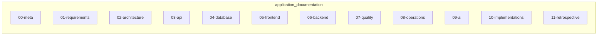

| Metadata | Value |
|:---|:---|
| **Status** | Active |
| **Version** | 1.2.0 |
| **Last Updated** | 2026-09-10 |
| **Author** | Sangeetha Grantha Team |
| **Document Type** | Current guide |

# Documentation Standards

---


## General Principles

Documentation in Sangita Grantha follows a **spec-driven approach** where documentation is the source of truth for implementation. All documentation should:

- Be accurate and reflect current implementation
- Be organized in a logical, discoverable structure
- Include status, version, and last updated metadata
- Reference related documents for cross-linking
- Use clear, concise language appropriate for the audience

## File Structure Standards

### Front Matter

All documentation files should include front matter with:

- **Status**: `Current`, `Draft`, `Deprecated`, or `Archived`
- **Version**: Semantic version (e.g., `1.0`, `0.2`)
- **Last Updated**: ISO date format (YYYY-MM-DD)
- **Owners**: Team or role responsible for maintaining the document

```text
Example:
```

### Directory Organization

Documentation is organized in `application_documentation/` with the following structure:



## Content Standards

### Writing Style

- Use clear, professional language
- Prefer active voice
- Use consistent terminology (see glossary)
- Include code examples where helpful
- Link to related documents for context

### Code Examples

- Code examples should be executable or reflect actual implementation
- Include file paths and line numbers when referencing existing code
- Use appropriate syntax highlighting
- Keep examples focused and minimal

### Tables and Lists

- Use tables for structured data comparisons
- Use lists for sequential steps or unordered items
- Keep tables readable (avoid overly wide columns)

## Technical Documentation Standards

### API Documentation

- Document all endpoints with:
  - HTTP method and path
  - Request/response schemas
  - Authentication requirements
  - Example requests/responses
- Reference OpenAPI spec in `openapi/` directory
- Include error response formats

### Database Documentation

- Document schema changes in migration files
- Include ERDs for complex relationships
- Document constraints, indexes, and triggers
- Reference migration tool (Flyway — see [ADR-013](../02-architecture/decisions/ADR-013-db-migration-with-flyway.md))

### Architecture Documentation

- Include system diagrams where helpful
- Document design decisions in ADRs
- Reference tech stack versions from `gradle/libs.versions.toml`
- Document patterns and conventions

## Review Process

### Documentation Review Checklist

Before marking documentation as "Current":

- [ ] Status and version metadata present
- [ ] Content matches current implementation
- [ ] Links to related documents are valid
- [ ] Code examples are accurate
- [ ] Terminology matches glossary
- [ ] No TODO placeholders remain

### Review Responsibilities

- **Authors**: Ensure accuracy and completeness
- **Team Leads**: Review for technical correctness
- **Platform Team**: Review for standards compliance

## Maintenance Guidelines

### Regular Updates

- Update documentation when implementation changes
- Review quarterly for accuracy
- Archive obsolete documents to `archive/` directory
- Update "Last Updated" date when making changes

### Change Management

- Major changes should increment version number
- Breaking changes should update status to "Draft" until reviewed
- Deprecated features should be marked as "Deprecated"
- Use git commits to track documentation history

## Tools and Automation

### Recommended Tools

- **Markdown**: Standard format for all documentation
- **Mermaid**: For diagrams (when supported)
- **OpenAPI**: For API specifications
- **Git**: Version control and history

### Automation Goals

- Validate markdown syntax (future)
- Check for broken links (future)
- Generate API docs from OpenAPI spec (future)

## Quality Metrics

### Success Criteria

- All active features have corresponding documentation
- Documentation is discoverable and well-organized
- Code examples are tested and accurate
- Cross-references are maintained

### Monitoring

- Track documentation coverage (features vs. docs)
- Monitor broken links
- Review update frequency
- Gather feedback from team

## References

- [Sangita Grantha Documentation Index](../README.md)
- [Product Requirements Document](../01-requirements/product-requirements-document.md)
- [Tech Stack](../02-architecture/tech-stack.md)
- [Backend Architecture](../02-architecture/backend-system-design.md)
## Current guides, plans, and evidence

- Lead with the reader's task and describe current behavior before internal implementation detail.
- Put implemented/planned/placeholder boundaries beside the feature they qualify. A schema or DTO is not proof of a mounted route.
- Keep the main, admin, and mobile PRDs aligned with [the feature map](../01-requirements/features/README.md). Migrations are Flyway; reference [Current Versions](./current-versions.md) instead of copying pins.
- Maintain one top-level title, descriptive section headings, language-tagged balanced code fences, and relative source links.
- Preserve dated reports, ADR rationale, and research as evidence. The last editorial-update date is not a new test or live-data verification date.
- Use [the document catalog](./document-catalog.md) to find every retained page. Add current guides to the relevant section index.
- Run `make check-docs`; separately check bare relative links, changed heading anchors, and code/diagram formatting because the existing gate does not cover them.

Every numbered area is indexed from [the documentation home](../README.md), including onboarding, metadata, implementations, and retrospectives. Historical evidence may remain at its stable cited path with explicit reading context; obsolete operating instructions should be replaced by links to the current guide or moved under the archive with redirects where needed.

---

[Section index](./README.md) · [Documentation home](./../README.md) · [Feature status](./../01-requirements/features/README.md)
