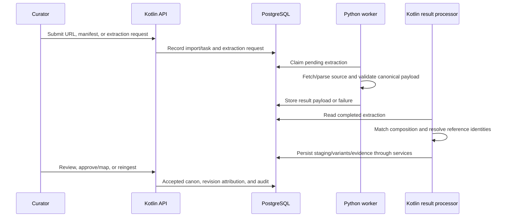

| Metadata | Value |
|:---|:---|
| **Status** | Active |
| **Version** | 1.2.0 |
| **Last Updated** | 2026-09-10 |
| **Author** | Sangeetha Grantha Team |
| **Document Type** | Current guide |

# Ingestion architecture and operating guide

---

The ingestion pipeline turns supported source documents into reviewable canonical composition data. Kotlin owns orchestration, reference resolution, editorial acceptance, and canonical persistence. Python owns extraction and optional enrichment. They communicate through the PostgreSQL extraction queue.

## End-to-end flow

There are several entry points and acceptance paths. Do not infer a universal lifecycle from a single worker status: extraction, import review, canonical persistence, and publication are separate states.

## Ownership and source map

| Area | Responsibility | Source |
|:---|:---|:---|
| Manifest/batch orchestration | Upload, batch/job/task/event state and controls | [BulkImportRoutes](../../../../../modules/backend/api/src/main/kotlin/com/sangita/grantha/backend/api/routes/BulkImportRoutes.kt), [bulkimport services](../../../../../modules/backend/api/src/main/kotlin/com/sangita/grantha/backend/api/services/bulkimport) |
| Individual imports | Source requests, review, mapping, reingestion | [ImportService](../../../../../modules/backend/api/src/main/kotlin/com/sangita/grantha/backend/api/services/ImportService.kt) |
| Extraction worker | Queue claim, HTML/PDF strategies, canonical output | [worker README](../../../../../tools/krithi-extract-enrich-worker/README.md) |
| Canonical contract | Python validation and Kotlin serialization | [schema.py](../../../../../tools/krithi-extract-enrich-worker/src/schema.py), [CanonicalExtractionDto](../../../../../modules/shared/domain/src/commonMain/kotlin/com/sangita/grantha/shared/domain/model/import/CanonicalExtractionDto.kt) |
| Canonical creation | Composition identity, metadata and creation | [KrithiCreationFromExtractionService](../../../../../modules/backend/api/src/main/kotlin/com/sangita/grantha/backend/api/services/KrithiCreationFromExtractionService.kt) |
| Lyric variants | Variant/section persistence and provenance | [LyricVariantPersistenceService](../../../../../modules/backend/api/src/main/kotlin/com/sangita/grantha/backend/api/services/LyricVariantPersistenceService.kt) |
| Reference resolution | Composer/raga/tala/deity/temple candidates | [EntityResolutionService](../../../../../modules/backend/api/src/main/kotlin/com/sangita/grantha/backend/api/services/EntityResolutionService.kt) |

## Submit and monitor

Use Imports for a single source request, Bulk Import for a CSV manifest, or Sources and Processing for extraction operations. Batch controls include pause, resume, cancel, retry, approve/reject, finalize, and report export where supported.

The worker registers HTML and PDF extraction strategies. PDF processing includes text extraction, page segmentation, structural parsing, and OCR fallback. HTML processing is source-aware. Source formats listed in schemas or older plans may extend beyond implemented strategies.

For a local PDF, the path must be readable by the worker process. Compose mounts repository `data/pdfs` at `/app/pdfs`; a host-only absolute path cannot be assumed to work inside the container.

## Canonical payload and musical fidelity

Canonical extraction carries composition metadata, ordered ragas, sections, language/script variants, and source context. Python and Kotlin must agree on field names, enums, nullability, and nesting. New producers use canonical payloads; older `ScrapedKrithiMetadata` compatibility remains in the backend until TRACK-096 convergence is complete.

Parser behavior includes source-specific Indic-script handling, diacritic normalization, section-label cleanup, per-script variations, and repairs for repeated Pallavi/compound labels. Preserve source distinctions while normalizing presentation noise. Never discard a section or invent an Anupallavi simply to force a common template.

Unclassified output uses `UNESTABLISHED`. Ragamalika must retain ordered membership in `krithi_ragas`; primary-raga fields alone are insufficient. See the [domain model](../../../domain-model.md).

## Resolve and review

Composition matching must distinguish candidates before creating or enriching canon. Raga identity requires mela-qualified match keys and aliases; unknown/ambiguous names go to the curator queue. [Raga identity](../../../../04-database/raga-identity.md) explains attach-alias, confirm-new, and disambiguation.

Inspect source evidence, extracted text, candidate identity, section count/order, and language/script before accepting a result. Structural votes aggregate source assertions; they do not replace review of dissenting evidence. Similarity, extraction confidence, and source authority are different signals.

Acceptance can write current-state projection, versioned section snapshots, source evidence, and audit events through the appropriate service path. See [versioned canon](../../../../04-database/versioned-canon.md). Verify actual workflow state before assuming public publication.

## Retry and reingest

A row claim using `FOR UPDATE SKIP LOCKED` prevents workers from claiming the same pending row concurrently. It is not a guarantee of exactly-once end-to-end delivery. Retries, worker restarts, duplicate URLs, and result processing still need idempotent handling and verification.

For a parser correction:

1. Reproduce against a retained source/fixture and fix the shared extraction path.
2. Re-extract only the affected source/composition scope.
3. Inspect the new canonical payload before accepting/reingesting it.
4. Use `POST /v1/admin/imports/{id}/reingest` or the appropriate review path.
5. Verify current variants/sections, raga junctions, revision attribution, and API reader output.

Do not implement composition corrections as new Flyway data-fix migrations. Earlier corpus migrations were retired under TRACK-139; current migration numbers may have been reused for legitimate schema work.

## Diagnose by stage

| Symptom | Evidence to inspect |
|:---|:---|
| Pending request never starts | Worker process/logs, database connectivity, queue status |
| Failed extraction | Source accessibility, container file path, source format, parser/OCR/provider error |
| DONE extraction but no usable composition | Result processor logs, canonical decoding, import state, candidate matching |
| Missing or merged variant | Language/script/source identity, variant match decision, persistence joins |
| Missing Ragamalika sequence | Canonical raga order and `krithi_ragas`, not just `primary_raga_id` |
| Unexpected public result | Publication state, V1/V2 form visibility, reader DTO and selected variant |
| Search misses after reingest | Embedding documents/hashes/profile coverage; indexing is separate |

[Monitoring](../../../../08-operations/monitoring.md) and [configuration](../../../../08-operations/config.md) cover operational inspection. [Post-import verification](../../../../07-quality/qa/test-plan.md) gives the final checks.

## Validate changes

Run the matching worker/parser tests, backend import/service tests, and affected browser journeys. Use real PostgreSQL/Flyway Testcontainers for database behavior; external source/provider calls should be controlled in deterministic tests. Keep live corpus counts and provider evaluations as dated evidence, separate from code test results.

Use the [bulk-import overview](../README.md) for related strategy/history documents. [ADR-012](../../../../02-architecture/decisions/ADR-012-unified-extraction-architecture.md) records the ownership decision.

---

[Documentation home](./../../../../README.md) · [Feature status](./../../README.md)
