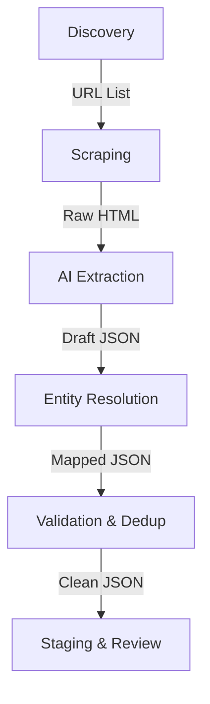

| Metadata | Value |
|:---|:---|
| **Status** | Active |
| **Version** | 1.0.0 |
| **Last Updated** | 2026-01-24 |
| **Author** | Sangeetha Grantha Team |

# Krithi Bulk Import Capability & Koog Integration Analysis

| Metadata | Value |
|:---|:---|
| **Status** | Draft |
| **Version** | 0.1.0 |
| **Last Updated** | 2026-01-20 |
| **Author** | System |

---

| Metadata | Value |
|:---|:---|
| **Status** | Analysis & Recommendation |
| **Version** | 1.0.0 |
| **Date** | 2026-01-19 |
| **Author** | Gemini AI |
| **Context** | Import Pipeline Strategy & Koog Evaluation |

---

## 1. Executive Summary

This document presents a comprehensive analysis for implementing a **Krithi Bulk Import Capability** for *Sangeetha Grantha*. The goal is to ingest Carnatic music compositions from distributed web sources (Karnatik.com, specific Blogspot archives) and enrich them with authoritative data from TempleNet.com.

Additionally, this analysis evaluates **Koog** (JetBrains' AI Agent Framework) as an orchestration engine for this pipeline.

**Gemini Recommendation:**
Adopt a **Hybrid Phased Approach**.
1.  **Phase 1 (Foundation):** Build a custom, lightweight ingestion pipeline using Kotlin Coroutines and the existing `GeminiApiClient` for extraction. This delivers immediate value with minimal infrastructure overhead.
2.  **Phase 2 (Enrichment):** Integrate TempleNet.com scraping to build a Reference Data Layer (Temples/Deities) to enrich Krithis.
3.  **Phase 3 (Orchestration Evolution):** Evaluate Koog specifically for the *complex* "Extraction & Resolution" agents once the basic pipeline reaches maturity or complexity limits.

---

## 2. Data Source Analysis

We have identified 5 primary sources with distinct characteristics. The strategy must accommodate structured, semi-structured, and unstructured data.

| Source | Type | Content Focus | Extraction Difficulty | Strategic Value |
| :--- | :--- | :--- | :--- | :--- |
| **[Karnatik.com](https://karnatik.com/lyrics.shtml)** | Structured HTML | Lyrics, Raga, Tala, Composer | 🟢 Low | **Primary**. High volume, consistent structure. The "Gold Standard" for initial seeding. |
| **[Guru Guha Blog](https://guru-guha.blogspot.com/)** | Unstructured Blog | Dikshitar Krithis (Index & Meaning) | 🔴 High | **Enrichment**. List is plain text (no links). Requires "Search & Scrape" strategy. |
| **[Syama Krishna Vaibhavam](https://syamakrishnavaibhavam.blogspot.com/)** | List/Blog | Syama Sastri Krithis | 🟡 Medium | **Discovery**. Good for gap analysis of missing Syama Sastri krithis. |

### Source-Specific Strategies

#### 1. Karnatik.com (The Anchor)
*   **Strategy:** Iterative crawling.
*   **Pipeline:**
    1.  Crawl the index page to build a URL list.
    2.  Scrape individual pages.
    3.  **Extraction:** HTML is predictable. Use CSS selectors (Jsoup) for 90% of data. Use LLM only for "fuzzy" cleanup or meaning extraction.
*   **Volume:** ~High.

#### 2. Guru Guha Blog (The Hidden Gem)
*   **Challenge:** The [Alphabetical List](https://guru-guha.blogspot.com/2009/04/dikshitar-kritis-alphabetical-list.html) is a **plain text list** with no hyperlinks. It provides `Krithi Name - Raga` tuples but no direct path to content.
*   **Strategy:** Two-Stage "Search & Scrape".
*   **Pipeline:**
    1.  **Index:** Parse the alphabetical list to build a "Target Manifest" of Dikshitar Krithis.
    2.  **Discovery:** For each item, perform a site-specific search (e.g., via Google Custom Search API: `site:guru-guha.blogspot.com "Krithi Name"`) to find the actual blog post URL.
    3.  **Extraction:** Scrape the resulting post. Use **Gemini** to separate the rich commentary/meaning from the lyrics, as the post structure is highly variable.

#### 3. Other Blogs (Syama Krishna / Thyagaraja)
*   **Strategy:** Discovery & AI Extraction.
*   **Pipeline:**
    1.  Parse alphabetical lists (these typically have links).
    2.  **Extraction:** HTML is messy. Rely heavily on **Gemini 1.5 Pro / 2.0 Flash** to parse the DOM text into structured JSON.

---

## 3. The Import Pipeline Architecture

To handle data cleansing, de-duplication, and moderation, the pipeline is divided into **6 Distinct Stages**.

### Stage Details

1.  **Discovery:** Generate a queue of URLs to process.
2.  **Scraping:** Fetch raw HTML. Handle rate limits and retries. Store Raw HTML (Data Lake pattern) to allow re-processing without re-scraping.
3.  **AI Extraction (The Brain):**
    *   Input: Raw HTML + Source Config.
    *   Process: Send to LLM (Gemini). Prompt: "Extract Krithi, Raga, Tala, Composer, Language, and Sections (Pallavi, etc.) from this HTML."
    *   Output: Standardized `KrithiImportDto`.
4.  **Entity Resolution (The Connector):**
    *   **Composer:** Fuzzy match "Tyagaraja" -> `composer_id: uuid`.
    *   **Raga:** Fuzzy match "Sankarabharanam" -> `raga_id: uuid`.
    *   **Temple/Deity:** Search `lyrics` and `metadata` against the **TempleNet** reference data.
5.  **Validation & De-duplication:**
    *   **Duplicate Check:** Check `(title_normalized, raga_id, composer_id)` tuple.
    *   **Logic:** If exact match, mark as `DUPLICATE`. If fuzzy match, mark for `MANUAL_MERGE`.
6.  **Staging & Review:**
    *   Insert into `imported_krithis` table.
    *   Status: `PENDING_REVIEW`.
    *   **UI:** Admin interface to approve/reject/edit imports side-by-side with raw data.

---

## 4. Koog Evaluation

**[Koog](https://docs.koog.ai/)** is a Kotlin-first AI Agent framework.

### Analysis for Import Pipeline

| Feature | Relevance to Project | Verdict |
| :--- | :--- | :--- |
| **Graph Workflows** | **High.** The pipeline (Scrape -> Extract -> Resolve) is a DAG. | ✅ **Strong Fit.** Koog makes this explicit and visualizable. |
| **Tool Calling** | **Medium.** "Lookup Raga", "Save Krithi" can be tools. | ⚠️ **Overkill?** Direct service calls are simpler for batch jobs. |
| **Ktor Integration** | **High.** Sangeetha Grantha uses Ktor. | ✅ **Native Fit.** |
| **Reliability (Retries)** | **High.** Web scraping is flaky. | ✅ **Useful.** But easy to implement with standard libraries too. |
| **Complexity** | **Negative.** Adds a new framework abstraction. | ❌ **Risk.** Learning curve for a task solvable with simple code. |

### The "Over-Engineering" Risk
For a batch import job, a linear script or a simple coroutine pipeline is often sufficient. Koog shines when the agent needs "autonomy" (e.g., "I found a broken link, I will try searching Google instead").
*   **Current Need:** Mostly deterministic pipeline (Scrape -> Parse -> Save).
*   **Koog's Strength:** Non-deterministic, adaptive workflows.

---

## 5. Options & Recommendation

### Option A: Custom Coroutine Pipeline (Recommended Start)
Build a `ImportPipelineService` in Kotlin.
*   **Mechanism:** Use `kotlinx.coroutines` channels or flows.
*   **Extraction:** Direct calls to `GeminiApiClient`.
*   **Pros:** Simple, fully controlled, easy to debug, zero new dependencies.
*   **Cons:** Must implement own retry/error reporting logic.

### Option B: Koog Orchestration
Implement the pipeline as a Koog Agent Graph.
*   **Mechanism:** Define `ScrapeAgent`, `ExtractionAgent`, `ResolutionAgent`.
*   **Pros:** structured workflow, built-in observability, easier to extend with "smart" behaviors later.
*   **Cons:** Learning curve, beta framework status.

### Option C: External ETL (Airflow/Python)
Use Python scripts for scraping (BeautifulSoup) and Airflow for scheduling.
*   **Pros:** Rich scraping ecosystem (Python).
*   **Cons:** fragmented stack (Kotlin backend + Python ETL). **Strongly discouraged** to keep the monorepo unified.

### Final Recommendation: Hybrid (Option A+)

1.  **Stick to Kotlin:** Keep the logic within the `backend` module. Do not split the stack.
2.  **Start with Custom Pipeline (Option A):**
    *   Write a `WebScrapingService` using **Jsoup** (for structured) and **Gemini** (for unstructured).
    *   Write an `ImportOrchestrator` using Kotlin Flows.
    *   Store results in Postgres `imported_krithis`.
3.  **Adopt Koog Later (Targeted):**
    *   Use Koog specifically for the **"Intelligent Resolution"** step if simple fuzzy matching fails.
    *   Example: An agent that "reasons" about which Temple is meant by "The abode of Kapali" (Mylapore) using the TempleNet data.

## 6. Action Plan

1.  **Migration:** Create database tables for `import_batches` and `imported_krithis` (See `04__import-pipeline.sql`).
2.  **Scraper:** Implement `KarnatikSourceHandler` using Jsoup.
3.  **Reference Data:** Write a script to scrape TempleNet and populate `temples` table.
4.  **Pipeline:** Build the `ImportService` to orchestrate: Scrape -> Extract (Gemini) -> Resolve -> Save.
5.  **UI:** Build the "Import Review" screen in the Admin Web.
