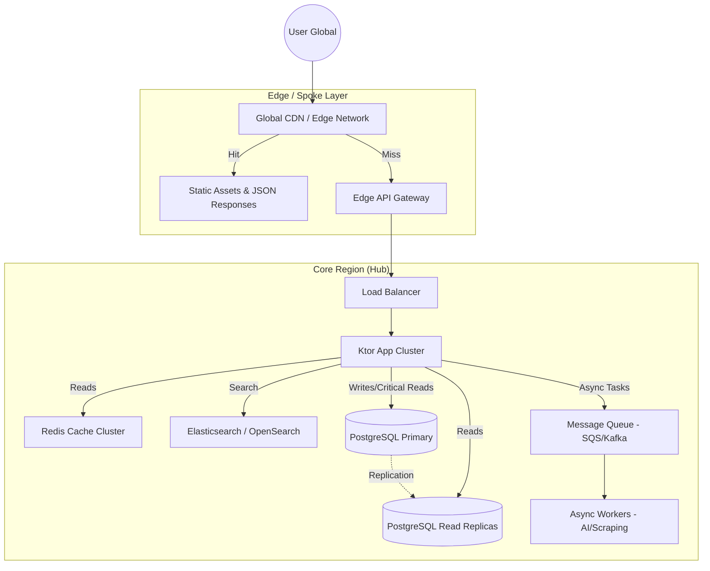

# Global Scale Architecture Proposal: Sangeetha Grantha

> **Status**: Proposal | **Version**: 1.0 | **Date**: 2026-01-14
> **Target Scale**: 5M+ Monthly Active Users (MAU), Distributed Globally

## 1. Executive Summary

Sangeetha Grantha's current architecture (Monolithic Ktor + Single PostgreSQL) is robust for its current boutique scale but will face severe bottlenecks under global load ("The Million User Problem").

To support **millions of users** distributed worldwide, the system must transition from a **Vertical Scaling** model to a **Horizontal, Edge-First** strategy. This proposal outlines the architectural evolution required to guarantee <100ms latency for 95% of requests globally while maintaining strong consistency for the editorial "System of Record".

### Key Recommendations at a Glance
1. **Edge-First Delivery**: Offload 90% of read traffic to CDNs and Edge Caches.
2. **Read-Write Splitting**: Decouple high-volume public reads from transactional admin writes.
3. **Dedicated Search Service**: Move search workloads from PostgreSQL to Elasticsearch/OpenSearch.
4. **Asynchronous AI Pipeline**: Decouple heavy AI/Scraping tasks using durable message queues.

---

## 2. High-Level Global Architecture

The proposed architecture adopts a **Hub-and-Spoke** model. The "Hub" (Primary Region) handles writes, consistency, and admin operations. The "Spokes" (Edge/Regions) handle public read traffic close to the user.

---

## 3. Detailed Architectural Pillars

### 3.1 Global Traffic & Caching (The 10M User Shield)
For a content-heavy application like Sangeetha Grantha, **reads outnumber writes by 1000:1**. We must aggressively cache at the edge.

*   **CDN (Content Delivery Network)**:
    *   **Static Assets**: React bundle, images, fonts served via Cloudflare/CloudFront.
    *   **API Caching**: Public endpoints (e.g., `/v1/krithis/{id}`) should send `Cache-Control: public, max-age=3600, s-maxage=3600`. The CDN serves these directly, shielding the backend.
*   **Application Caching (Redis)**:
    *   Implement **Redis** (ElastiCache) as a "Look-aside" cache for DB queries.
    *   **Keys**: `krithi:{id}`, `ref:ragas`, `search:{hash}`.
    *   **Invalidation**: Event-driven. When an editor publishes a Krithi, the backend emits an event to clear specific Redis keys and purge CDN URLs.

### 3.2 Database Strategy (Scaling the "Source of Truth")
A single PostgreSQL instance is a single point of failure and a vertically limited bottleneck.

*   **Read Replicas**:
    *   Effectively infinite read scaling. Deploy 3+ Read Replicas.
    *   **Routing**: Use `PgBouncer` or application-level routing to send all `GET` requests (excluding Admin) to replicas.
*   **Connection Pooling**:
    *   Replace direct HikariCP connections with **PgBouncer** (transaction pooling mode) to support thousands of concurrent server threads sharing a small pool of DB connections.
*   **Future Sharding**:
    *   If `krithis` table exceeds 100M rows, shard by `composer_id` or `musical_form`. (Likely not needed for <10M users if caching is effective).

### 3.3 Search & Discovery Engine
PostgreSQL `ILIKE` or even `tsvector` trigram searches are computationally expensive and degrade O(N) with data size.

*   **Dedicated Search Cluster**:
    *   Adopt **Elasticsearch** or **OpenSearch**.
    *   **Sync**: Use a "Change Data Capture" (CDC) pattern (e.g., Debezium) or application-level "Dual Write" to sync published Krithis to the search index.
    *   **Capabilities**: Enables fuzzy matching for lyrics, synonym handling (Sanskrit/Tamil variations), and complex multifaceted filtering (Raga + Tala + Composer) with sub-50ms latency.

### 3.4 Compute & Autoscale
The application servers (Ktor) must be stateless and horizontally scalable.

*   **Containerization**:
    *   Deploy Ktor application as Docker containers on **Kubernetes (EKS/GKE)** or **Cloud Run**.
    *   **HPA (Horizontal Pod Autoscaling)**: Scale pods based on CPU/Memory utilization.
*   **Statelessness**:
    *   Ensure NO session state is stored in memory. JWTs handle Auth state.
    *   Ensure NO file system dependency. Uploads go directly to Object Storage (S3/GCS).

### 3.5 Asynchronous Processing (AI & Bulk Ops)
AI tasks (Transliteration, Scraping) are slow and resource-intensive. They must not block API threads.

*   **Queue-Based Architecture**:
    *   **Frontend**: User requests scrape -> Backend returns `job_id` (202 Accepted).
    *   **Queue**: Backend pushes task to **SQS/RabbitMQ/PubSub**.
    *   **Workers**: Separate Worker Nodes (possibly simplified Ktor apps) pull tasks, call Gemini API, and update key DB.
    *   **Notification**: Client polls `job_id` or uses WebSockets/SSE for updates.

---

## 4. Operational Excellence for Scale

### 4.1 Observability
You cannot scale what you cannot see.
*   **Distributed Tracing**: OpenTelemetry (Jaeger/Honeycomb) to trace a request from CDN -> LB -> Ktor -> DB.
*   **Metrics**: Prometheus + Grafana. Key metrics: `cache_hit_ratio`, `db_pool_utilization`, `p99_latency`, `error_rate`.

### 4.2 Security at Scale
*   **Rate Limiting**: Implement token-bucket rate limiting at the **Edge** (WAF) or Gateway (Kong/Nginx) level to prevent DDoS.
*   **WAF**: Protect against SQLi/XSS.
*   **Secret Management**: Rotate keys automatically (AWS Secrets Manager / Hashicorp Vault).

---

## 5. Transition Roadmap

1.  **Immediate (The Low Hanging Fruit)**:
    *   Enable **CDN caching** for all public `GET` endpoints.
    *   Introduce **Redis** for reference data caching.
    *   Implement **PgBouncer** for connection stability.
2.  **Near-Term (Architecture Split)**:
    *   Spin up **Read Replicas** and configure Ktor to route reads there.
    *   Migrate Search to **Elasticsearch**.
3.  **Long-Term (Global Scale)**:
    *   Move to **Kubernetes/Cloud Run** for auto-scaling.
    *   Implement **Async Workers** for AI tasks.

## 6. Conclusion
Sangeetha Grantha is effectively a "Read-Heavy Knowledge Base". By acknowledging this and moving aggressively to an **Edge-Cached, Read-Replica backed architecture**, the system can scale to millions of users with relatively modest infrastructure costs. The complexity lies not in data volume, but in maintaining low-latency access globally.
