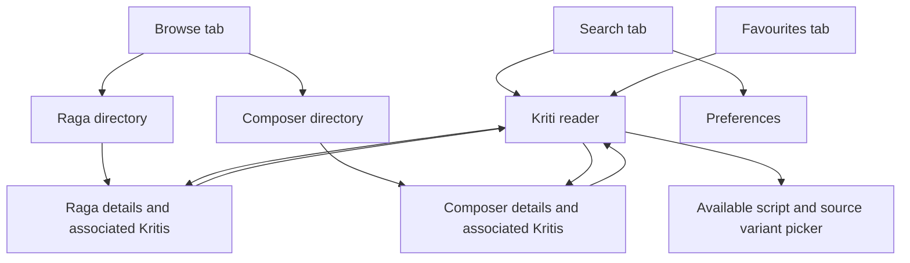

| Metadata | Value |
|:---|:---|
| **Status** | Intent and Spec accepted — concrete Plan awaiting acceptance |
| **Version** | 1.3.0 |
| **Last Updated** | 2026-09-05 |
| **Author** | Codex, for Seshadri |
| **Track** | [TRACK-138](../../../conductor/tracks/TRACK-138-rasika-mobile-app.md) |

# Rasika Mobile App — Minimal Working Release

---

## 1. Recommendation and confirmed choices

Build an Android and iPhone application using Kotlin Multiplatform and Compose Multiplatform, sharing the screens, state and catalogue client. Validate Android first, then run the same core journeys on iOS before calling the multiplatform release complete.

The application should open directly into useful catalogue search. Three primary tabs are enough: **Search**, **Browse**, and **Favourites**. Browse provides searchable Raga and Composer directories. Each directory entry opens its details and a list of associated Kritis. Selecting a Kriti opens a readable, sectioned lyric view with metadata and available script/variant choices.

The user confirmed on September 5:

| Choice | Confirmed direction |
|:---|:---|
| Platforms | Android and iPhone; Android validated first |
| Connectivity | Online search with locally saved favourites |
| Language | English interface; lyrics in all available stored scripts |
| Data delivery and engagement | Keep catalogue/lyrics on the server; fetch through the API and measure real visits and usage |

Recommended remaining defaults: no login, existing Sangita Grantha backend, local development connection first, and no app-store submission in the initial engineering milestone. Favourites are device-local bookmark IDs and small display labels. The user explicitly ruled out downloading the dataset to each mobile app. Search, browse and Kriti reading fetch from the server, including when opening a favourite.

This release can proceed independently of [Track 108](../../../conductor/tracks/TRACK-108-semantic-search.md). Search by names, raga and composer does not require embeddings or model calls. Semantic discovery can later be added behind the catalogue interface if useful.

Seshadri explicitly accepted Track 138's Intent and the “Decisions and remaining questions” recommendations on September 5. The product choices are settled. The track's Spec was subsequently accepted explicitly on September 5. The concrete implementation Plan is now Draft and awaits acceptance; this analysis does not substitute for Plan acceptance.

## 2. Existing foundations and missing pieces

Repository code, Gradle configuration, mobile documentation and public routes were inspected. No mobile application was compiled or launched during this analysis. No database publication/coverage counts were queried. Runtime data availability remains a first-slice check.

| Area | Verified current state | Implication |
|:---|:---|:---|
| Shared domain | Serializable composition, raga, composer, lyric, section and notation DTOs exist | Reuse the domain contract; add small public reader DTOs where needed |
| Shared UI | `modules/shared/presentation` has a Gradle file but no source directory | Screens, theme, state holders and app composition root must be implemented |
| Android | Shared Android library targets exist; no dedicated application module or manifest found | Add an Android host and launcher; a library build is not an installable app |
| iOS | ARM64 device and simulator targets/framework configuration exist; no Xcode application project found | Add an iOS host, framework integration and signing configuration |
| Networking | Ktor dependencies exist; shared `ApiConfig.BASE_URL` is `http://localhost:8080` | Build a reusable mobile catalogue client with injected environment configuration |
| Search | Public route accepts query, lyric, composer/raga and other filters | Reuse repository logic while correcting public visibility and raga membership |
| Reference data | Public raga and composer list routes exist | Add bounded search/detail projections with approved aliases and counts |
| Lyric reader | Existing services expose variants and sections through admin routes; public composition detail returns core metadata | Add an authorized public read projection including ordered lyric sections |
| Favourites | No mobile implementation or local persistence exists | Add a small platform-backed bookmark store |
| CI | Existing CI covers backend/web/worker; no dedicated mobile app host exists | Add Android build/tests and an explicit iOS build/test path |

Local host checks found Apple Silicon (`arm64`), Xcode 26.6, an Android SDK with API 34–37-related platform directories, platform tools and the emulator executable. This is encouraging setup evidence, not proof of compatible builds, installed simulator runtimes, accepted SDK licenses, signing, or connected physical devices. The existing Gradle configuration requests compile SDK 37; confirm the exact installed SDK package resolves during the build spike.

Evidence: [presentation build](../../../modules/shared/presentation/build.gradle.kts), [domain build](../../../modules/shared/domain/build.gradle.kts), [project modules](../../../settings.gradle.kts), [dependency catalog](../../../gradle/libs.versions.toml), [API configuration](../../../modules/shared/domain/src/commonMain/kotlin/com/sangita/grantha/shared/config/ApiConfig.kt), [public routes](../../../modules/backend/api/src/main/kotlin/com/sangita/grantha/backend/api/routes/PublicKrithiRoutes.kt), and [admin reader routes](../../../modules/backend/api/src/main/kotlin/com/sangita/grantha/backend/api/routes/AdminKrithiRoutes.kt).

### Relationship to earlier mobile documentation

The [existing mobile PRD](./prd.md) already describes a read-only KMP product, but includes offline lyrics, broader facets and other optional work. The [older UI specification](../../05-frontend/mobile/ui-specs.md) additionally proposes a hero carousel, discovery feed and several undecided navigation/state libraries. Neither is an implementation inventory.

For this proposed MVP, omit the carousel/feed and catalogue/lyric downloads. “Featured content” in the earlier discussion meant a curated home-screen carousel of suggested Kritis; it is unnecessary for the requested search-and-browse experience. Defer notation, deity/temple browsing, extensive tags and account sync. Use one navigation solution and one state pattern. The PRD's reference to implemented trigram lyric search is not supported by the reviewed repository, which currently uses `LIKE` substring matching. Update those documents when this narrower scope becomes Accepted.

The local KMP skill also contains an older compile SDK value; the actual build and current version catalogue take precedence. Keep version changes tied to demonstrated compatibility needs rather than upgrading the whole monorepo for this app.

## 3. Why Kotlin Multiplatform fits

KMP and Compose Multiplatform are documented as stable for Android and iOS. That supports using a shared UI for this relatively simple catalogue application. Platform integrations and device testing still require explicit work. [Kotlin platform support](https://kotlinlang.org/docs/multiplatform/supported-platforms.html)

| Approach | Fit for this repository | Assessment |
|:---|:---|:---|
| KMP + shared Compose UI | Existing Kotlin domain, version catalog and presentation scaffold | Recommended; one main screen implementation and minimal new architectural surface |
| KMP logic + separate native UIs | Reuses Kotlin data/state but duplicates screens | Consider if future platform-specific interaction requirements justify two UI implementations |
| React Native | Can draw on TypeScript expertise from the admin web app; Kotlin DTOs need another client model boundary | Viable alternative, but the current web editor components are not a mobile UI implementation |
| Flutter | Introduces Dart and another model/toolchain boundary | No clear project-specific advantage for this MVP |
| Responsive web/PWA | Can offer browser access rapidly | A separate delivery choice if native app installation becomes unnecessary |

These comparisons are architecture judgments based on the inspected repository, not measured framework performance rankings. Do not promise a percentage of shared code. Android Activity, iOS host, networking engine, preferences and platform lifecycle integration remain platform-specific.

## 4. Minimal feature boundary

| Include in the first working release | Behavior |
|:---|:---|
| Kriti search | Case/diacritic-tolerant title and incipit lookup, with composer/raga filters |
| Raga search and directory | Search canonical names and approved aliases; open stored raga details |
| Kritis by Raga | Show distinct compositions containing the selected raga, including ragamalikas |
| Composer search and directory | Search canonical names and approved aliases; open available composer information |
| Kritis by Composer | List compositions linked to the selected composer UUID |
| Combined filters | Composer + raga + query combine with AND semantics |
| Kriti reader | Metadata, ordered ragas, stored sectioned lyrics, script and variant selection |
| Local favourites | Save/remove a bookmark; list it after app restart; retrieve current detail online |
| Basic preferences | Preferred lyric script, text size and system/light/dark appearance |
| Resilient states | Loading, empty, unavailable content, connection failure and retry |
| Server usage measurement | Count catalogue requests, searches, Kriti views and approximate anonymous visits/sessions |

Lyric-fragment search is a small optional extension if its normalized search path passes the same tests; do not advertise reliable cross-script remembered-line recovery until it is demonstrated. Initial search need not understand arbitrary transliteration or paraphrases.

Defer conversational/semantic search, generated translations, voice, playback, recording uploads, notation rendering, social features, paid subscriptions, recommendations, push notifications, account synchronization and full offline search. These features are outside the user's selected minimal experience.

## 5. Proposed screen design

### Navigation



Pass entity IDs through navigation. Preserve the query, selected filters, pagination position and scroll offset when returning from a reader. Bottom tabs preserve their own useful state. Use the platform back gesture rather than building a custom navigation metaphor.

### Search

The first screen contains a small product title, one prominent search field, Composer and Raga filter chips, and a vertically scrolling list. With an empty query, show an alphabetically ordered first page of published Kritis and a concise browse shortcut. Do not open the keyboard automatically or invent featured content.

Each result displays title, composer, ordered raga names and tala when available. Keep language secondary. A trailing bookmark control has a clear accessible label and does not compete with the main tap target. Long titles wrap instead of being clipped to one line.

```text
Sangita Grantha                         Settings

[ Search Kritis or first lines                 ]
[ Composer: All v ]   [ Raga: All v ]

<Kriti title>                                ☆
<Composer>
<Raga or ordered ragas> · <Tala when known>
──────────────────────────────────────────────
<Next Kriti title>                           ☆
<Composer>
<Raga> · <Tala>

         Search      Browse      Favourites
```

This is a layout sketch with placeholders, not fabricated catalogue records. An initial search debounce of approximately 300 ms is a tuning default. Cancel the preceding request on a new query and reject late responses so older results cannot replace newer ones. Reset pagination whenever a query or filter changes.

### Browse → Ragas

Use a searchable A–Z list with the canonical name, optional parent/melakarta information, and a count of associated published Kritis. Show a compact Melakarta/Janya filter only if classification is reliably available. Counts are catalogue counts, not a claim about the total historical repertoire.

Raga detail shows stored alternate names, parent relationship, arohanam and avarohanam when present, followed immediately by associated Kritis. Avoid a graph or large taxonomy tree in the MVP. A raga with no published Kritis still has a useful reference page and an explicit empty association list.

### Browse → Composers

Use a searchable list with name and published Kriti count. Composer detail displays a short stored profile where available, then its Kritis, with an optional Raga filter. Do not require composer photographs; typographic lists are lighter and avoid missing-image states.

### Kriti reader

Give the title and lyrics most of the space. Composer and raga names are tappable, followed by tala, musical form and original language. The script picker lists only stored choices. If several readings share a script, a separate variant/source choice disambiguates them.

Render Pallavi, Anupallavi and Charanams using the stored order and labels, preserving line breaks and numbered Charanams. Do not assume every composition has the same section structure. A persistent bookmark action and text-size preference are enough for v1. Available source references belong in a small expandable area; raw import payloads do not.

```text
‹ Back                                      ☆

<Kriti title>
<Composer>   ·   <Raga(s)>
<Tala>       ·   Original language: <Language>

Script: [ Telugu v ]   Variant: [ <Label> v ]

Pallavi
<Stored lyric lines, generously spaced>

Anupallavi
<Stored lyric lines>

Charanam 1
<Stored lyric lines>

Source reference                            ›
```

Selecting Tamil script does not change the composition language to Tamil. When the preferred script is absent, display the selected available script explicitly. Do not silently generate transliterations. Missing lyrics should produce a useful metadata page with “Lyrics are not available in this catalogue yet.”

### Favourites and preferences

Favourites display saved IDs and small title labels. Opening a favourite retrieves its current metadata and lyrics from the server. When offline, the saved list remains available, while opening detail explains that a connection is needed. Bookmark removal must work offline. Do not persist catalogue responses or lyrics as an offline content store.

Use a small settings sheet rather than a fourth tab. Remember preferred script and text size. Follow the system theme by default, with light and dark overrides. Show local-only storage clearly so users do not expect cross-device sync or recovery after app removal.

### Visual and accessibility direction

Recommend a warm neutral surface with a restrained amber accent, quiet dividers, and generous lyric spacing. Avoid decorative background imagery, dense badges and all-caps section text. Use a readable interface font and tested Indic font coverage through shared resources where system fallback is inadequate.

Design for narrow phones, large accessibility text, TalkBack/VoiceOver, dark mode, keyboard dismissal, native back gestures and safe-area/edge-to-edge insets. Use approximately 48 dp Android / 44 pt iOS minimum interactive targets as design baselines, then verify actual platform behavior. Text controls must remain usable without shrinking lyrics to fit.

## 6. Backend work needed for a real mobile experience

### Public access and publication state

The reviewed [public search route](../../../modules/backend/api/src/main/kotlin/com/sangita/grantha/backend/api/routes/PublicKrithiRoutes.kt) uses optional authentication, defaults `publishedOnly` to false, and accepts a caller-supplied value. Public detail delegates to an unfiltered `findById` through [KrithiService](../../../modules/backend/api/src/main/kotlin/com/sangita/grantha/backend/api/services/KrithiService.kt). The mobile client must not become responsible for hiding drafts.

Make public discovery published-only at the server, including detail, lyrics and counts. Preserve curator access through an explicitly authorized admin contract and migrate the admin client if it currently relies on the public route's permissive behavior. Test anonymous, invalid-token and authorized requests. A mobile package must never contain an admin token.

Before demonstration, count published compositions and verify representative ones have usable lyrics. An empty published corpus is a release-readiness issue; it is not a reason to bypass visibility or automatically publish the catalogue. Any required curation belongs in an explicit audited workflow.

### Raga membership, ordering and normalization

The [search repository](../../../modules/backend/dal/src/main/kotlin/com/sangita/grantha/backend/dal/repositories/KrithiSearchRepository.kt) joins `krithi_ragas` but filters `ragaId` against `primaryRagaId`. Use junction membership for “Kritis by Raga”; return each Kriti once and preserve its full ordered raga list. Use `COUNT(DISTINCT krithi_id)` semantics for association counts.

The repository orders a paged ID subquery, but its final data query does not explicitly impose the same order. Add a stable public result order with a UUID tie-breaker and preserve it when aggregating raga rows. Validate adjacent pages for missing/repeated items on a fixed dataset; document that live catalogue edits can change offset-based pages.

Use canonical aliases for composer/raga discovery and the existing accepted raga identity rules. Do not treat similar spelling as proof of the same raga or use a resolution method that creates entities/queue rows during a public query. Preserve original text while matching normalized representations. Escape literal `%` and `_` when the search UI promises plain text rather than SQL wildcard behavior.

### Recommended public contract

The precise route naming will be finalized in the Spec. Prefer a coherent read-only catalogue namespace if it avoids ambiguous admin/public reuse; otherwise safely extend the existing versioned public routes.

| Proposed operation | Required response |
|:---|:---|
| Search Kritis with query, composerId, ragaId, page and pageSize | Stable paginated summaries, total count, composer identity/name, ordered ragas, incipit and optional tala |
| Search/list Ragas | Canonical identities, approved search aliases, parent/melakarta context, published association count |
| Get Raga | Public reference metadata and aliases; associated Kritis use the search operation |
| Search/list Composers | Canonical identities/names, approved search aliases and published association count |
| Get Composer | Public profile; associated Kritis use the search operation |
| Get public Kriti reader | Public metadata, ordered ragas, available variants and ordered sectioned lyrics with source reference |

Avoid one request per result card. Either aggregate reader data in one bounded response or return variant inventory plus one selected variant, loading another on selection. Choose after measuring representative payload sizes; a dozen scripts should not force repeated metadata queries or unbounded image/raw-source payloads.

The current [search summary DTO](../../../modules/shared/domain/src/commonMain/kotlin/com/sangita/grantha/shared/domain/model/krithi/KrithiSearchDto.kt) lacks the incipit, composer ID and tala needed by the proposed card/navigation. Existing [lyric section DTOs](../../../modules/shared/domain/src/commonMain/kotlin/com/sangita/grantha/shared/domain/model/ExtendedEntities.kt) reference section IDs; the mobile reader needs section type, label and order resolved as well. Add explicit serializable public DTOs rather than exposing administrative author IDs and raw extraction data.

Bound query length and page size, parameterize repository queries, and keep database access inside `DatabaseFactory.dbQuery`. Catalogue reads do not require data mutations. Any backend correction or migration must follow the audit and Flyway rules. Local bookmark changes do not write to the backend.

### Server traffic and engagement measurement

Fetch on committed searches, directory navigation and opening a Kriti, including a saved favourite. Use paginated responses; do not preload the entire catalogue or bulk-download lyrics. Retain current-screen data only as needed for rendering and back-navigation. Revalidate when content is reopened or explicitly refreshed. Search debounce, cancellation and bounded pagination keep requests tied to meaningful interactions.

The backend already installs [Micrometer HTTP metrics](../../../modules/backend/api/src/main/kotlin/com/sangita/grantha/backend/api/plugins/Metrics.kt) and [request logging](../../../modules/backend/api/src/main/kotlin/com/sangita/grantha/backend/api/plugins/RequestLogging.kt). Extend those foundations to provide an initial usage report:

| Measure | Definition |
|:---|:---|
| API traffic | Request volume, status, response latency and failures per bounded route category |
| Searches | Executed user searches, including zero-result rate; distinguish pagination and retries |
| Kriti views | Successful user openings of a Kriti reader; script switches are associated interactions, not additional visitors |
| Raga/Composer browsing | Directory/detail visits and subsequent Kriti openings |
| Visits/sessions | Approximate anonymous sessions derived from a short-lived random session token attached to real requests |

A single Rasika can make many API calls. Keep hits, content views and sessions separate in reports; sessions do not establish unique people. No login is required. The session token is not an authorization credential. Define expiry, retry/event deduplication and development-traffic exclusion in the Spec. Keep raw search text and lyric payloads out of routine engagement logs, and do not use session IDs or unrestricted entity/query values as high-cardinality Prometheus labels. A small log-derived usage report is enough initially; a separate analytics dashboard/provider is not required.

Conditional HTTP requests may reduce transferred bytes while still reaching the server; instrument route access consistently. UI recomposition must not generate extra requests. Acceptance is observable real interactions and useful audience measurements, not an artificial request-count target.

## 7. Proposed mobile implementation structure

```text
modules/shared/domain/          Existing DTOs and shared domain contracts
modules/shared/mobile-data/     Proposed Ktor catalogue client and bookmark repository
modules/shared/presentation/    Shared screens, theme, navigation and immutable UI state
modules/mobile/androidApp/     Proposed Android launcher, manifest and platform setup
modules/mobile/iosApp/         Proposed Xcode host and Compose UIViewController integration
```

Keep mobile networking/persistence out of backend-facing domain models. There is no need to refactor all existing domain dependencies before the first screen; new responsibilities should be placed in the new mobile data module.

Use shared immutable `StateFlow` state with lifecycle-aware state holders and collectors. Screens receive state and callbacks. Use one supported multiplatform Navigation implementation with typed entity-ID routes; do not introduce Decompose, Voyager and Navigation together. JetBrains documents shared navigation and lifecycle support; pin compatible stable artifacts rather than copying an alpha version from a documentation example. [Compose navigation](https://kotlinlang.org/docs/multiplatform/compose-navigation.html), [Compose lifecycle](https://kotlinlang.org/docs/multiplatform/compose-lifecycle.html)

Provide platform HTTP engines through interfaces/factories: OkHttp on Android and Darwin on iOS, with common serialization, timeouts and error mapping. Retain only bounded screen/session state and revalidate catalogue views with the server as described above. For local favourites/preferences, a small `LocalLibraryStore` interface over Android preferences/DataStore and iOS preferences is sufficient. Store UUID, a small last-known title label, saved timestamp and format version. Serialize writes atomically and test concurrent add/remove and restart behavior. Select the exact small storage dependency during the Spec; a relational offline database is unnecessary for bookmarks alone.

The shared library already uses the Android-KMP library plugin. Add the Android application host separately to match AGP 9 module boundaries. Review built-in Kotlin and current Android DSL requirements against the pinned toolchain; do not reintroduce legacy plugin combinations. [Android KMP plugin](https://developer.android.com/kotlin/multiplatform/plugin), [AGP 9 module separation](https://kotlinlang.org/docs/multiplatform/multiplatform-project-agp-9-migration.html)

Do not put secrets or a developer-machine address into reusable common code. Android emulator development can use its host alias `10.0.2.2`; a physical phone requires a reachable LAN or HTTPS endpoint. `localhost` on a phone is the phone itself. Define separate debug and release endpoint configuration. [Android emulator networking](https://developer.android.com/studio/run/emulator-networking)

An iOS simulator build can validate the shared interface locally; physical iPhone installation also requires a signing team/profile and a reachable API. Release builds must use HTTPS, without broad debug transport exceptions. Distribution credentials and store submission are later explicit steps, not prerequisites for drafting or compiling the app hosts.

## 8. Data fidelity and local storage behavior

Use [domain correctness rules](../domain-model.md) and [raga identity rules](../../02-architecture/decisions/ADR-017-raga-reference-entity-identity-resolution.md) as constraints. Preserve ragamalika order, distinguish musical forms, and render stored sections without adding missing Anupallavis or inventing Charanams. Do not turn a source variant into an asserted lineage unless it is documented.

Raga scales, composer dates and source notes are optional. Display missing values as absent or “Not documented”; do not fill them with generated guesses. Recognize that a stored source reference is useful provenance, not a guarantee of publication rights or correctness. Review which existing sources can be displayed in a public release before external distribution.

Local favourites should survive process death and normal upgrades. On reopening a favourite online, retrieve the current public record. If it is withdrawn or deleted, mark it unavailable and let the user remove the bookmark. A network failure is distinct from a confirmed 404 and must not erase favourites. Do not claim that a previously saved metadata snapshot remains authoritative forever.

No new account system or cloud bookmark profile is required. Server usage measurement is included, using approximate anonymous sessions and aggregate interactions. Keep release logging free of unnecessary search/lyric payloads. A crash-reporting service is an optional later operational decision, not a hidden dependency in the MVP.

## 9. What counts as a working release

The milestone is an installable Android debug build and a runnable iOS simulator application using the real backend, with source/run instructions and verified core flows. Screens populated only from sample arrays do not satisfy it. Physical-device/beta distribution readiness should be reported separately, including any signing or hosted-API gap.

### User journeys

| Scenario | Acceptance outcome |
|:---|:---|
| Search a known Kriti and open it | Real record, correct metadata, ordered lyrics and back-to-results state |
| Search a Raga by canonical name or approved alias | Correct identity and a useful reference page |
| Browse Kritis by Raga | Includes a known secondary-raga ragamalika case exactly once |
| Browse Kritis by Composer | Every result has the selected composer UUID |
| Combine composer/raga/query | AND semantics, accurate count and explicit empty state |
| Switch lyric script/variant | Displays the selected stored reading without changing original language |
| Save, restart, open favourites | Bookmark survives; current detail loads online |
| Disconnect network | Saved list remains; search/detail failures are clear and retryable |
| Type rapidly and change filters | Old requests cannot overwrite the latest results |
| Access unpublished/unknown record | Public detail and lyric endpoints return the agreed unavailable response |
| Inspect local storage after use | Only preferences/bookmark IDs and small labels persist; no catalogue or lyric download |
| Follow search → raga → Kriti → favourite reopening | Server observes actual requests; usage report separates searches, views and one session; retries do not inflate visitor counts |

### Technical proof

Add shared tests for filtering state, cancellation, stale response suppression, variant selection and bookmark persistence boundaries. Use a mock HTTP engine for deterministic network tests. Backend integration tests must cover visibility, any-raga membership, duplicate-free results, stable paging and the aggregated reader shape.

Exercise the full journeys in an Android emulator, then an iOS simulator, including back gestures, app background/resume and large text. Verify at least a narrow handset and one larger configuration, light/dark appearance, and every supported stored Indic script. Define minimum OS versions after dependency compatibility and target-device review; the current Android library minimum is API 24, which the first build should either retain or explicitly revise.

Proposed responsiveness targets under a documented small load: first search page p95 at or below one second server-side; useful mobile results within two seconds on a controlled network; no typing blocked by synchronous network work. These are initial targets, not measurements or a promise for arbitrary mobile networks.

Record exact Gradle/Xcode commands, tool versions, APK path, simulator target and test results in the implementation track. A green shared-library build alone does not prove either mobile host runs. Use the existing backend checks and restart workflow when Kotlin backend/shared code changes. No such source changes were made in this analysis.

## 10. Suggested delivery stages and effort

| Stage | Deliverable | Indicative effort |
|:---|:---|:---|
| A | Accepted scope; published-corpus readiness; Android/iOS host build spike; public contract design | 1–2 working days |
| B | Public reader/search fixes, usage instrumentation and API integration tests; shared client | 2–4 days |
| C | Android Search → Kriti reader slice against real data, then Browse Raga/Composer flows | 3–5 days |
| D | Local favourites, preferences, error states, Indic typography and accessibility | 2–3 days |
| E | iOS host integration, equivalent flows, build/CI checks and run documentation | 2–4 days |

Allow roughly 10–18 engineering days for an experienced engineer familiar with the repository, or approximately three to four calendar weeks with reviews and data fixes. Stage durations are estimates; the largest uncertainties are current public corpus readiness, toolchain compatibility and iOS integration. Bootstrap both app hosts early, even though Android receives behavioral validation first, to expose build constraints before most screens are written.

The first useful demonstration should be one real Kriti search → reader → available script switch → favourite → restart. Add Raga and Composer browsing using the same result/reader components. This keeps the UI small while testing the backend, lifecycle and storage contracts early.

## 11. Decisions and remaining questions

| Decision | State / recommendation |
|:---|:---|
| Android + iPhone; Android first | Confirmed by user |
| Online search + local favourites | Confirmed by user |
| English UI; all stored lyric scripts | Confirmed by user |
| Server-delivered catalogue and observable usage | Confirmed by user; no full dataset or lyric downloads |
| Kotlin Multiplatform + Compose | Accepted; fits existing project investment |
| No login | Accepted; no account feature is required for local bookmarks |
| Search / Browse / Favourites navigation | Accepted |
| Existing backend, development connection first | Accepted; hosted endpoint has not been selected or verified |
| Published catalogue only | Required public data boundary; actual eligible coverage remains to be checked |
| App identity | Working display name “Sangita Grantha”; app IDs/signing identity settled before distribution |
| Physical iPhone / beta release | Follow-up milestone needing device/signing/endpoint decisions |
| Minimum supported iOS version | Set during dependency/device compatibility check; not inferred from installed Xcode |

Intent, these recommendations and the track's Spec were accepted on September 5. The next workflow decision is acceptance of the concrete Draft implementation Plan in Track 138. Device signing, production hosting and store distribution can be resolved when their concrete deliverables are ready. They need not delay the initial simulator/emulator work after the required scope gates are satisfied.
