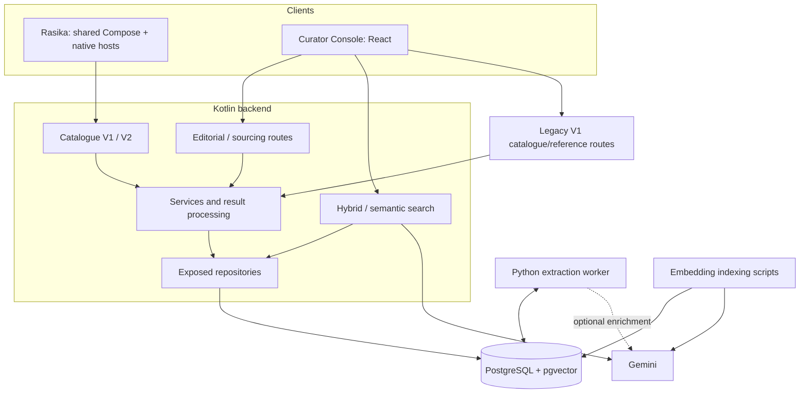

| Metadata | Value |
|:---|:---|
| **Status** | Active |
| **Version** | 1.4.0 |
| **Last Updated** | 2026-09-10 |
| **Author** | Sangeetha Grantha Team |
| **Document Type** | Current guide |

# System architecture

---

Sangeetha Grantha has two clients and one editorially managed catalogue. Rasika reads a constrained public API. The Curator Console uses editorial, sourcing, and search routes. A Python worker extracts source material; Kotlin services decide how results enter canonical storage.

## Runtime boundaries

[Routing.kt](../../modules/backend/api/src/main/kotlin/com/sangita/grantha/backend/api/plugins/Routing.kt) shows which surfaces are mounted. [AppModule.kt](../../modules/backend/api/src/main/kotlin/com/sangita/grantha/backend/api/di/AppModule.kt) wires dependencies. [Compose](../../compose.yaml) defines the local deployment shape.

## Module responsibilities

| Module | Owns |
|:---|:---|
| `shared/domain` | Serializable DTOs and domain enums |
| `shared/mobile-data` | Public V2 client, repositories, local persistence and fixtures |
| `shared/presentation` | Rasika presenters, screens, navigation and semantics |
| `mobile/androidApp`, `mobile/iosApp` | Platform hosts and native tests |
| `backend/api` | Ktor routes/plugins, authorization, services, orchestration, provider clients |
| `backend/dal` | Exposed mappings, repositories, transactions, database error translation |
| `backend/test-support` | PostgreSQL Testcontainers, Flyway and shared fixture support |
| `frontend/sangita-admin-web` | Editorial browser application |
| `tools/krithi-extract-enrich-worker` | Source extraction, canonical validation, optional enrichment and indexing tools |

## Public reads

Catalogue routes use allowlisted reader DTOs rather than exposing editorial entities. V1 excludes `UNESTABLISHED`; V2 includes published unclassified compositions and adds discovery. Strict parameter parsing rejects unsupported/repeated query parameters. Successful catalogue responses use `Cache-Control: no-store`.

Rasika uses V2 only. It preserves stored source/script variants and handles missing/incomplete content without generating replacements. The current V2 route set stops at discovery, compositions/lyrics, ragas, and composers; further directories remain planned.

See [API contract](../03-api/api-contract.md) and [mobile architecture](../05-frontend/mobile/README.md).

## Editorial writes and identity

Routes delegate to services and repositories. Database operations run inside `DatabaseFactory.dbQuery`; boundaries return DTOs, not Exposed entities. Mutations must be authorized and audited. Accepted content changes use the controlled canon/revision path where applicable.

JWT claims derive roles from storage. Main admin routes require `grp_sangita_admin`; dashboard statistics have an explicit optional-auth route. Token provisioning and password hashing do not imply an interactive password login. See [authentication](../00-meta/quick-reference-auth.md).

Reference resolution uses canonical metadata and aliases. Raga identity uses match keys with mela context, alias-key collision protection, and a curator queue. [Raga identity](../04-database/raga-identity.md) explains the model and actions.

## Ingestion and history

Kotlin submits extraction work; Python claims requests and returns canonical payloads. Kotlin consumes results, matches identities, and persists review/canonical data through services. Row locking coordinates claims, while retries and duplicate sources still require idempotent processing.

Source documents and extraction runs provide attribution for versioned section content. Current tables remain the read projection; audit records complement revision snapshots. Corpus corrections should be reproducible through parser → extraction → import/reingest → curator, rather than encoded as new schema migrations.

Read [ingestion architecture](../01-requirements/features/bulk-import/02-implementation/technical-implementation-guide.md) and [versioned canon](../04-database/versioned-canon.md).

## Retrieval

PostgreSQL stores composition overview/passage search documents and profile-bound vectors. Indexing scripts populate them separately from import. Query embedding must agree with the active model and dimensions; hybrid combines lexical/vector ranks and can fall back to lexical when no profile is active.

No separate vector database is required by the current implementation. Provider usage and index coverage are operational prerequisites. See [search](../03-api/search.md).

## Delivery and evidence

Flyway applies schema and repeatable reference seeds consistently in development and Testcontainers. CI validates backend, frontend, worker, mobile, database, docs, and repository conventions. Native build checks remain separate from device acceptance.

The local Compose stack is implemented. Cloud topologies in scaling documents are proposals; a production target is not established by those diagrams. [Deployment readiness](../08-operations/deployment.md) lists the boundary.

[Architecture decisions](./decisions/adr-index.md) · [Schema](../04-database/schema.md) · [Quality](../07-quality/README.md) · [Current versions](../00-meta/current-versions.md)

---

[Section index](./README.md) · [Documentation home](./../README.md) · [Feature status](./../01-requirements/features/README.md)
