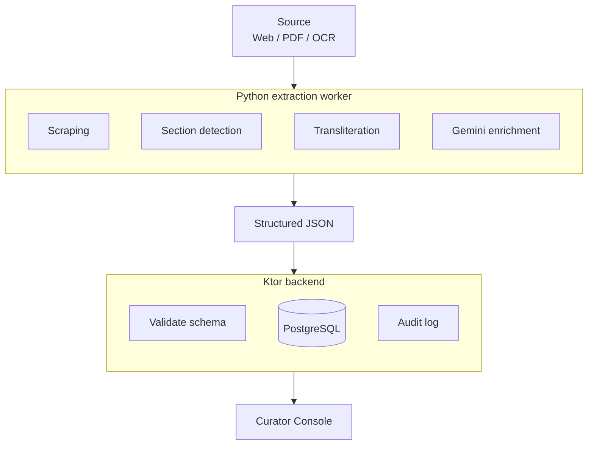
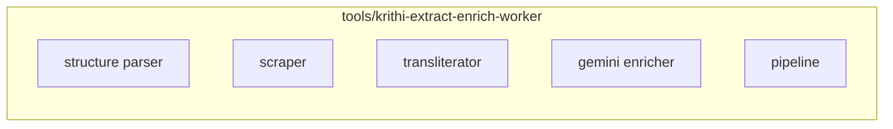

| Metadata | Value |
|:---|:---|
| **Status** | Accepted |
| **Version** | 1.1.0 |
| **Last Updated** | 2026-09-10 |
| **Author** | Sangeetha Grantha Team |
| **Document Type** | Decision record |

# ADR-012: Unified Extraction Architecture — Python as Single Source of Truth

---

> [!NOTE]
> Decision record: preserve the original rationale and check its decision/supersession status. Current runtime guidance is in [system architecture](./../backend-system-design.md) and [Flyway migrations](./../../04-database/migrations.md).

## Context

The platform ingests Carnatic music compositions (Krithis) from multiple semi-structured sources (web pages, PDFs, OCR text). Early architecture split extraction responsibilities:

- **Python worker** (`tools/krithi-extract-enrich-worker`): Web scraping, HTML parsing, Gemini AI enrichment
- **Kotlin backend**: Some inline parsing logic for section detection and structure validation

This dual-ownership created problems:

1. **Inconsistent parsing**: Python and Kotlin applied different heuristics for detecting Pallavi/Anupallavi/Charanam sections, producing conflicting results.
2. **Data quality issues**: A comprehensive audit (TRACK-083) revealed 92% of 473 krithis had section structure inconsistencies traceable to parsing divergence.
3. **Maintenance burden**: Bug fixes needed to be applied in two codebases.
4. **AI integration complexity**: Gemini-powered enrichment only existed in Python, but Kotlin tried to post-process its output.

TRACK-064 (Unified Extraction Engine) and TRACK-065 (Python Module Promotion) addressed this.

## Decision

Adopt the principle: **"Intelligence in Python, Ingestion in Kotlin, Review in Curator UI"**.

- **Python** is the **single source of truth** for all composition parsing, section detection, transliteration, and AI enrichment
- **Kotlin backend** receives structured output from Python and persists it — no parsing or transformation logic
- **Curator UI** (React admin) provides human review and editorial corrections

The Python extraction worker is promoted from a "tool" to a first-class architectural component.

## Rationale

1. **Single parsing implementation**: One `structure_parser.py` module handles all section detection — Pallavi, Anupallavi, Charanam, Nottusvara Sahityam, and edge cases.
2. **AI-native**: Python has superior ecosystem support for Gemini/LLM integration, NLP libraries, and text processing.
3. **Rapid iteration**: Python's dynamic nature allows faster experimentation with parsing heuristics compared to compiled Kotlin.
4. **Clean separation**: Backend becomes a pure CRUD + workflow engine. No domain-specific text processing leaks into the API layer.
5. **Data quality**: After unification + remediation (Migration 38), section consistency reached 100% across all 473 krithis.

## Implementation Details

### Architecture Flow

### Key Python Modules

Package layout is under `tools/krithi-extract-enrich-worker/` (uv / `src/` — see the worker skill). `requirements.txt` in older notes is superseded by `pyproject.toml`.

### Data Remediation

Migration 38 (`38__section-structure-remediation.sql`) corrected all 473 krithis to match the unified parser output, resolving the 92% inconsistency rate discovered during audit.

## Consequences

### Positive

- **100% section consistency**: Single parser eliminated all parsing divergence
- **Faster feature development**: New extraction features only need Python changes
- **Better AI integration**: Direct Gemini API access without cross-language bridging
- **Cleaner backend**: Kotlin API is purely CRUD + workflow, easier to maintain

### Negative

- **Cross-process dependency**: Backend depends on Python worker output format — changes require coordination
- **Two runtimes in production**: Python worker runs alongside Kotlin backend (mitigated by Docker Compose orchestration)

### Neutral

- **Extraction worker promotion**: `tools/krithi-extract-enrich-worker/` is now architecturally critical, not just a utility tool

## References

- TRACK-064: Unified Extraction Engine Migration
- TRACK-065: Python Extraction Module Promotion
- TRACK-083: Data Quality Audit & Remediation
- [Backend System Design](../backend-system-design.md)

---

[Section index](./README.md) · [Documentation home](./../../README.md) · [Feature status](./../../01-requirements/features/README.md)
