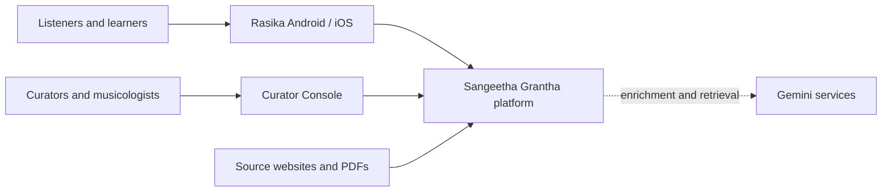
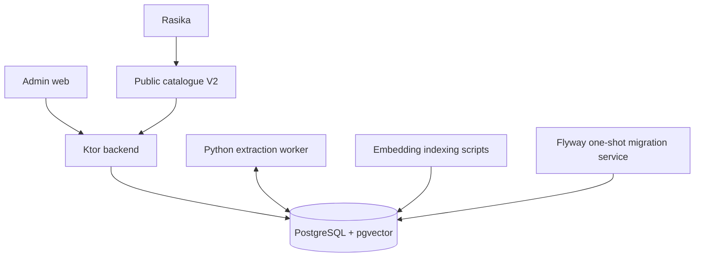
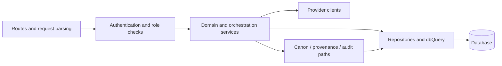

| Metadata | Value |
|:---|:---|
| **Status** | Active |
| **Version** | 1.2.0 |
| **Last Updated** | 2026-09-10 |
| **Author** | Sangeetha Grantha Team |
| **Document Type** | Current guide |

# System context and components

---

These diagrams describe the implemented repository architecture. They intentionally separate users, runtime services, and internal ownership. Cloud scaling diagrams are proposals, documented separately in [deployment readiness](../../08-operations/deployment.md).

## System context

```mermaid
flowchart LR
    U[Listeners and learners] --> R[Rasika Android / iOS]
    C[Curators and musicologists] --> A[Curator Console]
    R --> P[Sangeetha Grantha platform]
    A --> P
    S[Source websites and PDFs] --> P
    P -. enrichment and retrieval .-> G[Gemini services]
```

## Runtime containers

```mermaid
flowchart TB
    R[Rasika] --> V2[Public catalogue V2]
    A[Admin web] --> K[Ktor backend]
    V2 --> K
    K --> D[(PostgreSQL + pgvector)]
    W[Python extraction worker] <--> D
    I[Embedding indexing scripts] --> D
    F[Flyway one-shot migration service] --> D
```

The extraction worker exchanges queue/results through PostgreSQL rather than a public extraction HTTP API. Indexing is a separate operation. Flyway is a migration task, not a long-running application server.

## Backend components

```mermaid
flowchart LR
    R[Routes and request parsing] --> A[Authentication and role checks]
    A --> S[Domain and orchestration services]
    S --> P[Repositories and dbQuery]
    P --> D[(Database)]
    S --> E[Provider clients]
    S --> C[Canon / provenance / audit paths]
    C --> P
```

Public routes have their own allowlisted read model and visibility rules; authorization applies to the relevant route families. Read the [system design](../backend-system-design.md), [data relationships](./erd.md), and [flows](./flows.md) for detail.

---

[Section index](./README.md) · [Documentation home](./../../README.md) · [Feature status](./../../01-requirements/features/README.md)
