| Metadata | Value |
|:---|:---|
| **Status** | Active |
| **Version** | 1.1.0 |
| **Last Updated** | 2026-02-08 |
| **Author** | Sangeetha Grantha Team |

# C4 Model Diagrams

This document provides C4 model diagrams for Sangita Grantha at multiple levels of abstraction.

---

## 1. Overview

The [C4 model](https://c4model.com/) provides a hierarchical set of software architecture diagrams:

1. **System Context** - Shows how the system fits into the world
2. **Container** - High-level technology choices and responsibilities
3. **Component** - Decomposition of containers into components
4. **Code** - Implementation details (typically UML, not shown here)

---

## 2. System Context Diagram

This diagram shows Sangita Grantha and its relationships with users and external systems.

### Context Diagram (Alternative Flowchart)

```mermaid
flowchart TB
    subgraph Users["Users"]
        R[👤 Rasika/Learner]
        E[👤 Editor/Curator]
        A[👤 Administrator]
    end

    subgraph SG["Sangita Grantha System"]
        CORE[🎵 Sangita Grantha<br/>Digital Carnatic Music Compendium]
    end

    subgraph External["External Systems"]
        K[📚 Karnatik.com]
        S[📚 Shivkumar.org]
        G[🤖 Google Gemini]
    end

    R -->|"Search & View<br/>(Mobile App)"| CORE
    E -->|"Curate Content<br/>(Admin Web)"| CORE
    A -->|"Manage System<br/>(Admin Web)"| CORE

    CORE -->|"Import Data"| K
    CORE -->|"Import Notation"| S
    CORE -->|"AI Services"| G

    style CORE fill:#438DD5,color:#fff
    style R fill:#08427B,color:#fff
    style E fill:#08427B,color:#fff
    style A fill:#08427B,color:#fff
```

---

## 3. Container Diagram

This diagram shows the high-level technology choices and how containers communicate.

### Container Diagram (Alternative Flowchart)

```mermaid
flowchart TB
    subgraph Users
        R[👤 Rasika]
        E[👤 Editor]
    end

    subgraph SG["Sangita Grantha System Boundary"]
        subgraph Clients["Client Applications"]
            MOB["📱 Mobile App<br/><small>Kotlin Multiplatform<br/>iOS & Android</small>"]
            ADM["🖥️ Admin Web<br/><small>React 19 + TypeScript<br/>Vite + Tailwind</small>"]
        end

        subgraph Backend["Backend Services"]
            API["⚙️ Backend API<br/><small>Kotlin + Ktor<br/>REST API</small>"]
        end

        subgraph Data["Data Layer"]
            DB[("🗄️ PostgreSQL 15<br/><small>Krithis, Variants<br/>Notation, Audit</small>")]
        end
    end

    subgraph External["External Services"]
        GEM["🤖 Google Gemini<br/><small>AI Services</small>"]
    end

    R --> MOB
    E --> ADM

    MOB -->|"HTTPS/JSON"| API
    ADM -->|"HTTPS/JSON"| API

    API -->|"JDBC"| DB
    API -.->|"HTTPS"| GEM

    style API fill:#438DD5,color:#fff
    style DB fill:#438DD5,color:#fff
    style MOB fill:#85BBF0,color:#000
    style ADM fill:#85BBF0,color:#000
```

---

## 4. Component Diagram - Backend API

This diagram shows the internal structure of the Backend API container.

---

## 5. Component Diagram - Admin Web

This diagram shows the internal structure of the Admin Web container.

---

## 6. Component Diagram - Data Layer

This diagram shows the database schema organization.

---

## 7. Deployment Diagram

This diagram shows how containers are deployed in production.

---

## 8. Key Architectural Decisions

| Decision | Rationale |
|----------|-----------|
| **Kotlin Multiplatform** | Share domain logic between mobile platforms |
| **Ktor + Exposed** | Lightweight, Kotlin-native backend stack |
| **React 19** | Modern frontend with server components capability |
| **PostgreSQL** | Robust relational DB with excellent text search |
| **Cloud Run** | Serverless scaling, pay-per-use |
| **Layered Architecture** | Clear separation of concerns |

---

## 9. Related Documents

- [ERD](./erd.md) - Entity relationship diagrams
- [Flows](./flows.md) - System flow diagrams
- [Backend System Design](../backend-system-design.md) - Detailed backend architecture
- [Tech Stack](../tech-stack.md) - Technology choices