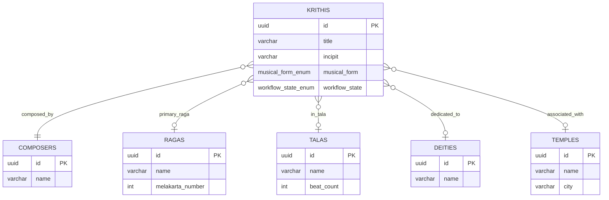
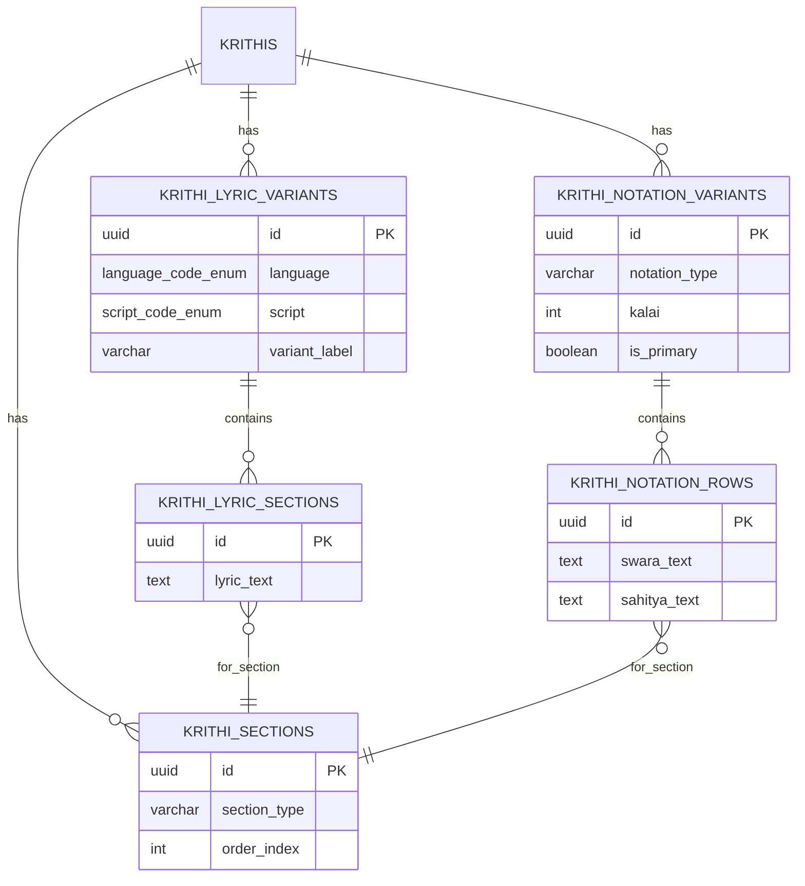
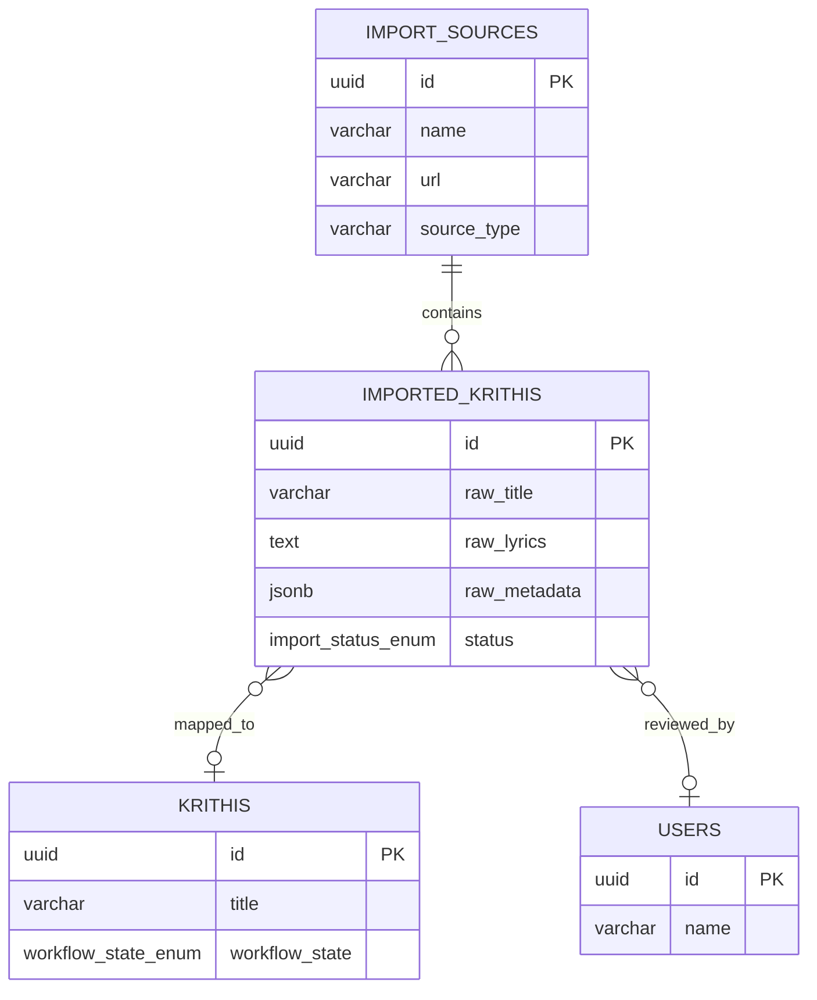
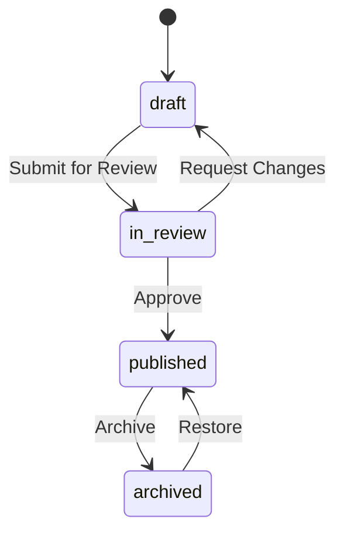
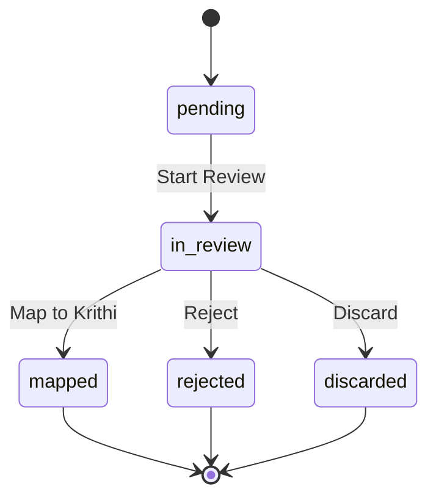

| Metadata | Value |
|:---|:---|
| **Status** | Active |
| **Version** | 1.1.0 |
| **Last Updated** | 2026-02-08 |
| **Author** | Sangeetha Grantha Team |

# Entity Relationship Diagram

This document provides visual representation of the Sangita Grantha database schema using Mermaid diagrams.

---

## 1. Complete ERD Overview

The following diagram shows all entities and their relationships:

```mermaid
erDiagram
    %% ==========================================
    %% REFERENCE DATA ENTITIES
    %% ==========================================

    COMPOSERS {
        uuid id PK
        varchar name
        varchar name_normalized
        int birth_year
        int death_year
        varchar place
        text notes
        timestamp created_at
        timestamp updated_at
    }

    RAGAS {
        uuid id PK
        varchar name
        varchar name_normalized
        int melakarta_number
        uuid parent_raga_id FK
        varchar arohanam
        varchar avarohanam
        timestamp created_at
        timestamp updated_at
    }

    TALAS {
        uuid id PK
        varchar name
        varchar name_normalized
        varchar anga_structure
        int beat_count
        timestamp created_at
        timestamp updated_at
    }

    DEITIES {
        uuid id PK
        varchar name
        varchar name_normalized
        text description
        timestamp created_at
        timestamp updated_at
    }

    TEMPLES {
        uuid id PK
        varchar name
        varchar name_normalized
        varchar city
        varchar state
        varchar country
        uuid primary_deity_id FK
        decimal latitude
        decimal longitude
        timestamp created_at
        timestamp updated_at
    }

    TEMPLE_NAMES {
        uuid id PK
        uuid temple_id FK
        language_code_enum language
        script_code_enum script
        varchar name
        boolean is_primary
        timestamp created_at
    }

    SAMPRADAYAS {
        uuid id PK
        varchar name
        varchar name_normalized
        text description
        timestamp created_at
        timestamp updated_at
    }

    TAGS {
        uuid id PK
        varchar name
        varchar category
        timestamp created_at
    }

    %% ==========================================
    %% CORE COMPOSITION ENTITIES
    %% ==========================================

    KRITHIS {
        uuid id PK
        varchar title
        varchar incipit
        uuid composer_id FK
        musical_form_enum musical_form
        language_code_enum primary_language
        uuid primary_raga_id FK
        uuid tala_id FK
        uuid deity_id FK
        uuid temple_id FK
        boolean is_ragamalika
        workflow_state_enum workflow_state
        uuid created_by FK
        uuid updated_by FK
        timestamp created_at
        timestamp updated_at
    }

    KRITHI_RAGAS {
        uuid id PK
        uuid krithi_id FK
        uuid raga_id FK
        int order_index
        uuid section_id FK
        timestamp created_at
    }

    KRITHI_SECTIONS {
        uuid id PK
        uuid krithi_id FK
        varchar section_type
        int order_index
        timestamp created_at
        timestamp updated_at
    }

    %% ==========================================
    %% LYRIC ENTITIES
    %% ==========================================

    KRITHI_LYRIC_VARIANTS {
        uuid id PK
        uuid krithi_id FK
        language_code_enum language
        script_code_enum script
        varchar transliteration_scheme
        uuid sampradaya_id FK
        varchar variant_label
        varchar source_reference
        uuid created_by FK
        timestamp created_at
        timestamp updated_at
    }

    KRITHI_LYRIC_SECTIONS {
        uuid id PK
        uuid variant_id FK
        uuid section_id FK
        text lyric_text
        text lyric_text_normalized
        timestamp created_at
        timestamp updated_at
    }

    %% ==========================================
    %% NOTATION ENTITIES
    %% ==========================================

    KRITHI_NOTATION_VARIANTS {
        uuid id PK
        uuid krithi_id FK
        varchar notation_type
        uuid tala_id FK
        int kalai
        int eduppu_offset_beats
        varchar variant_label
        varchar source_reference
        boolean is_primary
        uuid created_by FK
        timestamp created_at
        timestamp updated_at
    }

    KRITHI_NOTATION_ROWS {
        uuid id PK
        uuid notation_variant_id FK
        uuid section_id FK
        int order_index
        text swara_text
        text sahitya_text
        varchar tala_markers
        timestamp created_at
        timestamp updated_at
    }

    %% ==========================================
    %% TAGGING & CLASSIFICATION
    %% ==========================================

    KRITHI_TAGS {
        uuid id PK
        uuid krithi_id FK
        uuid tag_id FK
        timestamp created_at
    }

    %% ==========================================
    %% IMPORT PIPELINE
    %% ==========================================

    IMPORT_SOURCES {
        uuid id PK
        varchar name
        varchar url
        varchar source_type
        text notes
        timestamp created_at
        timestamp updated_at
    }

    IMPORTED_KRITHIS {
        uuid id PK
        uuid source_id FK
        varchar raw_title
        text raw_lyrics
        jsonb raw_metadata
        import_status_enum status
        uuid mapped_krithi_id FK
        uuid reviewed_by FK
        text review_notes
        timestamp created_at
        timestamp updated_at
    }

    %% ==========================================
    %% USER & AUDIT
    %% ==========================================

    USERS {
        uuid id PK
        varchar email
        varchar name
        varchar phone
        boolean is_active
        timestamp created_at
        timestamp updated_at
    }

    ROLES {
        uuid id PK
        varchar name
        text description
        timestamp created_at
    }

    USER_ROLES {
        uuid user_id FK
        uuid role_id FK
        timestamp created_at
    }

    AUDIT_LOG {
        uuid id PK
        uuid actor_id FK
        varchar action
        varchar entity_type
        uuid entity_id
        jsonb old_value
        jsonb new_value
        jsonb context
        timestamp created_at
    }

    %% ==========================================
    %% RELATIONSHIPS
    %% ==========================================

    %% Reference Data Relationships
    RAGAS ||--o| RAGAS : "parent_raga_id"
    TEMPLES ||--o| DEITIES : "primary_deity_id"
    TEMPLES ||--o{ TEMPLE_NAMES : "has"

    %% Krithi Core Relationships
    KRITHIS }o--|| COMPOSERS : "composed_by"
    KRITHIS }o--o| RAGAS : "primary_raga"
    KRITHIS }o--o| TALAS : "in_tala"
    KRITHIS }o--o| DEITIES : "dedicated_to"
    KRITHIS }o--o| TEMPLES : "associated_with"
    KRITHIS }o--|| USERS : "created_by"
    KRITHIS }o--|| USERS : "updated_by"

    %% Krithi Structure Relationships
    KRITHIS ||--o{ KRITHI_SECTIONS : "has"
    KRITHIS ||--o{ KRITHI_RAGAS : "ragamalika"
    KRITHI_RAGAS }o--|| RAGAS : "raga"
    KRITHI_RAGAS }o--o| KRITHI_SECTIONS : "for_section"

    %% Lyric Relationships
    KRITHIS ||--o{ KRITHI_LYRIC_VARIANTS : "has"
    KRITHI_LYRIC_VARIANTS }o--o| SAMPRADAYAS : "from"
    KRITHI_LYRIC_VARIANTS }o--|| USERS : "created_by"
    KRITHI_LYRIC_VARIANTS ||--o{ KRITHI_LYRIC_SECTIONS : "contains"
    KRITHI_LYRIC_SECTIONS }o--|| KRITHI_SECTIONS : "for_section"

    %% Notation Relationships
    KRITHIS ||--o{ KRITHI_NOTATION_VARIANTS : "has"
    KRITHI_NOTATION_VARIANTS }o--|| TALAS : "in_tala"
    KRITHI_NOTATION_VARIANTS }o--|| USERS : "created_by"
    KRITHI_NOTATION_VARIANTS ||--o{ KRITHI_NOTATION_ROWS : "contains"
    KRITHI_NOTATION_ROWS }o--|| KRITHI_SECTIONS : "for_section"

    %% Tagging Relationships
    KRITHIS ||--o{ KRITHI_TAGS : "tagged_with"
    KRITHI_TAGS }o--|| TAGS : "tag"

    %% Import Relationships
    IMPORT_SOURCES ||--o{ IMPORTED_KRITHIS : "contains"
    IMPORTED_KRITHIS }o--o| KRITHIS : "mapped_to"
    IMPORTED_KRITHIS }o--o| USERS : "reviewed_by"

    %% User & Audit Relationships
    USERS ||--o{ USER_ROLES : "has"
    USER_ROLES }o--|| ROLES : "role"
    AUDIT_LOG }o--|| USERS : "actor"
```

---

## 2. Domain-Specific Views

### 2.1 Composition Model (Core)

This view focuses on the central `krithis` entity and its primary relationships:

### 2.2 Lyric & Notation Model

This view shows how lyrics and notation are structured:

### 2.3 Import Pipeline

This view shows the data ingestion flow:

---

## 3. Enum Reference

### 3.1 Workflow States

### 3.2 Import States

---

## 4. Key Design Decisions

| Decision | Rationale |
|----------|-----------|
| **Separate lyric and notation tables** | Lyrics are language/script specific; notation is tala/performance specific |
| **Section-based structure** | Preserves musicological structure (pallavi, anupallavi, charanam) |
| **Ragamalika support** | `krithi_ragas` table allows ordered multi-raga compositions |
| **Variant support** | Multiple lyric/notation variants per composition (sampradaya, bani) |
| **Import staging** | Raw imports never auto-publish; require editorial review |
| **Audit trail** | All mutations logged for provenance and compliance |

---

## 5. Usage Guidelines

### Updating This Diagram

1. **Schema changes**: When adding/modifying tables, update the ERD
2. **Migration sync**: Ensure diagram matches actual migrations in `database/migrations/`
3. **DTO alignment**: Verify entities match DTOs in `modules/shared/domain`

### Rendering

- GitHub/GitLab: Mermaid renders natively
- VS Code: Use "Markdown Preview Mermaid Support" extension
- Export: Use Mermaid CLI or online editor for PNG/SVG

---

## 6. Related Documents

- [Schema Overview](../../04-database/schema.md) - Detailed schema documentation
- [Migrations](../../04-database/migrations.md) - Migration files and workflow
- [Domain Model](../../01-requirements/domain-model.md) - Conceptual domain model
- [Glossary](../../01-requirements/glossary.md) - Term definitions