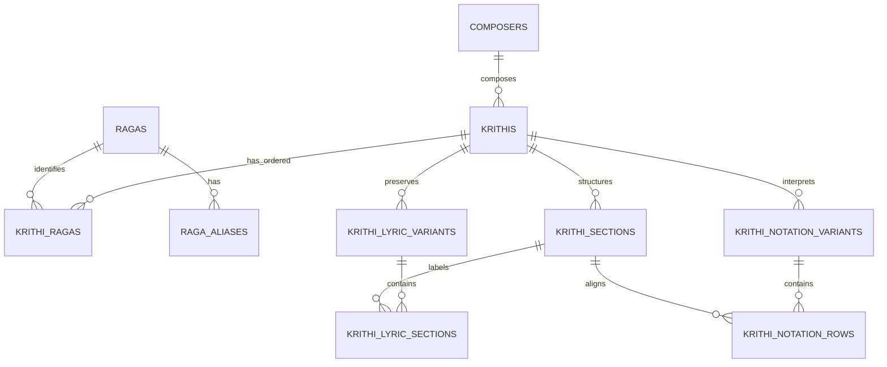
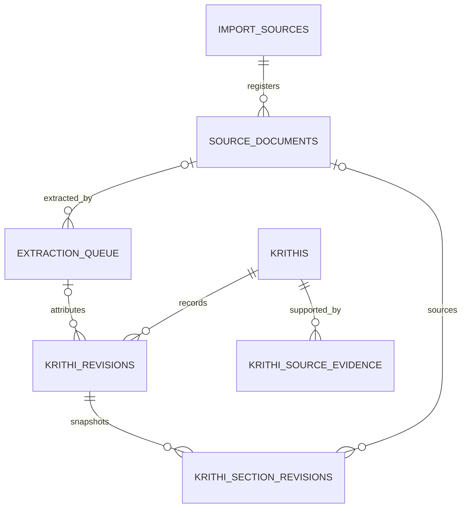
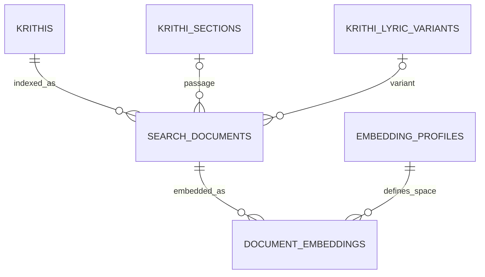

| Metadata | Value |
|:---|:---|
| **Status** | Active |
| **Version** | 1.4.0 |
| **Last Updated** | 2026-09-10 |
| **Author** | Sangeetha Grantha Team |
| **Document Type** | Current guide |

# Data relationship diagrams

---

These are conceptual diagrams of the main relationships, not exhaustive DDL. [Flyway migrations](../../../database/migrations) define exact columns, constraints, and delete behavior. [Schema guide](../../04-database/schema.md) explains table responsibilities.

## Composition, text, and references

```mermaid
erDiagram
    COMPOSERS ||--o{ KRITHIS : composes
    KRITHIS ||--o{ KRITHI_RAGAS : has_ordered
    RAGAS ||--o{ KRITHI_RAGAS : identifies
    RAGAS ||--o{ RAGA_ALIASES : has
    KRITHIS ||--o{ KRITHI_SECTIONS : structures
    KRITHIS ||--o{ KRITHI_LYRIC_VARIANTS : preserves
    KRITHI_LYRIC_VARIANTS ||--o{ KRITHI_LYRIC_SECTIONS : contains
    KRITHI_SECTIONS ||--o{ KRITHI_LYRIC_SECTIONS : labels
    KRITHIS ||--o{ KRITHI_NOTATION_VARIANTS : interprets
    KRITHI_NOTATION_VARIANTS ||--o{ KRITHI_NOTATION_ROWS : contains
    KRITHI_SECTIONS ||--o{ KRITHI_NOTATION_ROWS : aligns
```

Raga junction order preserves Ragamalika. Lyric variants retain separate language/script/source identities. Notation rows are separate from lyric sections.

## Source and accepted history

```mermaid
erDiagram
    IMPORT_SOURCES ||--o{ SOURCE_DOCUMENTS : registers
    SOURCE_DOCUMENTS o|--o{ EXTRACTION_QUEUE : extracted_by
    KRITHIS ||--o{ KRITHI_REVISIONS : records
    KRITHI_REVISIONS ||--o{ KRITHI_SECTION_REVISIONS : snapshots
    EXTRACTION_QUEUE o|--o{ KRITHI_REVISIONS : attributes
    SOURCE_DOCUMENTS o|--o{ KRITHI_SECTION_REVISIONS : sources
    KRITHIS ||--o{ KRITHI_SOURCE_EVIDENCE : supported_by
```

Manual changes can be actor-attributed without an extraction. Audit events complement content revisions. See [versioned canon](../../04-database/versioned-canon.md) for attribution rules and current/as-of reads.

## Retrieval index

```mermaid
erDiagram
    KRITHIS ||--o{ SEARCH_DOCUMENTS : indexed_as
    KRITHI_SECTIONS o|--o{ SEARCH_DOCUMENTS : passage
    KRITHI_LYRIC_VARIANTS o|--o{ SEARCH_DOCUMENTS : variant
    SEARCH_DOCUMENTS ||--o{ DOCUMENT_EMBEDDINGS : embedded_as
    EMBEDDING_PROFILES ||--o{ DOCUMENT_EMBEDDINGS : defines_space
```

Index rows are maintained separately from import. The active profile must match the query embedder. See [search](../../03-api/search.md) and [raga identity](../../04-database/raga-identity.md) for the corresponding constraints.

---

[Section index](./README.md) · [Documentation home](./../../README.md) · [Feature status](./../../01-requirements/features/README.md)
