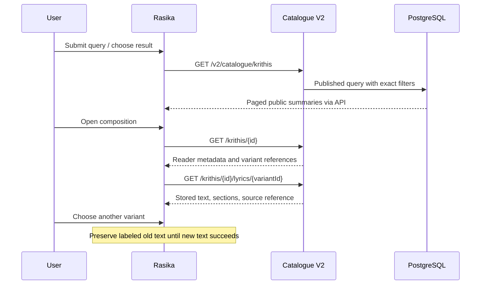
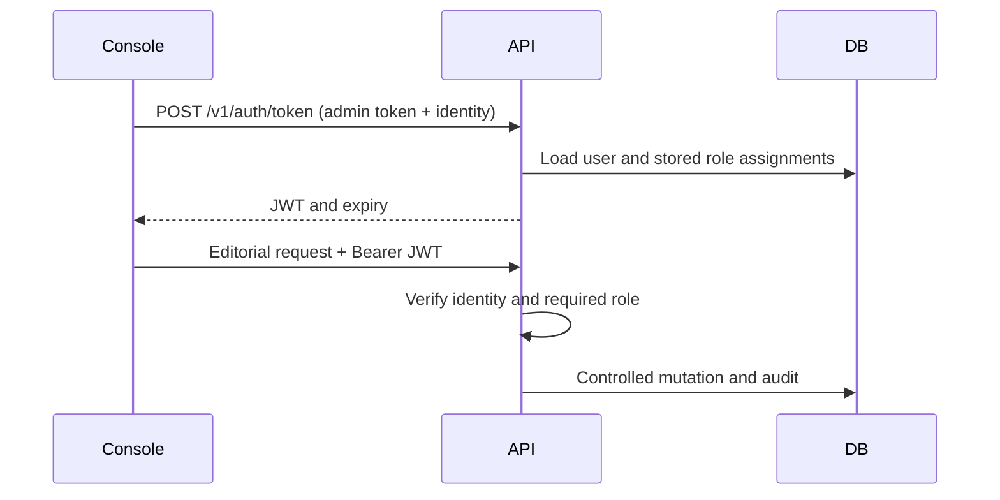

| Metadata | Value |
|:---|:---|
| **Status** | Active |
| **Version** | 1.4.0 |
| **Last Updated** | 2026-09-10 |
| **Author** | Sangeetha Grantha Team |
| **Document Type** | Current guide |

# Application flows

---

Read these flows alongside the [API contract](../../03-api/api-contract.md). They describe the current architecture, while per-route validation and failure behavior remain in the implementation.

## Read a stored lyric variant

```mermaid
sequenceDiagram
    participant User
    participant Rasika
    participant API as Catalogue V2
    participant DB as PostgreSQL
    User->>Rasika: Submit query / choose result
    Rasika->>API: GET /v2/catalogue/krithis
    API->>DB: Published query with exact filters
    DB-->>Rasika: Paged public summaries via API
    User->>Rasika: Open composition
    Rasika->>API: GET /krithis/{id}
    API-->>Rasika: Reader metadata and variant references
    Rasika->>API: GET /krithis/{id}/lyrics/{variantId}
    API-->>Rasika: Stored text, sections, source reference
    User->>Rasika: Choose another variant
    Note over Rasika: Preserve labeled old text until new text succeeds
```

## Token and role boundary

```mermaid
sequenceDiagram
    participant Console
    participant API
    participant DB
    Console->>API: POST /v1/auth/token (admin token + identity)
    API->>DB: Load user and stored role assignments
    API-->>Console: JWT and expiry
    Console->>API: Editorial request + Bearer JWT
    API->>API: Verify identity and required role
    API->>DB: Controlled mutation and audit
```

Account/password provisioning is separate from the current token-login flow. Refresh reloads roles. See [authentication](../../00-meta/quick-reference-auth.md).

## Extraction to curation

```mermaid
flowchart LR
    S[Source request / manifest] --> K[Kotlin orchestration]
    K --> Q[Extraction queue]
    Q --> P[Python HTML / PDF extraction]
    P --> C[Canonical result payload]
    C --> R[Kotlin result processing and identity resolution]
    R --> V[Review / variants / source evidence]
    V --> A[Accepted canon and revisions]
    A --> D[Published catalogue when workflow permits]
```

Retries and curation must preserve identity, source variants, and ordered ragas. See [ingestion](../../01-requirements/features/bulk-import/02-implementation/technical-implementation-guide.md).

## Schema and content evolution

Flyway changes schema and reference seeds through the committed migration directory. Parser fixes and targeted reingestion correct composition content through the canon/provenance path. [Migrations](../../04-database/migrations.md) and [versioned canon](../../04-database/versioned-canon.md) explain the separate responsibilities.

---

[Section index](./README.md) · [Documentation home](./../../README.md) · [Feature status](./../../01-requirements/features/README.md)
