| Metadata | Value |
|:---|:---|
| **Status** | Active |
| **Version** | 1.1.0 |
| **Last Updated** | 2026-02-08 |
| **Author** | Sangeetha Grantha Team |

# System Flows

This document provides visual representation of key system flows in Sangita Grantha using Mermaid diagrams.

---

## 1. System Architecture Overview

### 1.1 High-Level Architecture

### 1.2 Module Structure

---

## 2. Authentication Flows

### 2.1 Admin Login Flow

### 2.2 Protected API Request

---

## 3. Krithi Management Flows

### 3.1 Create Krithi Flow

### 3.2 Edit Krithi with Lyric Variants

### 3.3 Workflow State Transitions

---

## 4. Search & Discovery Flows

### 4.1 Public Search Flow

### 4.2 Admin Search with Filters

---

## 5. Bulk Import Pipeline

### 5.1 CSV Import Flow

### 5.2 Import Review Workflow

### 5.3 Entity Resolution Flow

---

## 6. Data Access Patterns

### 6.1 Repository Pattern

### 6.2 Audit Logging Pattern

---

## 7. Frontend Component Architecture

### 7.1 Admin Web Information Architecture

### 7.2 State Management Flow

---

## 8. Development Workflow

### 8.1 Steel Thread Test Flow

### 8.2 Database Migration Flow

```mermaid
flowchart TB
    subgraph Dev["Development"]
        D1[Create migration file<br/>NN__description.sql]
        D2[Write SQL<br/>migrate:up section]
        D3[Test locally<br/>cargo run -- db migrate]
    end

    subgraph Review["Code Review"]
        R1[Review migration SQL]
        R2[Check for breaking changes]
        R3[Verify documentation]
    end

    subgraph Deploy["Deployment"]
        P1[Apply to staging]
        P2[Verify schema]
        P3[Apply to production]
    end

    D1 --> D2 --> D3
    D3 --> R1 --> R2 --> R3
    R3 --> P1 --> P2 --> P3
```

---

## 9. Related Documents

- [Backend System Design](../backend-system-design.md) - Architecture details
- [API Contract](../../03-api/api-contract.md) - Endpoint specifications
- [ERD](./erd.md) - Entity relationship diagrams
- [Steel Thread Implementation](../../06-backend/steel-thread-implementation.md) - Test workflow