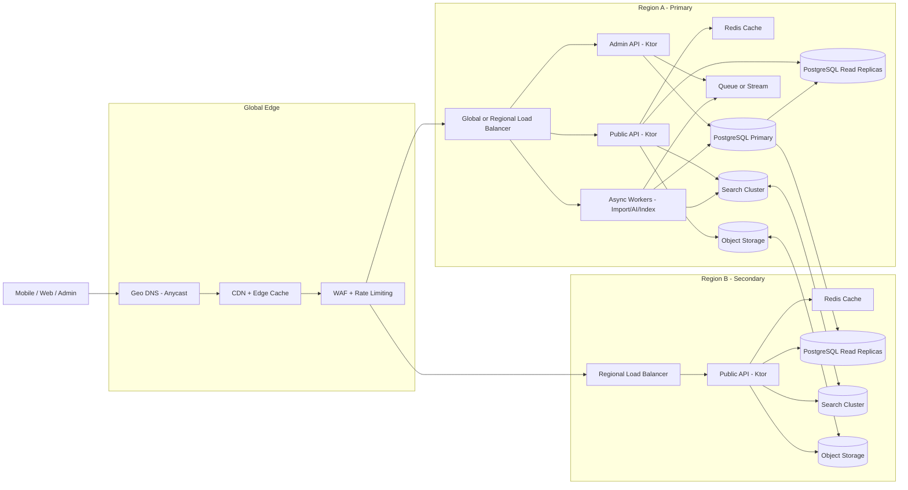
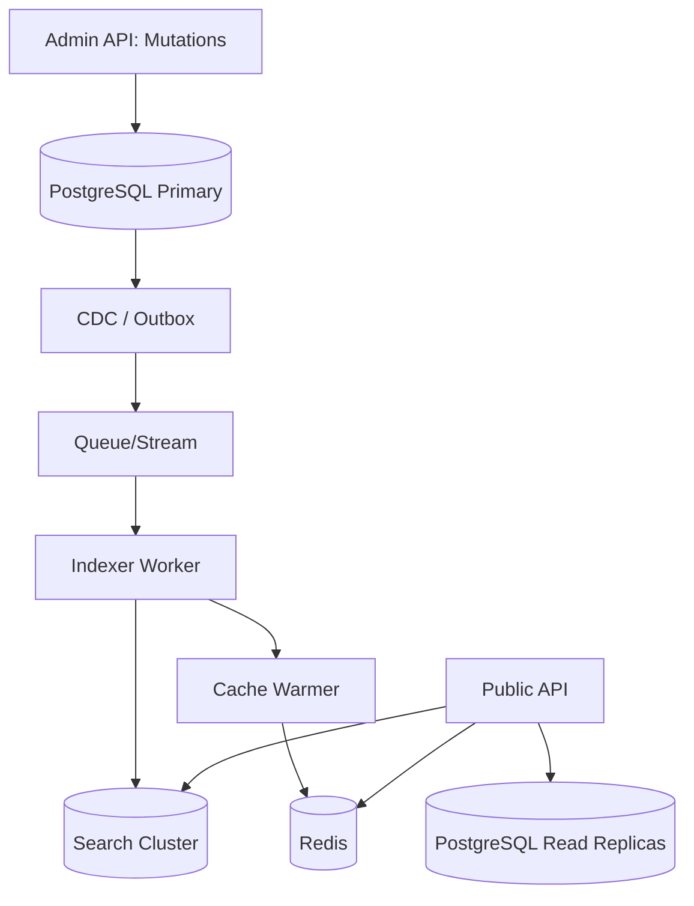

# Target Scale Architecture (Multi-Region) — Roadmap-Focused

> **Status**: Draft | **Version**: 0.1 | **Last Updated**: 2026-01-09  
> **Owners**: Platform + Backend Teams

**Related Documents**
- [Backend Architecture](./backend-system-design.md)
- [Tech Stack](./tech-stack.md)
- [Schema Overview](../04-database/schema.md)
- [Security Requirements](../06-backend/security-requirements.md)

---

## 1) Concrete Target Architecture Diagram

**Notes**
- **Public read traffic** is routed via CDN and caches; data comes from read replicas and search indices.  
- **Admin writes** go only to the primary database in Region A.  
- **Async workers** handle import/AI processing and index updates via queue/stream.  
- **Multi-region** is active-active for read APIs, active-passive for writes (single primary).  

---

## 2) Data Indexing Flow (Search + Cache)

**Notes**
- Use **CDC/outbox** to guarantee indexing consistency after DB commits.
- **Search** handles full-text and faceted queries; **read replicas** handle detail views when cache misses.
- **Cache warmers** can precompute top lists (ragas, composers, trending).

---

## 3) Read-Replica Topology & Consistency

**Topology**
- **Primary DB** in Region A handles **all writes**.
- **Read replicas** in Region A and Region B handle public reads.
- **Search indices** replicate between regions.
- **Object storage** is cross-region replicated for audio/media (future).

**Consistency**
- Public APIs are **eventually consistent** (search and replica lag).
- Admin API remains **strongly consistent** on primary.

---

## 4) Roadmap-Focused Changes & Risk Assessment

The following focuses on the previously listed priority roadmap, with concrete additions and risk levels.

### 4.1 Edge Caching + Rate Limiting (Priority 1)
**Changes**
- CDN for public endpoints.
- API gateway/WAF for rate limiting and threat protection.
- Cache-control headers tuned per endpoint.

**Risk**: **Low**  
**Why**: Mostly infrastructure config and HTTP behavior changes; code impact is limited.

### 4.2 Search Service + Indexing Pipeline (Priority 2)
**Changes**
- Introduce a search cluster (OpenSearch/Elastic).
- Add CDC/outbox + indexing workers.
- Update public search endpoints to query search first.

**Risk**: **Medium**  
**Why**: Requires new infra + data consistency guarantees + operational expertise.

### 4.3 Async Import/AI Pipelines (Priority 3)
**Changes**
- Move AI/web scraping and imports to a queue/worker model.
- Track job status + retries in DB.

**Risk**: **Medium**  
**Why**: Adds async processing and retry semantics, but limited impact on core public APIs.

### 4.4 JWT + SSO for Admin (Priority 4)
**Changes**
- Implement JWT auth + refresh flow.
- Add optional SSO/IdP integration (Google/Auth0/Okta).
- Enforce RBAC claims in routes and services.

**Risk**: **Low–Medium**  
**Why**: Security critical but relatively isolated to auth middleware and admin surface.

### 4.5 Multi-Region Read Replicas (Priority 5)
**Changes**
- Configure cross-region read replicas.
- Route read-only traffic by region.

**Risk**: **Medium–High**  
**Why**: Requires careful replication, failover, and latency tuning.

---

## 5) Low-Risk vs High-Risk Summary

| Change | Risk Level | Key Reasons |
|--------|------------|-------------|
| CDN + rate limiting | Low | Infra-only, minimal data correctness impact |
| JWT + SSO | Low–Medium | Security-critical but localized |
| Async import/AI | Medium | New queue + retry semantics |
| Search indexing | Medium | Consistency and operational overhead |
| Multi-region replicas | Medium–High | Cross-region replication complexity |

---

## 6) Implementation Sequence (Roadmap-Aligned)

1. **Edge caching + WAF/rate limiting**
2. **Search cluster + CDC/outbox + indexing workers**
3. **Async import/AI pipelines**
4. **JWT + SSO for admin**
5. **Multi-region read replicas**
