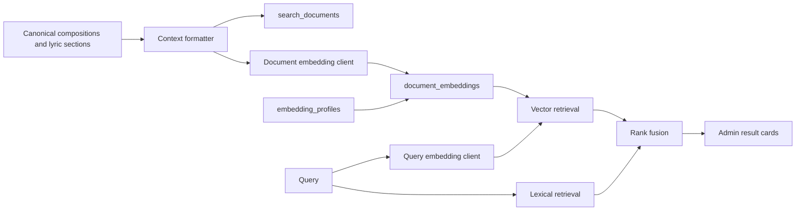

| Metadata | Value |
|:---|:---|
| **Status** | Active |
| **Version** | 1.0.0 |
| **Last Updated** | 2026-09-10 |
| **Author** | Sangeetha Grantha Team |
| **Document Type** | Current guide |

# Catalogue search

---

Sangeetha Grantha has two complementary search experiences. Rasika uses the public catalogue's predictable query/filter/paging contract. The Curator Console also offers hybrid and semantic retrieval over indexed composition overviews and lyric passages.

## Choose the search mode

| Mode | Useful for | Behavior |
|:---|:---|:---|
| Lexical | Known title, incipit, spelling, or phrase | Text matching and conventional catalogue filters |
| Hybrid | A phrase or topic that benefits from both exact and related matches | Combines lexical and vector result ranks using reciprocal rank fusion |
| Semantic | Meaning, related concepts, thematic discovery | Retrieves from the active vector index |

The admin list defaults to Hybrid, but an empty query uses ordinary browsing. Raga and composer filters apply to discovery requests. The language filter belongs to the lexical experience. A relevance score is a ranking signal, not a probability that the musicological interpretation is correct.

Rasika's Explore is not a conversational assistant and does not currently call these vector-search routes. See the [catalogue contract](./api-contract.md).

## API behavior

Both `POST /v1/search/hybrid` and `POST /v1/search/semantic` accept `query`, optional `composerId`/`ragaId`, and `limit` (default 20). Results identify the composition, matched text, document kind, and available ranking scores. `totalMatches` is the number returned.

| Index state | Hybrid | Semantic |
|:---|:---|:---|
| No active profile | Lexical-only retrieval | Empty result list |
| Compatible active profile and indexed content | Fused lexical/vector ranking | Vector ranking |
| Active profile disagrees with query model or dimensions | Availability error | Availability error |
| Empty/whitespace query | Empty API result | Empty API result |

Hybrid's lexical fallback searches `search_documents`; it does not query the ordinary catalogue tables directly. A completely fresh index can therefore yield no hybrid results even when ordinary catalogue browsing finds compositions.

Requests without an admin role are restricted to published results. Admin identity can expose editorial results. Check both audiences when validating index visibility.

Sources: [HybridSearchService](../../modules/backend/api/src/main/kotlin/com/sangita/grantha/backend/api/services/HybridSearchService.kt), [search routes](../../modules/backend/api/src/main/kotlin/com/sangita/grantha/backend/api/routes/SemanticSearchRoutes.kt), [search DTOs](../../modules/shared/domain/src/commonMain/kotlin/com/sangita/grantha/shared/domain/model/SearchDtos.kt).

## Ranking and result identity

Semantic retrieval uses cosine similarity (`1 - cosine distance`) and selects one representative matched document per composition. Hybrid retrieves up to 500 lexical and vector candidates per branch, combines document ranks with `1/(60 + vectorRank) + 1/(60 + lexicalRank)` for the available branches, then selects one representative per composition. Small overview preferences influence representative selection.

The repository clamps requested limits to 1–100. Composer filters use the composition identity; raga filters match the primary raga or membership in `krithi_ragas`. Anonymous/non-admin scope requires both a published composition and visible search document. `similarityScore`, `lexicalScore`, and `rrfScore` are different measures; a displayed percentage is not a calibrated confidence probability.

Source: [KrithiSearchRepository](../../modules/backend/dal/src/main/kotlin/com/sangita/grantha/backend/dal/repositories/KrithiSearchRepository.kt).

## Index architecture



[Migration V58](../../database/migrations/V58__semantic_search_pgvector.sql) defines the storage contract: profiles identify model/dimensions/task type, documents identify composition/section/variant/chunk, and embeddings bind a document to a profile. Vectors are stored as `vector(768)` with a cosine HNSW index. The current tooling defaults to `gemini-embedding-2`; model availability and billing are external operational concerns.

Indexing is a separate operation from importing. Importing a composition does not establish that its latest text has been embedded. The tools compare content hashes, retire obsolete documents, audit writes, and support profile activation after a successful run.

The [embedding guide](../09-ai/embeddings.md) describes document eligibility, metadata context, direct versus locally batched execution, content hashes, profile activation, and read-only coverage queries.

## Populate or refresh the index

Run from the worker directory after configuring the intended database and embedding credentials. Inspect the plan first:

```bash
cd tools/krithi-extract-enrich-worker
uv sync --frozen --extra dev
uv run python scripts/embed_catalogue.py --limit 5 --dry-run
```

For an authorized indexing run:

```bash
uv run python scripts/embed_catalogue.py --limit 5
```

Use the script's `--help` for `--krithi-id`, `--all`, `--force`, `--model`, and `--activate-profile`. Keep the backend query embedder and active profile aligned. A different model needs its own profile and compatible index coverage before activation. Dimension changes require a storage migration; changing a flag cannot resize the existing column.

The [batch indexing script](../../tools/krithi-extract-enrich-worker/scripts/batch_embed_catalogue.py) shares index-maintenance logic with the direct runner. See [TRACK-108 implementation](../10-implementations/track-108-semantic-search-gemini-embedding-2.md) and its [dated validation](../10-implementations/track-108-validation-2026-09-08.md) for the original rollout evidence.

## Diagnose results

1. Verify the composition exists and its workflow state permits the requesting audience to see it.
2. Verify `search_documents`, `document_embeddings`, and the active profile for the intended database.
3. Compare the indexed text/hash with current lyrics, especially after reingestion or section repairs.
4. If the API reports unavailability, inspect embedding credentials, provider failures, and profile compatibility.
5. Compare a known-title lexical query with the hybrid/semantic result. A thematic miss alone is not evidence of a parser failure.

[Operations](../08-operations/README.md) covers logs and runtime configuration; [quality checks](../07-quality/README.md) cover deterministic tests and retrieval evidence.

---

[Section index](./README.md) · [Documentation home](./../README.md) · [Feature status](./../01-requirements/features/README.md)
