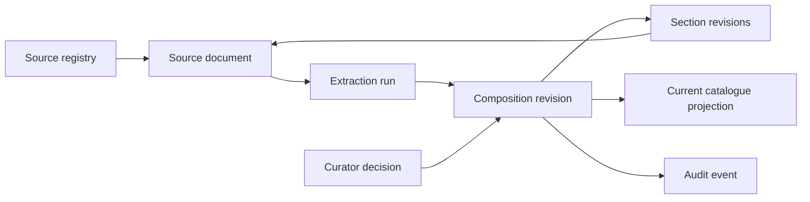

| Metadata | Value |
|:---|:---|
| **Status** | Active |
| **Version** | 1.0.0 |
| **Last Updated** | 2026-09-10 |
| **Author** | Sangeetha Grantha Team |
| **Document Type** | Current guide |

# Versioned canon and provenance

---

The current catalogue answers “what text do we publish now?” Versioned canon adds the history needed to answer “what text was accepted at a particular time, and where did each section come from?” Audit events and content revisions serve different purposes and are both retained.

## The stored model

| Table | Responsibility |
|:---|:---|
| `source_documents` | A retrieved source artifact, its registry entry, URL, format, checksum, and retrieval time |
| `extraction_queue` | A particular extraction attempt and its result; links to the source document |
| `krithi_revisions` | Revision envelope: composition, revision number, change kind, reason, attribution, and time |
| `krithi_section_revisions` | Section text and metadata attached to a revision, with section-level extraction/source attribution |
| Current `krithi_*` tables | Readable current-state projection used by existing catalogue/editorial APIs |
| `krithi_source_evidence` | Composition-level source evidence |
| `audit_log` | Actor/action/entity trail for mutations |

The actual DDL is [V44](../../database/migrations/V44__versioned_canon.sql). Earlier ADR sketches use illustrative fields; the migration and [RevisionRepository](../../modules/backend/dal/src/main/kotlin/com/sangita/grantha/backend/dal/repositories/RevisionRepository.kt) define storage and access behavior.

## Write and read responsibilities

The revision repository exposes append, snapshot, latest, history, and as-of provenance operations. Revision numbers advance within a composition. Accepted import/curator changes should capture revision content, current-state projection, and audit attribution within the controlled persistence path.

The model records transaction-time history: when a revision entered the system. It does not yet establish a separate scholarly valid-time timeline. A curator edit can be attributed to its user without claiming that newly written text came from an extraction. Source/extraction links remain meaningful evidence, not fields to fill with guesses.

The public catalogue serves current reader DTOs. A stored revision model does not imply a public revision-history endpoint or a complete history-browser UI; no such route is mounted in the current public catalogue.

## Correct source content through the pipeline

A parser repair should be followed by targeted re-extraction, reingestion/review, and verification of the resulting sections, variants, ordered raga junctions, and provenance. Editing corpus rows in a new Flyway migration bypasses that history and couples schema startup to a particular dataset.

[TRACK-139](../../conductor/tracks/TRACK-139-retire-corpus-data-fix-migrations.md) retired earlier corpus-fix migration files. Their old version numbers overlap with later legitimate schema migrations: always identify a migration by filename, description, and checksum, not the number alone. See [migration history handling](./migrations.md#5-rollback--history-tracking).

## Verification

For a representative accepted change, verify:

1. A new revision exists for the correct composition and has actor or extraction attribution.
2. Section snapshots contain the accepted text in order and retain the intended variant metadata.
3. An as-of read returns the intended earlier revision rather than current projection rows.
4. The current reader shows the accepted state; `krithi_ragas` and lyric-section joins are populated.
5. Audit and source evidence refer to the actual change.

Use [integration tests](../07-quality/integration-tests-approach.md) for isolated proofs and the [post-import checks](../07-quality/qa/test-plan.md) for a real import. The design rationale remains in [ADR-014](../02-architecture/decisions/ADR-014-versioned-canon.md).

---

[Section index](./README.md) · [Documentation home](./../README.md) · [Feature status](./../01-requirements/features/README.md)
