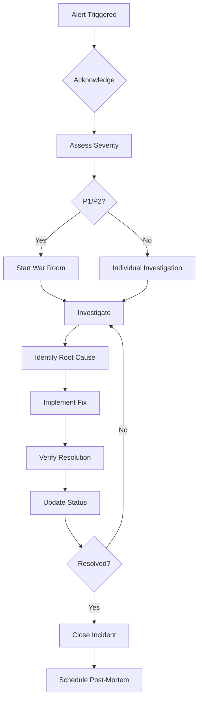

| Metadata | Value |
|:---|:---|
| **Status** | Active |
| **Version** | 1.0.0 |
| **Last Updated** | 2026-01-29 |
| **Author** | Sangeetha Grantha Team |

# Incident Response Runbook

This runbook provides procedures for responding to incidents affecting Sangita Grantha.

---

## 1. Severity Levels

### 1.1 Severity Definitions

| Severity | Name | Definition | Examples |
|----------|------|------------|----------|
| **P1** | Critical | Complete outage or data loss risk | Site down, database corruption, security breach |
| **P2** | High | Major feature unavailable | Search broken, admin console down, auth failures |
| **P3** | Medium | Degraded performance or minor feature broken | Slow responses, import failures, UI bugs |
| **P4** | Low | Minor issues, cosmetic problems | Typos, minor UI glitches, non-urgent bugs |

### 1.2 Response Times

| Severity | Acknowledge | First Update | Resolution Target |
|----------|-------------|--------------|-------------------|
| P1 | 15 min | 30 min | 4 hours |
| P2 | 1 hour | 2 hours | 8 hours |
| P3 | 4 hours | 8 hours | 48 hours |
| P4 | Next business day | 2 days | 1 week |

---

## 2. Incident Response Process

### 2.1 Response Flow



### 2.2 Phase 1: Detection & Acknowledgment

**When an alert fires:**

1. **Acknowledge immediately**
   ```bash
   # If using PagerDuty
   pd incident acknowledge --id <incident-id>

   # Or acknowledge in Slack
   # React with ✅ to the alert message
   ```

2. **Assess initial impact**
   - Check monitoring dashboards
   - Verify alert is not false positive
   - Determine affected users/services

3. **Assign severity level**
   - Use severity definitions above
   - When in doubt, escalate severity

### 2.3 Phase 2: Communication

**Internal Communication:**

```markdown
# Incident Notification Template

**Incident ID:** INC-YYYY-MM-DD-NNN
**Severity:** P1/P2/P3/P4
**Status:** Investigating / Identified / Mitigating / Resolved
**Start Time:** YYYY-MM-DD HH:MM UTC

**Impact:**
[Description of user-facing impact]

**Current Actions:**
[What is being done right now]

**Next Update:** HH:MM UTC
```

**External Communication (P1/P2):**
- Update status page
- Post to social media if needed
- Prepare customer communications

### 2.4 Phase 3: Investigation

**Gather Information:**

```bash
# Check service health
curl -s https://api.sangitagrantha.org/health | jq

# Check recent deployments
gcloud run revisions list --service=sangita-grantha-api-prod --limit=5

# Check error logs (last 30 minutes)
gcloud logging read "resource.type=cloud_run_revision \
  AND severity>=ERROR \
  AND timestamp>=\"$(date -u -d '30 minutes ago' +%Y-%m-%dT%H:%M:%SZ)\"" \
  --limit=100

# Check database health
gcloud sql instances describe sangita-grantha-prod

# Check metrics
gcloud monitoring dashboards list
```

**Common Investigation Paths:**

| Symptom | Check First | Then Check |
|---------|-------------|------------|
| Site down | Load balancer | Cloud Run health |
| Slow responses | Database connections | Query performance |
| Auth failures | JWT secrets | User service |
| Import failures | Source connectivity | Queue depth |
| Data issues | Recent migrations | Audit logs |

### 2.5 Phase 4: Mitigation

**Quick Mitigation Options:**

1. **Rollback deployment:**
   ```bash
   # List recent revisions
   gcloud run revisions list --service=sangita-grantha-api-prod

   # Rollback to previous version
   gcloud run services update-traffic sangita-grantha-api-prod \
     --to-revisions=<previous-revision>=100
   ```

2. **Scale up resources:**
   ```bash
   # Increase Cloud Run instances
   gcloud run services update sangita-grantha-api-prod \
     --min-instances=5 --max-instances=20
   ```

3. **Enable maintenance mode:**
   ```bash
   # Update Cloud Run env var
   gcloud run services update sangita-grantha-api-prod \
     --set-env-vars="MAINTENANCE_MODE=true"
   ```

4. **Database failover:**
   ```bash
   # Promote replica (if configured)
   gcloud sql instances failover sangita-grantha-prod
   ```

### 2.6 Phase 5: Resolution

1. **Verify fix:**
   - Run health checks
   - Verify user-facing functionality
   - Check error rates returning to normal

2. **Update communications:**
   - Update status page
   - Notify stakeholders
   - Post resolution notice

3. **Document:**
   - Record timeline
   - Note actions taken
   - Capture metrics

---

## 3. Common Incident Scenarios

### 3.1 Complete Site Outage (P1)

**Symptoms:** All endpoints returning errors, monitoring shows 0% availability

**Quick Diagnosis:**
```bash
# Check Cloud Run status
gcloud run services describe sangita-grantha-api-prod --region=us-central1

# Check load balancer
gcloud compute backend-services get-health sangita-grantha-backend

# Check Cloud SQL
gcloud sql instances describe sangita-grantha-prod
```

**Resolution Steps:**
1. Check if deployment in progress - wait or rollback
2. Check Cloud SQL connectivity
3. Check for resource exhaustion
4. Check for configuration changes
5. Escalate to GCP support if infrastructure issue

### 3.2 High Error Rate (P2)

**Symptoms:** Error rate > 5%, users reporting failures

**Quick Diagnosis:**
```bash
# Check recent errors
gcloud logging read "resource.type=cloud_run_revision AND severity=ERROR" \
  --limit=50 --format="table(timestamp,jsonPayload.message)"

# Check specific endpoint
curl -v https://api.sangitagrantha.org/v1/krithis/search
```

**Resolution Steps:**
1. Identify failing endpoints
2. Check for database connection issues
3. Check for external service failures
4. Review recent code changes
5. Rollback if deployment-related

### 3.3 Database Connection Issues (P2)

**Symptoms:** Intermittent failures, "connection refused" errors

**Quick Diagnosis:**
```bash
# Check connection count
gcloud sql instances describe sangita-grantha-prod \
  --format="value(settings.databaseFlags)"

# Check database logs
gcloud sql instances list-logs sangita-grantha-prod --limit=20
```

**Resolution Steps:**
1. Check connection pool settings
2. Verify VPC connector health
3. Check for connection leaks
4. Consider increasing max connections
5. Restart Cloud Run instances

### 3.4 Slow Performance (P3)

**Symptoms:** Response times > 2s, users complaining of slowness

**Quick Diagnosis:**
```bash
# Check latency metrics
gcloud monitoring metrics list --filter="metric.type:latency"

# Check slow query log
gcloud sql operations list --instance=sangita-grantha-prod --limit=10
```

**Resolution Steps:**
1. Identify slow endpoints
2. Check database query performance
3. Review recent code changes
4. Check for resource constraints
5. Consider scaling up

### 3.5 Security Incident (P1)

**Symptoms:** Unauthorized access detected, suspicious activity

**Immediate Actions:**
1. **Contain:** Revoke compromised credentials immediately
2. **Preserve:** Do not delete logs or evidence
3. **Escalate:** Notify security team and management
4. **Document:** Record all observations

```bash
# Revoke all access tokens (invalidate JWT secret)
gcloud secrets versions add jwt-secret-prod --data-file=new-secret.txt

# Force restart all instances
gcloud run services update sangita-grantha-api-prod \
  --set-env-vars="RESTART_TRIGGER=$(date +%s)"

# Check audit logs for suspicious activity
gcloud logging read "protoPayload.authenticationInfo.principalEmail:*" \
  --limit=100
```

---

## 4. Escalation Procedures

### 4.1 Escalation Matrix

| Severity | First Responder | Escalate To | Executive Notice |
|----------|-----------------|-------------|------------------|
| P1 | On-call engineer | Tech Lead + Team | CTO immediately |
| P2 | On-call engineer | Tech Lead | CTO if > 2 hours |
| P3 | Assigned engineer | Team Lead | Not required |
| P4 | Assigned engineer | Not required | Not required |

### 4.2 Contact Information

| Role | Contact | Hours |
|------|---------|-------|
| On-call Engineer | PagerDuty | 24/7 |
| Tech Lead | @tech-lead (Slack) | Business hours |
| CTO | @cto (Slack) | As needed |
| GCP Support | GCP Console | 24/7 (P1 only) |

### 4.3 When to Escalate

Escalate when:
- Incident exceeds resolution time target
- Root cause cannot be identified
- Fix requires changes beyond your access
- Customer impact is spreading
- You need additional expertise

---

## 5. Post-Mortem Process

### 5.1 Post-Mortem Template

```markdown
# Post-Mortem: [Incident Title]

**Date:** YYYY-MM-DD
**Severity:** P1/P2/P3
**Duration:** X hours Y minutes
**Author:** [Name]
**Participants:** [Names]

## Summary
[1-2 sentence summary of what happened]

## Impact
- Users affected: [number/percentage]
- Features affected: [list]
- Duration: [time]
- Revenue impact: [if applicable]

## Timeline (UTC)
| Time | Event |
|------|-------|
| HH:MM | [Event description] |

## Root Cause
[Detailed explanation of what caused the incident]

## Resolution
[What was done to fix the issue]

## What Went Well
- [Item 1]
- [Item 2]

## What Went Poorly
- [Item 1]
- [Item 2]

## Action Items
| Action | Owner | Due Date | Status |
|--------|-------|----------|--------|
| [Action] | [Name] | [Date] | Open |

## Lessons Learned
[Key takeaways]

## Prevention
[How we prevent this from happening again]
```

### 5.2 Post-Mortem Guidelines

- **Blameless:** Focus on systems, not individuals
- **Timely:** Complete within 5 business days
- **Actionable:** Every finding should have an action item
- **Shared:** Publish to team for learning

### 5.3 Post-Mortem Meeting

**Agenda:**
1. Review timeline (10 min)
2. Identify root cause (15 min)
3. Discuss what went well/poorly (15 min)
4. Define action items (15 min)
5. Finalize document (5 min)

---

## 6. Tools & Resources

### 6.1 Monitoring Links

| Tool | URL | Purpose |
|------|-----|---------|
| Cloud Monitoring | console.cloud.google.com/monitoring | Metrics & Alerts |
| Cloud Logging | console.cloud.google.com/logs | Log analysis |
| Cloud Run | console.cloud.google.com/run | Service status |
| Cloud SQL | console.cloud.google.com/sql | Database status |

### 6.2 Useful Commands

```bash
# Quick health check
curl -s https://api.sangitagrantha.org/health | jq

# Check all Cloud Run services
gcloud run services list

# View active alerts
gcloud alpha monitoring policies list

# Check recent errors (last hour)
gcloud logging read "severity>=ERROR AND timestamp>=\"$(date -u -d '1 hour ago' +%Y-%m-%dT%H:%M:%SZ)\""

# Check deployment history
gcloud run revisions list --service=sangita-grantha-api-prod
```

---

## 7. Related Documents

- [Monitoring](../monitoring.md)
- [Deployment Guide](../deployment.md)
- [Database Runbook](./database-runbook.md)
- [Steel Thread Runbook](./steel-thread-runbook.md)
- [Troubleshooting](../../00-onboarding/troubleshooting.md)
