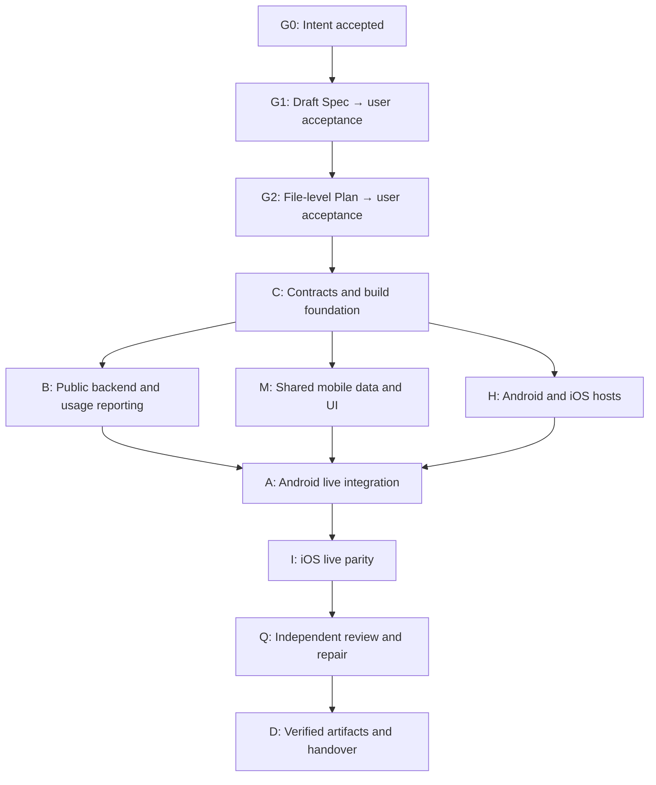

| Metadata | Value |
|:---|:---|
| **Status** | Ready to use — Plan acceptance remains |
| **Version** | 1.1.0 |
| **Last Updated** | 2026-09-10 |
| **Author** | Codex, for Seshadri |
| **Document Type** | Current guide |
| **Track** | TRACK-138 |

# Track 138: Agentic build guide

---

## Purpose and current state

Use one coordinating agent, a dependency graph and bounded specialist assignments to deliver the Rasika mobile MVP through implementation, runtime verification, review and repair. Seshadri confirmed that “Graph Capabilities” means **a build dependency graph and coordinated agents**. This does not introduce LangGraph, a knowledge graph, an LLM service or conversational UI into the app.

The [Track 138 Intent](../../conductor/tracks/TRACK-138-rasika-mobile-app.md) and [analysis decision recommendations](../01-requirements/mobile/rasika-mvp-analysis.md) are accepted. Seshadri accepted the Spec on 2026-09-05 after its independent musicological design review. A concrete file-level Draft Plan is now ready for acceptance in the track. This guide is an execution protocol and kickoff prompt, not approval of an unseen Plan. The track holds authoritative requirements, acceptance records and execution state.

The current task already has callable subagent tools; one bounded domain reviewer was used while preparing the Spec. No plugin installation, global configuration change, separate Codex task or scheduled automation is needed for this setup. The implementation loop has not been launched. A prompt coordinates available tools during execution; it cannot guarantee unattended continuation across exhausted usage limits, closed sessions, unavailable tools or outstanding human gates.

## How the graph works

The graph expresses prerequisites and verification gates. It is not a list of agents that all run simultaneously. The coordinator has converted these coarse nodes into the Draft Plan with exact files, commands, risks and requirements coverage. Once that Plan is accepted, the coordinator schedules ready nodes and updates the track's ledger.



Each implementation node has its own inner loop: **inspect → implement → run focused checks → review evidence → repair → verify**. A downstream node can rely on a dependency only after that dependency's contract and proof are verified. Independent local work can continue while another node waits for an external prerequisite. Final Android behavioral proof precedes iOS parity proof; iOS host scaffolding and compilation can proceed earlier.

| Node | Intended output | Exit condition to refine in the accepted Plan |
|:---|:---|:---|
| C | Public DTO/OpenAPI agreement; module boundaries; minimal host compatibility proof | Shared types compile; API semantics and fixture shapes agree; actual Android/iOS toolchain tasks and deployment target recorded |
| B | Published-only catalogue endpoints, legacy-public-route correction, authorized admin compatibility, search correctness, usage report | Backend/auth/pagination/domain tests pass; meaningful request/session report produced; affected admin flow verified |
| M | Typed mobile client, cancellation/state, local bookmarks/preferences, Search/Browse/Reader UI | Shared tests prove stale-result rejection, error handling and storage limits; UI uses agreed contracts and stored content |
| H | Android and iOS hosts, environment-specific networking and platform integrations | Both hosts build and launch; debug connection settings work; release settings do not permit broad cleartext access |
| A | Real Android journeys against development API | APK installed; representative search/browse/reader/script/variant/favourite/restart/fault flows exercised; traces and artifact paths saved |
| I | Equivalent iOS journeys | Simulator host launched and core journeys exercised against the API; exact project, scheme, destination and evidence recorded |
| Q | Independent Bugs, Security and Compliance review plus focused musicological checks | Important findings resolved and affected checks rerun; remaining limitations explicitly assessed against R1–R12 |
| D | Reproducible developer handover | Both platform artifacts/run instructions, requirement evidence and honest limitations available; no required MVP work outstanding |

Mocks and fixtures enable early work in M while B is in progress. They do not satisfy A or I. A source file existing, a reviewer's “looks good,” or a shared framework compiling is insufficient evidence of a working mobile application.

## Agent roles and ownership

Use a maximum of **one coordinator and three active specialists** in this environment, or fewer if the available limit is lower. Inherit the task's configured model unless the user specifies otherwise. Parallelize concrete independent work, not exploration of the same files.

| Role | Bounded responsibilities | Typical write ownership after Plan acceptance |
|:---|:---|:---|
| Coordinator | Gates, contracts, graph scheduling, integration, evidence, final delivery | Track/docs, public DTOs, OpenAPI, root Gradle/settings/version catalogue, cross-module interfaces and CI |
| Backend specialist | Catalogue routes/services/DAL, publication boundary, query correctness and measurement | Assigned backend files and tests; admin-client files only when explicitly allocated |
| Mobile specialist | Shared client/state, bookmarks/preferences and common Compose experience | Assigned `modules/shared/mobile-data` and `modules/shared/presentation` files |
| Platform specialist | Native hosts, platform storage/network adapters and device build support | Assigned `modules/mobile/androidApp` and `modules/mobile/iosApp` files |
| Reviewer, using a freed slot | Independent diff review or a bounded domain review | Read-only findings; coordinator assigns repairs to the relevant owner |

These directories describe proposed ownership, not permission to edit every file below them. The formal Plan must allocate concrete interfaces and files, including who owns platform-specific sources inside shared modules. Keep all shared contract/build files under a single writer. Migrations, if justified by the accepted Plan, receive one assigned owner and a coordinator-allocated migration number. Do not let separate agents race to change DTOs, version pins or build configuration.

Default to the current checkout with disjoint file ownership. Preserve pre-existing changes, including Track 108 work and unrelated untracked files. Do not move tasks or create sidebar tasks for each graph node. Isolated worktrees are an option if actual file overlap warrants them and the current state can be preserved, not a prerequisite for this guide.

Only the coordinator starts/stops the shared stack, applies approved local migrations or runs shared emulator/simulator integration sequences. Serialize overlapping Gradle/Xcode builds and shared test resources where they contend. Tests that use isolated Testcontainers can be scheduled separately when resources allow. Coalesce backend/shared edits before the required restart; never claim live verification against a stale running binary.

## Assignment and evidence contract

Every specialist receives a small, self-contained assignment:

```text
Node / objective:
Accepted Spec requirements covered:
Dependencies and their verified outputs:
Read first: applicable rules, layer skill, contracts and exact relevant files.
Write ownership: explicit paths; no changes outside these without coordinator reassignment.
Deliverable: observable behavior and interface that downstream work consumes.
Proof: focused commands and scenarios; distinguish unit/fixture proof from live proof.
Constraints: accepted product scope, public visibility and domain integrity requirements.
Return: changed files, commands/outcomes, evidence paths, findings, blockers and next action.
Do not commit, deploy, change scope, accept gates or edit the coordinator's ledger.
```

Require enough context for independent work; do not ask a child to rediscover the whole repository. Agents report contradictions before implementing guessed contract changes. The coordinator resolves routine design details within the accepted Spec/Plan and records them. Material scope changes return to the applicable acceptance gate; minor file-order or implementation refinements are documented without re-asking accepted product preferences.

The track ledger uses `Pending`, `Ready`, `Running`, `Verify`, `Done` and `Blocked`. A node becomes Ready only when dependencies and required approvals are satisfied; Done requires the declared evidence. For each active node, record owner, exact write set, latest outcome and next step in the track. For each completed node, append concise command results and artifact/log references. Keep the evidence in an implementation report linked from the track once product work begins; do not maintain conflicting status copies across agents.

When resuming, inspect the actual diff and artifacts, then reconcile them with the ledger. Revalidate only what changed or what lacks reliable evidence. Never infer a passed build from an old summary. Treat usage/runtime exhaustion as an interrupted run: leave a checkpoint and resume the same graph, without resetting accepted decisions or pretending completion.

## Verification and repair policy

Read [CLAUDE.md](../../CLAUDE.md), the applicable layer skills and [REVIEW.md](../../REVIEW.md) at the relevant phase. Follow the existing test-edit opt-in for deliberate test additions/changes; do not disable hooks or weaken tests. Keep proof proportional to behavior, with particular coverage for public visibility, raga identity, paging, cancellation and minimal storage.

The formal Plan must establish a requirements-to-evidence matrix for R1–R12. Use these checkpoints:

1. **Contract and backend:** `make test`, `make test-integration`, the required backend build, and focused API checks. Exercise drafts through old and new public routes, variant ownership, invalid/non-admin/admin access, exact raga filters, secondary membership, stable ordering and counts. New migrations use Flyway; do not reset or auto-publish the development corpus to create demo data.
2. **Shared mobile:** discover actual Gradle tasks from the implemented modules and run meaningful client/state/storage tests. Check cancellation and late responses, same-script source variants, absent content, bookmark persistence and no disk catalogue/lyric cache. Fixture-based cases supplement live corpus limitations.
3. **Android then iOS:** discover real assembly and Xcode commands. Record installed/launched artifacts, backend URL selection without secrets, representative interactions and screen/network evidence. Test search, Raga/Composer filtering, scripts/readings, back navigation, text size, favourites after restart and connection failure. A screenshot alone does not establish the interaction worked.
4. **Actual traffic:** show request attempts separately from successful logical searches/views and approximate sessions. Test retries, pagination, session expiry and recomposition. Sessions are not unique people; analytics must not fabricate hits or block catalogue reads. Document retention and separation of development traffic.
5. **Affected existing surfaces:** if admin routing changes, run `make test-frontend`, its production build and the affected browser journey. Follow the backend/shared restart skill before live verification. Run `make check-docs`; if agent configuration is changed, also `make agent-evals`.
6. **Independent review:** a reviewer who did not author the relevant change applies Bugs, Security and Compliance passes from REVIEW.md. Check the musicological contract for ambiguous raga names, repeated membership, source reading identity and evidence-based completeness. Assign important repairs to owners and rerun affected proof before declaring Done.

After a failure, capture the relevant error, form a specific hypothesis, make the smallest justified repair and rerun the affected check. Do not repeat the same command unchanged indefinitely or broaden testing after success without a reason. After repeated failure with no new evidence, inspect a different diagnostic surface or request the missing external input. Continue unrelated ready nodes while a bounded blocker remains. Tool permissions, unavailable simulators, network/package access or missing published data must be reported precisely; none makes an unverified target complete.

## Ready-to-paste kickoff and resume prompt

Paste the following into this repository's task. It is intentionally aware of acceptance gates so it works both now and after the Plan is accepted.

```text
Coordinate Track 138, the Rasika mobile MVP, using the execution protocol in
application_documentation/09-ai/track-138-agentic-build-guide.md.

Read AGENTS.md, .agents/AGENTS.md, CLAUDE.md, CODEX.md, REVIEW.md,
conductor/tracks/TRACK-138-rasika-mobile-app.md, and
application_documentation/01-requirements/mobile/rasika-mvp-analysis.md.
Inspect the current working tree and preserve all existing work. Load the
applicable layer skills before assigning or editing a layer.

Treat the recorded Intent and product decisions as accepted. I selected a build
dependency graph and coordinated agents, not LangGraph or runtime AI. Use the
track as the sole source of truth for acceptance and execution state.

Honor the repository's Intent -> Spec -> Plan gates. If Spec is not accepted,
present the completed Draft Spec for my acceptance and stop at that gate.
If Spec is accepted but Plan is not, prepare the exact file-level Plan with
dependencies, owners, risks, proof commands and R1-R12 evidence mapping, then
present it for acceptance. Do not self-approve either gate. Once both are
accepted, carry the implementation through to the verified working MVP without
repeated permission questions for ordinary implementation, fixes or local checks.

Act as coordinator. Use available subagents for bounded independent backend,
shared mobile and platform work, with at most three active specialists in
addition to yourself, subject to the runtime limit. Inherit the configured
model. Keep shared DTOs, OpenAPI, root build configuration, migration allocation,
CI and track state under one owner. Give each assignment its accepted
requirements, dependencies, exact write set and proof obligations. Avoid
overlapping writers. Reuse a freed slot for an independent reviewer. If subagent
tools are unavailable, execute the same graph sequentially and report that fact.

Follow the guide's graph: acceptance gates -> contracts/build foundation ->
parallel backend, shared app and native hosts -> live Android validation ->
live iOS parity -> independent review/repair -> delivery. Update the track ledger
after meaningful transitions. Use implement -> verify -> review -> repair loops.
Do not unlock dependencies on an unverified assertion. Keep progressing on ready
independent work when another node has a genuine external blocker.

Deliver the accepted KMP/Compose Android and iPhone app: conventional Kriti and
Raga search, Raga/Composer browsing and filtered Kritis, stored-script/reading
reader, local favourites and preferences, and usable loading/error/empty states.
Android is validated first. Searches/browsing/detail openings reach the server.
Persist only small bookmark identifiers/labels/bookkeeping and preferences;
do not download or persist the catalogue or lyrics. Do not generate artificial
traffic. Distinguish API attempts, logical searches/views and approximate
anonymous sessions in server-side reporting.

Enforce publication and authorization on both new and existing public surfaces;
preserve explicitly authorized curator workflows. Preserve raga UUID identity,
ordered repeated ragamalika membership, musical form, source variants and exact
stored text. No generated translations, missing sections or inferred authority.
Do not add login, semantic/conversational search, recommendation feeds, full
offline data or a new AI/analytics provider to the MVP.

Use repository-native build tooling and current version pins, with only justified
compatibility changes. Follow Flyway, dbQuery, audit, test-edit and restart rules.
Never read secrets, reset or auto-publish the catalogue, weaken failing tests,
commit/push, deploy or submit to stores without the applicable authorization.
Serialize shared stack and device operations. Runtime verification must use the
current binary and real API, not only mock responses.

Run required checks and fix important failures. Ask only for missing information,
material scope changes, explicit workflow gates or unavoidable external access.
If a target cannot be verified, record the exact blocker, evidence and smallest
next action; do not claim the MVP complete. On interruption, leave a durable
checkpoint with node states, owners, changed files, proof and next actions.

Finish with the Android debug APK path, iOS project/scheme and simulator run
instructions, actual command outcomes, live-flow evidence for both platforms,
the R1-R12 evidence matrix, usage-report sample and remaining limitations.
Keep production hosting, physical signing and store distribution distinct from
the local engineering milestone. Mark the track complete only when its accepted
MVP requirements are met and no required work remains.
```

For a later interrupted run, reuse this prompt and add: “Resume from Track 138's ledger; inspect current evidence before repeating work.” No new track is necessary.

## Handover and acceptance boundary

The finished engineering milestone is a working Android debug build plus a runnable iOS simulator application using the real backend, with reproducible commands and evidence. The coordinator reports build versus runtime outcomes separately and states any corpus coverage limitations. Signed iPhone distribution, hosted deployment and store publication require their own readiness and authorization; a simulator pass does not imply them.

The next action is acceptance of the concrete Draft Plan in Track 138; Intent and Spec are already accepted. The repository's [plan-from-spec command](../../.claude/commands/plan-from-spec.md) explicitly requires Plan acceptance before product code changes. The kickoff prompt checks the recorded state, skips already satisfied gates and supports sustained implementation once the Plan is accepted.

## Change record

- **2026-09-05 — TRACK-138:** Recorded the user-confirmed build-graph interpretation; prepared the coordination protocol, ownership model, verification loop and kickoff/resume prompt. Required musicological Spec review completed and incorporated in the track. No app implementation or scheduled agent loop started.

- **2026-09-05 — TRACK-138:** Spec acceptance recorded; concrete Draft Plan prepared in the track after read-only backend/mobile specialist inspection. Plan acceptance is the remaining implementation gate.

---

[Section index](./README.md) · [Documentation home](./../README.md) · [Feature status](./../01-requirements/features/README.md)
