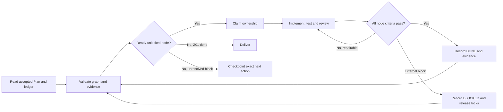

| Metadata | Value |
|:---|:---|
| **Status** | Active — TRACK-140 Plan accepted |
| **Version** | 1.1.0 |
| **Last Updated** | 2026-09-10 |
| **Author** | Sangeetha Grantha Team |
| **Document Type** | Current guide |

# TRACK-140: dependency graph and execution loop

---

[TRACK-140](../../conductor/tracks/TRACK-140-rasika-discovery-experience.md) owns the accepted Intent, accepted Spec, accepted Plan, requirements, work packages and execution ledger. Its [JSON graph](../../conductor/tracks/TRACK-140-execution-graph.json) owns node IDs/dependencies. This guide explains how to execute those work packages reliably, sequentially or with explicitly authorized parallel agents. It does not launch work, schedule future runs or add agent orchestration to the mobile application.

## Entry and completion conditions

Start product changes only when the track's Plan is Accepted. This is the explicit gate in [plan-from-spec](../../.claude/commands/plan-from-spec.md): “Do not edit product code until they set Plan Status to Accepted.” Seshadri accepted the Plan and authorized implementation on 2026-09-09; this entry gate is satisfied.

After Plan acceptance, continue through ready nodes without seeking permission again for routine, reversible implementation, tests or repairs within the accepted scope. New corpus curation, remote deployment, store submission and messages to other people are outside this graph. A material change to accepted product behaviour returns to Spec/Plan review; a file-path or implementation detail adjustment is recorded in the Plan with its dependency impact.

Completion is Z01 DONE with GA, GB, GC and Q01 DONE on current evidence. Compile-only iOS CI, isolated fixture passes, an illustrative screenshot, or a completed release A cannot satisfy the full track. Report unavailable corpus coverage separately; do not use it to claim unperformed native journeys passed. TRACK-138 retains its own ledger and status.

## Outer loop: schedule verified dependencies

The graph is a DAG. **Repair is a state transition within the scheduler, not a circular dependency edge.** The coordinator repeatedly chooses ready nodes, runs their inner loop, checkpoints evidence and recalculates readiness. Gate repairs can reopen an upstream node and invalidate downstream proof without adding graph cycles.



Scheduler pseudocode is a protocol, not an installed automation:

```text
require Intent == Accepted and Spec == Accepted and Plan == Accepted
validate graph, documentation mirrors, and current working-tree ownership
reconcile ledger with files, live workers, and evidence fingerprints
while Z01 is not DONE:
    invalidate DONE evidence whose relevant inputs changed
    ready = pending_or_stale_or_unblocked_nodes_with_all_dependencies_DONE()
    ready = filter_to_available_owners_and_nonconflicting_resource_locks(ready)
    if ready is empty:
        if a claimed node is still running: wait for its next bounded checkpoint
        else: report the smallest unresolved blocker and durable resume action; stop run
    else:
        claim the earliest ready node on the release-critical path
        run inner loop, then update this track's ledger and progress log
        continue independent ready work when another node is blocked
require all mandatory gates DONE with current integrated-candidate evidence
publish the final local evidence report and artifact locations
```

Do not wait on every possible parallel node to start the next one. For example, S01 unlocks B01 and D01; a verified D01 can unlock U01 while B01 is running. GA still requires B01, U02, U03 and N01. Later releases intentionally wait for the preceding release gate, limiting the amount of unintegrated work.

P01 is a readiness inventory, so its Done record may include an explicitly identified baseline/environment failure with a downstream owner. It does not certify that failed check passed. Implementation nodes and gates cannot use this exception: a missing check required by their Done criteria keeps them blocked. If a failure means even contracts or source assumptions cannot be assessed, P01 itself remains blocked.

## Inner loop: implement, verify, review, repair

1. **Inspect.** Read the node's requirements, M amendments, file set, dependency artifacts and baseline. Recheck current source instead of assuming a previous session's paths or tool versions remain correct. Load only relevant layer skills. Establish an exact small vertical outcome for the attempt.
2. **Claim.** Record owner, attempt number, relevant input fingerprint and resources before editing. Name intended files, including tests. In a shared checkout, claim files rather than assuming a branch isolates work. Never overwrite another agent's or the user's edits.
3. **Implement.** Keep changes inside the node boundary; add boundary tests listed in the Plan with the repository's test-edit opt-in. Do not reset user data, mutate the corpus, weaken a failing assertion or conceal a dependency change.
4. **Verify.** Run the node's focused checks, recording command, exit status and evidence. Once focused checks pass, run the required module/integration checks. Reuse passing proof only if its input fingerprint and environment still match. Missing tools or blocked package access are blockers, not passes.
5. **Review.** Apply the three passes in [REVIEW.md](../../REVIEW.md): Bugs, Security and Compliance, including musical meaning. A separate reviewer can be used if parallel agents are authorized; otherwise perform an explicit second pass over the complete diff and evidence. Distinguish reviewed code from observed runtime behaviour.
6. **Repair.** Assign findings to the owning node; fix root causes; rerun the affected proof and dependent gate. A contract/schema correction invalidates all consuming proof. Do not make competing fixes to shared files from multiple lanes.
7. **Checkpoint.** Mark Done only after all criteria pass on the current inputs. Write an evidence record, summary of relevant changes, residual content limitations and next ready node. Release file/build/runtime locks. No automatic git commit is implied.

After two attempts with the same failure signature, pause that local repair loop and diagnose the assumption/tooling/dependency rather than repeating the same command. A third unchanged failure without a new actionable hypothesis becomes BLOCKED with the exact external need or architectural decision. This is an execution safeguard, not permission to drop the requirement. Continue other ready work. New evidence or an environment change permits a recorded new attempt.

## Node states and invalidation

| State | Meaning / legal next step |
|:---|:---|
| PENDING | Not claimed. Coordinator derives READY only after dependencies are DONE and current. |
| READY | Dependencies and resources permit a claim; can become RUNNING. |
| RUNNING | One named owner has the file/resource claim; next VERIFY or BLOCKED. |
| VERIFY | Implementation candidate exists; focused checks and review underway; next DONE, REPAIR or BLOCKED. |
| REPAIR | A named finding requires another implementation attempt; next RUNNING. |
| DONE | All node criteria pass with recorded current inputs; can become STALE after relevant change. |
| STALE | Prior result exists but its proof inputs changed; recertify via READY/RUNNING/VERIFY after prerequisites recover. |
| BLOCKED | Exact unmet dependency/environment/decision recorded; move to READY only when it is resolved and prerequisites remain current. |

Changes to shared enums, public wire semantics, migrations, publication predicates or storage schema make affected consumers and every downstream release gate STALE. A screen-only repair invalidates its own tests and consuming native/visual/performance proof; it need not rerun unrelated worker lint. A docs-only edit does not invalidate native binaries unless it changes a requirement or contract. Record the affected dependency closure and reasoning.

Fingerprints include relevant tracked **and untracked** inputs, baseline revision, dependency output hashes, fixture/schema versions and tool/runtime profile. Git HEAD alone is insufficient for an uncommitted workspace. At gates, fingerprint the integrated product tree and artifact binaries; do not run a gate against a mixture of pre-repair and post-repair binaries. Evidence stays useful even when a local gitignored log disappears, but a claimed proof must be backed by retained artifacts or reproduced.

## Ownership and shared-resource rules

One coordinator owns the ledger, integration and shared locks. Parallel agents are optional and require authorization from the user or applicable instructions; this guide does not dispatch them. If enabled, use at most three bounded implementation/review lanes alongside the coordinator, matching available capacity. Otherwise run the same ready-node selection with one owner.

| Resource | Rule |
|:---|:---|
| OpenAPI, domain DTOs/enums, canonical extraction schema | Contract owner exclusively; consumers request a change with a concrete payload example and impact. Update both OpenAPI copies together. |
| Flyway versions and migration directory | Coordinator allocates unused versions after re-reading current migrations. One schema writer. No edit to applied migrations. |
| `RasikaApp.kt`, destination routes, DI, shared copy/theme/components | Shell owner integrates agreed screen interfaces. Reader/Explore workers stay in their screen files. |
| Build files, version catalogue, CI, native project/schemes | Native/coordinator owner. N01 can work alongside feature nodes but not edit their presentation or storage files. |
| Gradle/Kotlin compiler and Xcode builds | One heavy build invocation at a time in this checkout; Xcode's Gradle invocation also holds that lock. Source work can continue in disjoint files, but no inputs may change during a proof run. |
| Local stack, Flyway, device installation and benchmark session | Coordinator only; one known server/schema/binary set. Do not stop another lane's server or migrate underneath its test. |
| Isolated integration database | Test harness owns lifecycle and fixture data; never point it at the user's database. |
| Curator live workflow verification | Coordinator/reviewer uses disposable test data/environment. Creating/publishing test features must not publish or alter real compositions. |

Candidate release order for M2 is: code/contract/producer readiness → isolated migration and V1/V2 compatibility proof → stop old local processes → apply additive Flyway migrations → start compatible backend/worker/Curator Console → verify health/build identity → install new V2 mobile client. Remote rollout is excluded. An incompatible old server must not resume after the new default is active. Recovery uses a compatible forward fix; no database reset or automatic relabelling.

## Evidence and durable checkpoints

The track ledger holds state; the implementation report holds readable evidence; logs and binaries may live under `build/track-140/<run-id>/<node-id>/`. No second status database is required. Record exact paths when produced, not placeholders presented as existing artifacts.

Use this record at every completed attempt, with a compact pointer in the ledger:

```text
Node / attempt / owner:
State and UTC timestamp:
Accepted Plan version and graph version:
Input fingerprint (baseline revision + relevant file hashes, including new files):
Dependency output fingerprints:
Changed files and requirement/amendment IDs:
Checks: exact command, working directory, exit code, concise result, log path:
Runtime: device name/ID/OS, backend build/schema identity, fixture or live corpus:
Artifact hashes and screenshot/video/journey paths:
Review: findings, fixes, unresolved issues and reviewer:
Invalidated downstream nodes and reason:
Blocker, if any: observed error, owner, action that unblocks it:
Next ready node or exact resume action:
```

Do not export credentials, raw user queries, personal library contents or lyrics in telemetry traces. Boundary fixtures can contain explicitly synthetic text. The committed report summarizes runtime evidence and links retained local artifacts; keep enough command/output detail that another session can reproduce the result without relying on conversational memory.

At each release gate, record:

- The integrated candidate identity, compatible database history and installed binary hashes.
- Relevant automated checks, with failures and skips explicit.
- Both platform journeys, System/Light/Dark persistence, accessibility and RG140-WARM-1 samples.
- The difference between fixture proof and live catalogue coverage, including remaining curator-owned assessment needs.
- Review findings with disposition and the current R/M proof map.

## Resume after interruption

Read the accepted track and graph, then inspect working-tree changes and the ledger. Find the last valid dependency frontier; do not restart the track or trust a stale `RUNNING` label. Check whether its owner/process still exists before reclaiming locks. Do not launch duplicate work while an existing owner is still active.

For an interrupted write/test, inspect the partial diff and artifact logs. If no successful completion/exit record exists, treat verification as unfinished. Retain valid work; finish the narrow step and rerun only affected checks. Reinstall/restart when the actual device/server binary does not match the recorded candidate. Any corpus or requirement change must be surfaced explicitly, not silently folded into fixtures or scope.

Recompute readiness after every accepted contract repair and completed gate. If all remaining nodes depend on unavailable native runtime or another external blocker, report exactly what is done, what is blocked and how to resume. Do not label the track complete or arrange background retries unless separately requested.

## Graph validation

The following read-only command validates unique IDs, dependency existence, acyclicity, dependency parity with the work-package table and Mermaid, ledger membership, and that final handover includes every node in its dependency ancestry. Run it when the graph changes, alongside `make check-docs` and `git diff --check`.

```bash
python3 - <<'PY'
import json
import re
from pathlib import Path

root = Path.cwd()
graph = json.loads((root / 'conductor/tracks/TRACK-140-execution-graph.json').read_text())
track = (root / graph['track']).read_text()
plan = track.split('## Plan\n', 1)[1].split('## Progress Log', 1)[0]
nodes = graph['nodes']
ids = [n['id'] for n in nodes]
assert len(ids) == len(set(ids)), 'Duplicate node ID'
deps = {n['id']: set(n['dependsOn']) for n in nodes}
for n in nodes:
    assert len(n['dependsOn']) == len(set(n['dependsOn'])), n['id']
    assert deps[n['id']] <= set(ids), ('Missing prerequisite', n['id'])
remaining, order = set(ids), []
while remaining:
    ready = sorted(n for n in remaining if deps[n] <= set(order))
    assert ready, ('Dependency cycle', remaining)
    order.extend(ready)
    remaining.difference_update(ready)
work = plan.split('### Work packages, ownership and completion criteria', 1)[1]
work = work.split('### Editorial route and transaction decisions', 1)[0]
rows = re.findall(r'^\| ([A-Z]\d{2}|G[ABC]) \| ([^|]+) \|', work, re.M)
assert len(rows) == len(ids), ('Work-package row count', len(rows))
assert {n: set() if d.strip() == '—' else set(d.strip().split(', ')) for n, d in rows} == deps
mermaid = plan.split('```mermaid\n', 1)[1].split('```', 1)[0]
edges = set(re.findall(r'^\s*([A-Z][A-Z0-9]*)(?:\[.*?\])? --> ([A-Z][A-Z0-9]*)', mermaid, re.M))
assert edges == {(d, n) for n in ids for d in deps[n]}, 'Mermaid drift'
ledger = plan.split('### Execution ledger', 1)[1]
ledger_ids = re.findall(r'^\| ([A-Z][A-Z0-9]*) \|', ledger, re.M)
assert len(ledger_ids) == len(ids) and set(ledger_ids) == set(ids), 'Ledger drift'
ancestors, stack = set(), ['Z01']
while stack:
    node = stack.pop()
    if node not in ancestors:
        ancestors.add(node)
        stack.extend(deps[node])
assert ancestors == set(ids), 'A node is outside final handover dependencies'
print(f'PASS: {len(ids)} nodes; DAG, table, Mermaid, ledger and handover ancestry agree')
print('One valid order:', ' → '.join(order))
PY
```

## Kickoff prompt after Plan acceptance

```text
Implement the accepted TRACK-140 Plan using its JSON dependency graph and
track-140-agentic-build-guide.md. Confirm Intent, Spec and Plan are Accepted.
Read the repository rules and current diff, then start P01 and proceed through
ready nodes. Keep the track ledger current. Use the implement → verify → review
→ repair loop, dependency invalidation and shared-resource locks. Run sequentially
unless parallel agents have been explicitly authorized. Preserve user changes.
Do not stop after release A: A, B and C plus final review/handover are required.
Do not mutate the real corpus, deploy, submit to stores or close TRACK-138.
Report current evidence and exact blockers without converting missing proof
into completion.
```

## Resume prompt

```text
Resume TRACK-140 from its execution ledger. Reconcile running owners, current
files, graph dependencies and evidence fingerprints. Preserve completed work;
mark only affected proof stale. Continue the next ready node through its test,
review and repair loop. Rebuild/restart only when the tested candidate changed.
If blocked, continue independent ready work and checkpoint the exact remaining
external need. Keep all three release gates and R01–R18/M1–M9 in scope.
```

## Change record

- **2026-09-09:** Prepared with the TRACK-140 Draft Plan after Seshadri accepted its detailed Spec. No implementation loop has started. The graph is development structure, and this guide is reviewable execution guidance.

---

[Section index](./README.md) · [Documentation home](./../README.md) · [Feature status](./../01-requirements/features/README.md)
