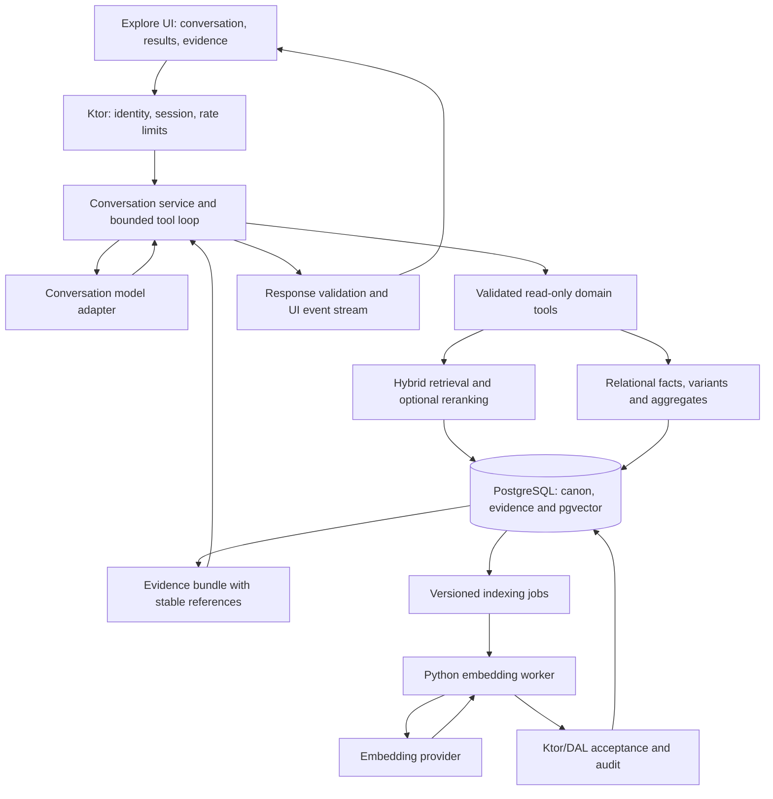

| Metadata | Value |
|:---|:---|
| **Status** | Draft — scope and architecture recommendation |
| **Version** | 1.0.0 |
| **Last Updated** | 2026-09-05 |
| **Author** | Codex, for Seshadri |
| **Related track** | [TRACK-108: Semantic Search](../../conductor/tracks/TRACK-108-semantic-search.md) |
| **Evidence basis** | Working-tree code and documentation; official provider documentation accessed 2026-09-05 |

# Track 108 — Conversational Carnatic Music Discovery

---

## 1. Recommendation

Build a conversational discovery experience for the discerning rasika, with semantic search as its retrieval foundation. The product should let a person find a composition from imperfect recollection, explore its sahitya, compare documented readings, follow connections between composers, ragas and kshetras, and examine the evidence behind an answer.

The present Track 108 is a useful infrastructure slice, but its explicit exclusion of generative answers means that completing it unchanged will not deliver the requested experience. Expand its retrieval requirements now, and specify a companion conversational delivery stream. Treat the first release as complete only when a user can ask a question, refine it naturally, open an actual catalogue record, and inspect supporting text.

Preserve PostgreSQL, Ktor, the Python worker, and React. Add a bounded conversation service and typed domain tools. A separate vector database, graph database, autonomous multi-agent system, and whole-catalogue fine-tune are unnecessary starting dependencies.

The distinguishing value is the application's curated corpus and provenance. The assistant should make those assets accessible, including their disagreements and gaps. A fluent answer without a retrievable basis is insufficient for this audience.

**Recommended release order:** hybrid discovery → conversational exploration with citations → comparative study and collections → voice and document input → separately evaluated performance-audio research.

This document is an analysis and proposed implementation direction. It does not mark the track's Spec or Plan Accepted and does not change application behavior.

## 2. What was evaluated and what remains unmeasured

Reviewed the [original track](../../conductor/tracks/TRACK-108-semantic-search.md), [July preparation analysis](./track-119-track-108-prep-approach.md), [track registry](../../conductor/tracks.md), migrations, search repository and routes, AI client configuration, domain DTOs, revision/provenance code, raga identity implementation, and React route structure.

Official documentation establishes currently documented provider capabilities, not their accuracy on this corpus or availability in this application's provider account. No paid model experiments, live database queries, production penetration tests, or browser usability tests were performed for this report. Proposed quality, latency, cost and schedule figures below are targets or estimates, not measured results.

Historical corpus measurements in the July preparation document were 1,226 compositions, 4,728 sections, 6,809 lyric variants and 14,898 lyric-section rows. [Track 117's closure](../../conductor/tracks/TRACK-117-versioned-canon-implementation.md) records completion of the re-import on July 19, including revisions for 1,225 of 1,226 compositions. The current [Track 133 working-tree log](../../conductor/tracks/TRACK-133-section-mismatch-remediation.md) reports 1,226 compositions on September 5. These are recorded observations from other work; section counts, publication status and field coverage must be remeasured before backfill.

## 3. Assessment of the existing scope

| Existing choice | Assessment | Recommended adjustment |
|:---|:---|:---|
| PostgreSQL + pgvector | Retain; keeps retrieval beside relational facts | Benchmark exact vector search before requiring HNSW at this corpus size |
| `gemini-embedding-001`, 768 dimensions fixed in advance | An evaluation baseline, not a September decision | Compare Embedding 2 and 001 on actual languages, scripts and query types before selecting dimensions |
| Whole-composition and section embeddings | Good starting grain | Preserve meaningful textual variants and immutable evidence pointers; add chunk boundaries for long sections |
| Hybrid search optional | Too weak for precise musical requests | Make exact/lexical + semantic retrieval mandatory for the first discovery release |
| Re-embed when lyrics change | Necessary but incomplete | Include metadata, aliases, summaries, preferred variants, source changes, merges and publication changes |
| Similarity score in the UI | Useful for diagnostics | Show why a result matched; do not present vector similarity as factual confidence |
| Admin search box + “Find similar” | A useful internal test surface | Add an enthusiast Explore route with conversation, readable results and evidence |
| Small relevance set and “musically sensible” review | Insufficient release criteria | Add explicit retrieval, conversation, source fidelity, identity and access-control gates |
| Full backfill waits for re-import | July dependency is stale | Re-import is recorded complete; run a current readiness audit instead |
| Generative answers explicitly deferred | Incompatible with the requested outcome | Specify and deliver a bounded, source-grounded conversation layer |

The original claim that an assistant would be scope creep was reasonable for a similarity-only feature. The user's stated objective now supplies a clear product reason to extend it. Keep retrieval independently testable and releasable while giving conversation its own acceptance criteria.

## 4. The application's data advantage and its limits

Schema support does not establish that a field is populated, reliable, or suitable for public display. The following inventory distinguishes available structures from the product work needed to use them.

| Data available in code/schema | Valuable enthusiast interaction | Readiness work |
|:---|:---|:---|
| Composition title, incipit, composer, language, musical form | Find a remembered work; constrain a search naturally | Resolve names to UUIDs; distinguish composition language from display script |
| Ordered `krithi_ragas` plus primary raga | Search within ragamalikas; show raga sequence | Filter the junction table, preserving order and any documented section association |
| Raga parent, scales, notes, aliases and relations | Explore a raga family; explain alternate names | Apply accepted identity rules; retrieve documented lakshana rather than generate a scale |
| Tala anga structure and beat count | Explain stored rhythmic structure; filter repertoire | Measure completeness; keep notation-specific kalai and eduppu separate |
| Multilingual/script lyrics and lyric sections | Recover a line; read the same sahitya in a preferred script | Preserve original text, script and scheme; evaluate transliteration variants |
| `sahitya_summary`, notes and thematic tags | Search for devotional ideas; explore imagery | Audit authorship and coverage; label generated interpretation separately |
| Lyric variants, source references, sampradaya link | Compare documented pathantarams | Distinguish a script rendering from a textual/tradition variant; expose missing DTO fields where necessary |
| Deities, temples, temple names and coordinates | Explore kshetra connections; map catalogue associations | Curate epithets and relation types; show missing locations explicitly |
| Source evidence, source documents and extraction metadata | “Where does this reading come from?” | Provide public-safe source excerpts and bibliographic locators |
| Append-only composition and section revisions | Inspect a correction; compare supported historical states | Preserve stable anchors and distinguish revisions from independent sources |
| Notation variants/rows, swara/jathi text, optional sahitya alignment | Open stored notation; compare documented notation variants | Audit actual coverage and alignment; no inferred notation or performance timing |
| Structural votes, import review and quality information | Understand unresolved readings; curator research | Summarize approved quality signals; raw operational data stays role-restricted |
| User/role/audit storage | Personal collections and curator accountability | Collections, conversation ownership and enthusiast preferences require new models |

Evidence: [core tables](../../modules/backend/dal/src/main/kotlin/com/sangita/grantha/backend/dal/tables/CoreTables.kt), [sourcing tables](../../modules/backend/dal/src/main/kotlin/com/sangita/grantha/backend/dal/tables/SourcingTables.kt), [revision tables](../../modules/backend/dal/src/main/kotlin/com/sangita/grantha/backend/dal/tables/RevisionTables.kt), [raga identity tables](../../modules/backend/dal/src/main/kotlin/com/sangita/grantha/backend/dal/tables/RagaIdentityTables.kt), and [domain correctness contract](../01-requirements/domain-model.md).

I did not find a dedicated recording/performance catalogue, reliable per-performance durations, timestamped lyric/audio alignment, or a structured word-by-word translation/commentary corpus in the reviewed schema. These are additional data products. An existing notes field, source URL, or model's general knowledge cannot substitute for them.

### Readiness audit before indexing

Produce counts and coverage percentages by composer, language, script and publication state: nonempty lyrics; section completeness; meaningful variant groups; summaries/tags; deity/temple links; notation; current revision coverage; and source-document/section evidence links. Separately report disputed, missing, orphaned and stale records. Verify ordered raga junctions and a representative sample through the API.

Select a representative 50-composition development slice, including long texts, multiple scripts, ragamalikas, incomplete records and meaningful variants. Do not use an arbitrary first 50 records as the quality sample. The final searchable set should be all eligible visible records, with ineligible records counted and explained rather than padded with empty vectors.

## 5. September 2026 capabilities that change the opportunity

These are verified documentation observations as of September 5, not claims that every feature is new this month.

| Capability / current candidates | What official sources establish | Application implication — recommendation |
|:---|:---|:---|
| OpenAI GPT-6 Astra and GPT-5.6 family | Current catalogue includes Astra, Sol, Terra and Luna, with tool support, multilingual text and image inputs | Benchmark a smaller candidate for ordinary turns and Astra for difficult comparisons; do not pay flagship costs for catalogue lookups. [Model catalogue](https://developers.openai.com/api/docs/models) |
| Gemini 3.8 Flash | Google records GA on September 2, 2026 | Strong first integration candidate given the existing Google investment; domain quality remains to be tested. [Release notes](https://ai.google.dev/gemini-api/docs/changelog) |
| Claude Fable 5.1, Opus 5 and Sonnet 5 | Current catalogue provides reasoning, multilingual vision and tool-use candidates | Include Sonnet/Opus in a bounded comparison and Fable only if demanding cases justify it. [Claude models](https://platform.claude.com/docs/en/models/overview) |
| Structured tool calls and structured answers | Providers document schema-constrained interfaces | Return validated search filters and known UI component data; schema compliance does not establish musical truth. [OpenAI function calling](https://developers.openai.com/api/docs/guides/function-calling), [Claude structured outputs](https://platform.claude.com/docs/en/build-with-claude/structured-outputs) |
| Gemini Embedding 2 | GA is recorded on April 22, 2026 | The original track's reason to exclude it is stale; evaluate it before the first full index. [Google release notes](https://ai.google.dev/gemini-api/docs/changelog) |
| Voice plus domain tools | Realtime APIs support tool-connected conversation; Google's Live offering includes a preview candidate | A spoken question can use the same authorized retrieval tools and evidence UI. Validate names and code-switching before making voice a primary interface. [OpenAI Realtime tools](https://developers.openai.com/api/docs/guides/realtime-mcp), [Gemini models](https://ai.google.dev/gemini-api/docs/models) |

Longer context is useful for comparing several complete compositions and their source passages. It does not remove the need to retrieve the right version, enforce permissions, compute counts, or bound response cost. Sending the entire catalogue on every turn would complicate freshness and evidence selection.

Multimodal input makes “identify the composition on this photographed page” plausible. It does not establish accurate swara transcription, raga identification from humming, or stylistically authentic singing. None of the reviewed provider sources establishes a Carnatic-specific accuracy benchmark for these tasks.

### Model selection policy

Separate three decisions: embedding model, conversational model, and speech/vision model. Run a small comparison, select one production conversation provider initially, and retain a narrow adapter boundary for later changes. Avoid implementing three complete provider stacks before demonstrating the core experience.

Use deterministic tools for IDs, filters, sorting, counts and catalogue facts. Use a fast model for intent and ordinary explanations when it passes the evaluation. Escalate difficult comparative interpretation to a stronger model under an explicit cost/time budget. Missing evidence should trigger retrieval or an honest limitation, not automatic escalation to a larger model.

Recommended benchmark candidates are Gemini 3.8 Flash, GPT-5.6 Terra and Claude Sonnet 5 for routine conversation; GPT-6 Astra and Claude Opus 5 for difficult cases. This is a test shortlist, not a claim of measured superiority. Include Fable 5.1 only if the difficult-case gate remains unmet. Record actual model IDs and provider-returned versions where available; avoid uncontrolled `latest` aliases.

## 6. Prioritized product opportunities

P0 denotes the first complete enthusiast release; P1 follows once that foundation works; P2 requires a separate experiment or additional corpus.

| Priority | Feature | Example user request | Dependencies / limits |
|:---|:---|:---|:---|
| P0 | Natural-language catalogue exploration | “Find compositions about this deity in Telugu; exclude this composer.” | Typed filters, aliases, permission-aware retrieval; null metadata is unknown |
| P0 | Remembered-line recovery | “I remember these words, but not the title.” | Lexical and semantic candidates, cross-script testing, exact quoted matches |
| P0 | Stateful refinement | “Only the ones in this raga. Show the second result in Tamil script.” | Server-owned entity/result references and separate display preferences |
| P0 | Evidence-backed answers | “Why did this match, and which line supports it?” | Immutable citations, exact snippets and source drawer |
| P0 | Contextual explanation | “Explain the pallavi and the imagery.” | Original passage plus labelled generated interpretation; sourced translations preferred |
| P0 | Useful similarity controls | “More like this in theme, but a different raga.” | Explicit similarity dimension; hard exclusions remain enforced |
| P1 | Pathantaram comparison | “Show where these two sources differ in the charanam.” | Distinct source/variant identity and text alignment; no invented lineage |
| P1 | Raga and nomenclature exploration | “Are these two names aliases or different related ragas?” | Existing alias/relation evidence; clarification for ambiguous names |
| P1 | Kshetra and deity journeys | “Explore the works linked to this temple and nearby places.” | Exact catalogue associations, curated aliases and available coordinates |
| P1 | Personal study collections | “Save these five and add a note about the pallavi.” | Ownership, reversible save actions, audit and deletion controls |
| P1 | Catalogue analysis | “Which ragas appear most often in this composer's published works?” | SQL aggregation, distinct composition semantics and visible scope/denominator |
| P1 | Repertoire planning | “Suggest a varied programme from these works.” | Explain choices; require user-supplied duration/difficulty assumptions where absent |
| P1 | Spoken interaction | “Let me ask that in Tamil and English.” | Speech model evaluation, editable transcript, interruption and accessible text alternative |
| P2 | Photograph/PDF discovery | “Which composition is on this page?” | Transient OCR/vision query, catalogue matching, page locator; no automatic canon import |
| P2 | Guided comparative learning | “Help me study this text over several sessions.” | Reviewed learning material, preferences and saved progress; expert assessment |
| P2 | Performance/audio research | “Find this sung phrase” or “compare these renditions.” | Recording rights, labelled audio, time alignment and specialist evaluation |
| P2 | Curator research assistant | “Which disputed readings most need review?” | Separate authorized operational tools; reviewed proposals before canonical mutation |

The highest-value additions are conversation continuity, source inspection, multilingual remembered-line recovery, and version comparison. They exploit existing data and address tasks that a search box handles poorly.

## 7. The enthusiast interface

The current [React application](../../modules/frontend/sangita-admin-web/src/App.tsx) is an administration shell: composition routes open an editor and sourcing routes expose operational workflows. Add a dedicated `/explore` experience and a read-oriented composition view. Reuse the existing frontend and domain components initially; a new website framework is unnecessary.

On desktop, use a conversation column, a result/study area, and an evidence drawer opened on demand. On mobile, stack conversation and result cards with a full-screen evidence sheet. Keep the user's question visible while examining lyrics.

Each answer can render known components: composition cards, lyric excerpts, comparison tables, raga sequences, location maps, or aggregate charts. The model returns validated component data; React owns markup, interactions and navigation. Arbitrary model-generated JavaScript or HTML has no role in this flow.

Display active constraints as editable chips: composer, raga, deity, musical form, original language, and selected catalogue scope. Display script and explanation language are separate preferences. “Show in Tamil script” must not silently change the search to Tamil-language compositions.

Answers distinguish **catalogue fact**, **source reading**, **generated interpretation**, and **not documented**. A citation opens the exact supporting passage, script/variant, source and revision. A metadata claim can cite its catalogue record; do not attach a lyric source as evidence for a fact it never states.

Progress messages should describe visible work, such as “Comparing the two source passages.” Return cards before a longer interpretation finishes. Provide stop/retry, empty results, partial results and provider-outage states. Keep keyboard navigation, Indic font rendering and screen-reader announcements usable during streaming.

### Illustrative acceptance journey

The following specifies behavior; it does not assert that the catalogue contains particular matching works.

1. **User:** “Find compositions expressing a plea for compassion.” The system retrieves candidates and shows the passage supporting each thematic match. A generated thematic interpretation is labelled as such.
2. **User:** “Only by this composer, and leave out ragamalikas.” The chosen composer's UUID and `isRagamalika = false` become enforced constraints; the meaning query remains active.
3. **User:** “Show the second one in Telugu script and explain the pallavi in English.” The system resolves “second” from the previously displayed result set. It retrieves an available Telugu-script variant, or explicitly offers a labelled generated transliteration if none exists.
4. **User:** “Does another source give a different charanam?” The system compares independent documented variants. If it only has multiple script renderings, it says so.
5. **User:** “Find three with a similar theme but a different raga.” The current raga exclusion is explicit. The system returns fewer than three when the evidence supports fewer; it does not fill the list with invented records.

### Behavior that establishes trust

For an ambiguous raga name, present the relevant catalogue alternatives before narrowing. For “all compositions,” state “all matching compositions in the visible catalogue” and return an exhaustive paginated query, not a top-k semantic sample. For an uncertain translation, show the source text and explain the uncertainty. A user correction changes the current conversation; it does not silently rewrite the canon.

## 8. Architecture and execution boundaries



**Proposed ownership:** Ktor owns authentication, sessions, query plans, tool execution, relational queries and final persistence. Python owns offline embedding generation and any separately approved enrichment. Provider calls run outside database transactions. The existing ingestion queue should not become the interactive conversation queue.

The worker diagram describes an explicit typed job/result contract; the existing extraction payload should not be overloaded with unrelated conversation fields. Preserve existing domain normalization rules, especially raga identity. This new boundary should be recorded in an ADR before implementation because it extends the earlier retrieval-only design.

### Proposed tools

| Tool | Contract and authority |
|:---|:---|
| `resolve_entities` | Return candidate UUIDs, labels and ambiguity; read-only lookup without minting reference entities |
| `search_catalogue` | Validated query + include/exclude filters + result limit; server imposes visibility |
| `get_composition` | Approved metadata, ordered ragas and available content inventory |
| `get_lyric_passages` | Exact stored text by composition, variant and section; return evidence IDs |
| `compare_variants` | Bounded passage comparison across explicitly selected readings |
| `get_source_evidence` | Public-safe provenance, snippets and source locators |
| `get_raga_context` | Stored aliases, relations, parent and documented lakshana |
| `aggregate_catalogue` | Allowlisted dimensions and measures; distinct composition count semantics |

A later `save_collection` tool is a separate write capability with ownership checks and auditing. The enthusiast toolset must not contain import, publish, merge, delete or reference-entity creation tools.

Do not expose unrestricted SQL. Translate schema-validated intent into parameterized repository operations inside `DatabaseFactory.dbQuery`. Entity IDs, limits, sort options and enum values are validated server-side. Tool arguments cannot assign the caller a role or choose unrestricted data scope.

### Conversation state

Persist or retain server-side: session owner, selected composition/variant, current filters and exclusions, result-set ID and ordered result IDs, requested display script, explanation language, and revision/index generation. This makes “the second one,” “same theme,” and “undo the last filter” deterministic.

Keep a bounded conversation summary and retrieve fresh evidence for each answer. A previous model answer is conversational context, not a source. Handle concurrent turns using a turn sequence/version and idempotency token. Anonymous sessions can be short-lived; saved histories and preferences need authenticated ownership, retention and deletion behavior.

Start with a maximum of four tool rounds and one optional escalation, then tune from traces. On budget exhaustion, return available verified results with a clear partial-answer message. Do not leave an unbounded model loop running.

### Proposed API surfaces

Retain the track's semantic endpoint as a retrieval/debug contract if useful, but define a unified hybrid search API for the UI. Add a conversation-turn endpoint accepting a user message, session/turn reference and display preferences; stream typed progress, cards, answer blocks, citations and completion/error events through an authenticated HTTP response. Add a citation-detail route that rechecks access and resolves immutable evidence. Update the [OpenAPI specification](../../openapi/sangita-grantha.openapi.yaml) and shared serializable DTOs as part of the accepted plan.

## 9. Retrieval and indexing design

### Retrieval procedure

1. Resolve composer/raga/temple names with canonical identity and aliases. Ask about consequential ambiguity rather than guessing.
2. Separate hard constraints, preferences and the semantic query. A phrase such as “not in this raga” becomes an exclusion predicate.
3. Retrieve lexical candidates from titles, incipits, aliases and original/normalized lyric text, alongside semantic candidates from appropriate content kinds. Benchmark trigram and PostgreSQL text search; do not assume English stemming works for Indic sahitya.
4. Apply publication/role predicates in every retrieval branch. For ragas, use ordered junction membership; distinguish “contains this raga” from “only this raga.”
5. Fuse ranks with a simple method such as reciprocal rank fusion, then group by composition before returning cards. Preserve multiple evidence passages within a result.
6. Optionally rerank a bounded set when evaluations show benefit. Recheck hard constraints and evidence references after reranking.
7. Retrieve the exact passages and facts required for the answer. Compute counts and exhaustive lists through SQL, independently of top-k retrieval.

Treat thematic similarity, lexical similarity, shared metadata and documented musical relationships as different signals. A deity name repeated in a metadata header should not overwhelm a query about lyrical imagery. Compare alternative text assembly recipes in the retrieval evaluation.

### Index document design

Use explicit document kinds: composition overview, lyric passage, and approved commentary/reference passage when available. Retain original text and an independently generated search-normalized representation. Split long sections at stable line boundaries with modest overlap; a whole-composition vector should use a bounded overview instead of silently truncating long lyrics.

Do not blindly embed every script rendering, and do not select one global Roman variant at the expense of meaningful readings. Group equivalent renderings only where equivalence is established. Preserve distinct source/pathantaram content; include language/script in retrieval metadata; deduplicate composition results after retrieval. Evaluate original-script plus normalized representations against preferred-variant-only indexing.

Proposed storage contracts:

| Object | Essential fields |
|:---|:---|
| Search document | UUID, composition UUID, kind, current section/variant references, immutable revision/evidence reference, original text, indexed text, content hash, language/script, eligibility state |
| Embedding profile | Provider/model identifier, dimensions, task/prompt recipe, normalization and chunking versions |
| Document embedding | Document UUID + profile UUID unique key, vector, generated-at, accepted content hash |
| Index generation/job | Source watermark, profile, state, cursor, attempts, error, timestamps and superseded/tombstone state |

One immutable evidence reference may identify a section revision; when existing revisions cannot distinguish two variants reliably, add an explicit mapping. [Current section revisions](../../modules/backend/dal/src/main/kotlin/com/sangita/grantha/backend/dal/tables/RevisionTables.kt) do not carry serving `section_id` or `lyric_variant_id`. A join by section type/order alone is not sufficient for same-script variants. References must never imply a precision the stored provenance lacks.

### Corrections to the July schema proposal

- Its nullable `section_id` in `UNIQUE (krithi_id, section_id, model_version)` permits duplicate whole-composition rows under ordinary PostgreSQL null uniqueness semantics. Use explicit document identity, or `NULLS NOT DISTINCT`/partial unique indexes if retaining that design. [PostgreSQL constraints](https://www.postgresql.org/docs/current/ddl-constraints.html)
- A `dims` column does not make `vector(768)` accept other dimensions. Use profile-specific physical storage/indexes when evaluating or migrating dimensions, with a clear active generation.
- HNSW's `vector` indexing limit is 2,000 dimensions; 3,072 dimensions needs another supported representation such as `halfvec`, with its own quality test. Filtered ANN queries may underfill results; benchmark iterative scans, overfetch or exact search. [pgvector documentation](https://github.com/pgvector/pgvector)
- You cannot reconstruct 1,536 dimensions from stored 768-dimensional vectors. Regenerate them or deliberately retain compatible full-dimensional vectors for later truncation.
- Do not reuse the July draft's migration numbers: those slots have since been used. Allocate the next available Flyway version at implementation time.

### Embedding-specific contract

Google documents incompatible spaces between 001 and Embedding 2: migration requires re-embedding. The models also differ in task specification, batching/aggregation and normalization. For 001, use retrieval query/document task types and normalize reduced dimensions; Embedding 2 uses prompt instructions and automatically normalizes reduced outputs. Its input limit is 8,192 tokens versus 2,048 for 001, and it supports multimodal inputs. Separate independent documents in batch requests; do not accidentally aggregate them into one vector. [Google embeddings](https://ai.google.dev/gemini-api/docs/embeddings)

Choose between 768 and 1,536 dimensions using the same frozen relevance set. Include 3,072 only if the measured gain warrants the storage/index change. Conversation-provider fallback can use the existing retrieval results; embedding-provider fallback must never compare incompatible vectors.

### Freshness and rollback

An indexing job should capture the document hash/profile before the external request. Accept its result only if that version is still current; otherwise discard the stale response and enqueue the current version. Checkpoints track content versions, not only the last composition ID.

Use a transactional outbox or equivalent durable enqueue on accepted changes, plus periodic reconciliation to catch paths that missed an event. Metadata and alias changes invalidate affected overview documents. Publication changes and deletions take effect in serving authorization immediately, even if embedding cleanup is delayed. Audit persistent changes, including indexing state and saved conversations, under the project's mutation policy.

Build a new index generation alongside the active one, evaluate coverage and relevance, then switch an active pointer. Retain the old generation for a bounded rollback window. Cache keys include profile, content/index generation and effective access scope; user-specific material never enters a shared public cache.

## 10. Immediate code-level findings

| Finding verified in the working tree | Consequence | Required implementation response |
|:---|:---|:---|
| [Search repository](../../modules/backend/dal/src/main/kotlin/com/sangita/grantha/backend/dal/repositories/KrithiSearchRepository.kt) uses substring `LIKE`, not a semantic or ranked text-search pipeline | The July description of `ILIKE` is imprecise; current normalization/case behavior must be measured | Add and benchmark a deliberate lexical retrieval arm |
| `ragaId` filters `primaryRagaId` even though the repository joins `krithi_ragas` | An occurrence later in a ragamalika can be missed | Implement any-raga versus exclusive-raga semantics explicitly |
| [Public search route](../../modules/backend/api/src/main/kotlin/com/sangita/grantha/backend/api/routes/PublicKrithiRoutes.kt) has optional auth, defaults `publishedOnly` to false and accepts the caller's value | Unpublished records can be searched through this route | Derive visibility from server-side authorization; test every search/detail/evidence path |
| Public detail calls [service `getKrithi`](../../modules/backend/api/src/main/kotlin/com/sangita/grantha/backend/api/services/KrithiService.kt), which delegates to `findById` | The reviewed path does not add a published-state check | Define and enforce a public-safe read projection |
| [Sourcing routes](../../modules/backend/api/src/main/kotlin/com/sangita/grantha/backend/api/routes/SourcingRoutes.kt) are an admin surface | The assistant cannot simply expose all existing source responses to enthusiasts | Introduce a narrow evidence DTO and redaction/visibility policy |
| [AI configuration](../../modules/backend/api/src/main/kotlin/com/sangita/grantha/backend/api/config/ApiEnvironment.kt) defaults to Gemini 2.0 Flash, 0.1 QPS, concurrency 1 and a 90-second request timeout | Defaults do not provide an interactive conversation budget; runtime overrides were not inspected | Separate interactive model configuration, rate limits, retries, deadlines and bulkheads |
| [Gemini request models](../../modules/backend/api/src/main/kotlin/com/sangita/grantha/backend/api/clients/GeminiModels.kt) represent text parts and generation schema, without the proposed tool loop | Existing ingestion integration is not a ready conversation runtime | Add explicit streaming/tool-call support behind a narrow adapter |
| [Compose](../../compose.yaml), [Testcontainers](../../modules/backend/test-support/src/main/kotlin/com/sangita/grantha/backend/testsupport/SangitaPostgres.kt), and [CI](../../.github/workflows/ci.yml) reference stock PostgreSQL 18.3 Alpine | A migration cannot create an extension whose binaries are absent | Validate a pinned PostgreSQL/pgvector build across dev, CI and tests, including backup/restore and collation compatibility |

Google now lists Gemini 2.0 Flash as shut down. This strengthens the need to correct fallback defaults, but does not establish which model this deployment actually uses. [Gemini model lifecycle listing](https://ai.google.dev/gemini-api/docs/models)

These findings are scoped to discovery readiness. They are not a complete security or repository audit. The visibility issue is a release prerequisite for an enthusiast surface; full OAuth/OTP delivery in [Track 119](../../conductor/tracks/TRACK-119-oauth-otp-auth.md) can be scheduled separately for accounts and saved histories.

## 11. Musicological and evidence standards

Follow the [domain correctness contract](../01-requirements/domain-model.md) and [accepted raga identity decision](../02-architecture/decisions/ADR-017-raga-reference-entity-identity-resolution.md).

Keep these distinctions explicit: raga identity versus similar spelling; alias versus related nomenclature; original language versus script; transliteration versus translation; lyric rendering versus pathantaram; current correction versus independent historical witness; notation versus performance; documented musical relationship versus inferred lyrical similarity.

For example, the repository's accepted raga rules distinguish Kanada/Kannada and separate certain nomenclature relations from aliases. The assistant must use those records and clarify ambiguity rather than normalize the names together. It must preserve the raga sequence of a ragamalika and form-specific section structures.

Every materially factual answer claim must link to the appropriate evidence type. Validate citation IDs, access, quoted text and document version deterministically. Evaluate whether a cited passage actually supports an interpretive claim with human review; a second model may assist but cannot certify it alone.

For source conflicts, show the readings and explain their provenance. Source authority and extraction confidence are different properties; neither makes every source statement correct. Multiple copied web pages must not automatically count as independent corroboration. Generated summaries and translations retain their model/version, input evidence and review status, and are not promoted into the canon automatically.

Treat retrieved lyrics, notes, uploads and web pages as untrusted content, never as operational instructions. Domain tools enforce authorization regardless of what text tells the model to do. External research, if added, should be explicitly distinguished from catalogue-backed answers and should not silently add external claims to canonical records.

## 12. Evaluation and proposed acceptance gates

Create 200 expert-reviewed cases for the first release: 100 retrieval questions, 60 multi-turn tasks, 20 evidence/abstention cases, and 20 adversarial access/identity cases. Balance across composers, language/script forms, long/short texts, ragamalikas and incomplete records. Include Roman spelling variants and code-switched queries. Keep development and held-out sets separated by composition/source family so transliteration variants do not leak between them.

These are initial proposed targets, subject to acceptance after measuring the baseline. Do not allow a good aggregate score to conceal failures in a supported script.

| Dimension | Gate |
|:---|:---|
| Remembered-line recovery | Recall@10 ≥ 0.90 on labelled cases, reported by script |
| Thematic discovery | Graded nDCG@10 ≥ 0.80 using expert relevance labels |
| Exact filtering/counts | 100% correct on deterministic positive, exclusion, null and ragamalika fixtures |
| Multi-turn task completion | ≥ 90% on held-out tasks without losing active constraints or selected result references |
| Evidence integrity | 100% of emitted citation IDs resolve to authorized evidence; quoted text matches the cited version |
| Answer support | ≥ 95% of materially factual claims supported in expert review; zero fabricated compositions, readings or sources in the release set |
| Ambiguity/abstention | ≥ 95% appropriate behavior on specifically ambiguous or unsupported cases |
| Visibility and ownership | Zero unpublished/private-record leaks across retrieval, citations, counts, caches and conversation sessions in the test suite |
| Freshness | Updated eligible content searchable within five minutes under normal load; removed visibility effective immediately |
| Retrieval responsiveness | p95 first result cards ≤ 2 seconds at a declared initial load of five concurrent sessions |
| Conversation responsiveness | p95 ordinary completed answer ≤ 8 seconds; complex comparison shows progress and has a declared ≤ 30-second deadline |

Use keyword-only, vector-only, hybrid and hybrid-plus-reranking baselines. Compare embeddings independently from conversational models so a retrieval failure is not hidden by a persuasive answer. Record token/cost totals, time to first useful card, complete-answer time, cancellation behavior and provider errors.

Add integration scenarios for stale worker results, changed publication state during a conversation, index cutover/rollback, deletion, dimension/profile mismatch, interrupted streams and provider outages. Test prompt injection in stored source text and uploads. Include accessibility and actual five-turn browser journeys. No real provider calls should be required for deterministic CI; live quality runs are versioned experiments.

## 13. Cost and operational planning

At the historical order of 6,000 documents, 768-dimensional float32 vectors contain about 18.4 MB of raw values; 1,536 dimensions doubles that. Text, table overhead, index overhead, revisions and additional variant documents are extra. This is a sizing illustration, not a September corpus count or a latency measurement.

Interactive generation will usually need more budget attention than this small vector store. Measure total tokens across every model/tool round, including provider-billed reasoning where applicable. Use:

```text
turn_cost = sum(input_tokens / 1,000,000 * input_rate
              + billed_output_tokens / 1,000,000 * output_rate)
            + query_embedding_cost + optional_rerank_or_audio_cost

monthly_cost = turns_per_day * 30 * average_turn_cost
               + indexing_and_enrichment + infrastructure
```

For a concrete sensitivity example, 8,000 input tokens and 1,000 billed output tokens at the documented standard, short-context GPT-5.6 Terra rates of $2/$12 per million cost $0.028 for one invocation; at GPT-6 Astra's $10/$50 rates, $0.13. At 1,000 such turns/day, those single-invocation totals would be $840 versus $3,900/month. Extra rounds, reasoning, embeddings, taxes and hosting are excluded. This is illustrative arithmetic, not a proposed usage forecast. [OpenAI API pricing](https://developers.openai.com/api/docs/pricing)

Apply per-session/user quotas, bounded evidence contexts, request cancellation, model-specific concurrency, spend alerts and a lexical-only fallback when embeddings are unavailable. If generation fails, keep retrieved cards usable. Do not copy the ingestion client's long retry window into a conversation request. Record operational traces without logging private text unnecessarily; define conversation retention before persisting histories.

## 14. Delivery plan and scope boundaries

The following is an engineering estimate for one experienced full-time engineer, timely review and limited musicologist availability each week. It is not a calendar commitment; provider quality and corpus remediation are the main uncertainties.

| Stage | Deliverable | Exit evidence | Indicative effort |
|:---|:---|:---|:---|
| A — Scope and baseline | Accepted Intent/Spec/Plan; corpus report; 50-composition slice; evaluation rubric and model comparison | Data gaps quantified and first retrieval/model results recorded | 3–5 working days |
| B — Retrieval foundation, Track 108 | pgvector-capable infra; lexical/hybrid retrieval; index lifecycle; public-safe read tools; exact filters; “Find similar” | Integration checks, visibility tests, recall/precision gates and rollback exercise | 7–10 days |
| C — First conversational release | Explore UI; bounded conversation runtime; follow-ups; lyrics; sourced explanation; evidence drawer | Five-turn browser journey, held-out tasks, cost/latency trace and failure behavior | 7–10 days |
| D — Scholarly exploration | Variant comparison, raga/kshetra exploration, aggregate questions and personal collections | Feature-specific expert review and ownership tests | 5–10 days |
| E — Optional multimodal input | Voice pilot and photograph/PDF matching | Language/name recognition and document citation evaluation | 5–10 days |

Stages A–C suggest roughly four to five engineering weeks, with contingency extending this to four to six calendar weeks when reviews and remediation are included. Stages D/E are subsequent increments. Audio-performance recognition is not included in those estimates.

### Recommended first vertical slice

Implement one complete journey across an eligible representative subset: remembered line → hybrid results → select a composition → retrieve its actual pallavi → explain with a citation → refine by raga → switch display script. Include an unknown query, a real ambiguity, a missing translation, an unpublished record and a simulated provider failure from the start.

This slice exercises the architecture more meaningfully than completing a full backfill and adding chat afterward. Extend corpus coverage once the retrieval/evidence contracts hold.

### Proposed track organization

Retain Track 108 as the foundation owner: corpus documents, index lifecycle, hybrid retrieval, exact filters, safe search/read contracts and retrieval evaluation. Create a companion track for conversational discovery only after accepting this direction; it owns session state, orchestration, Explore UI, generated interpretation, citations and conversation evaluation. Later collections, voice and audio research can have independently accepted scope. No new track IDs are allocated by this report.

Before implementing, revise Track 108's Intent/Spec/Plan to remove stale dependencies and include the new acceptance criteria, and draft an ADR for conversation ownership and evidence contracts. The present report is ready to serve as input to those artifacts.

## 15. Decisions to carry into the accepted specification

| Decision | Recommended default | Reason |
|:---|:---|:---|
| Product target | Enthusiast Explore experience within the existing React app | Delivers the stated audience without an unnecessary frontend rewrite |
| First release | Text conversation, hybrid discovery, follow-ups, citations and labelled interpretation | Uses current corpus structures and provides a complete experience |
| Knowledge scope | Visible catalogue and approved source material | Gives verifiable answers and clear coverage boundaries |
| Storage | PostgreSQL + pgvector | Keeps joins, visibility and operations together |
| Retrieval baseline | Exact/lexical plus semantic, composition-level result grouping | Supports both precise constraints and imperfect recollection |
| Embedding choice | Evaluate Embedding 2 against 001 at 768/1,536 dimensions | Removes an outdated exclusion while making quality measurable |
| Conversation provider | Begin integration with Gemini 3.8 Flash; choose production model after the shortlist evaluation | Lowest initial integration burden without assuming domain superiority |
| Identity | Read-only resolution using accepted canonical aliases/relations | Prevents query interpretation from corrupting the reference catalogue |
| Interpretations | On-demand and clearly labelled; reviewed storage is a later explicit action | Preserves the distinction between evidence and synthesis |
| Voice | A follow-on interface to the same tools | Keeps speech quality from blocking the core experience |
| Autonomous editing / audio recognition | Separate later scope | Requires additional authority, data and evaluation |

The acceptance decision should settle these defaults and the evaluation targets. The most consequential product choice is whether source-grounded conversation is part of the first enthusiast release. Given the stated objective, this analysis recommends that it is.
