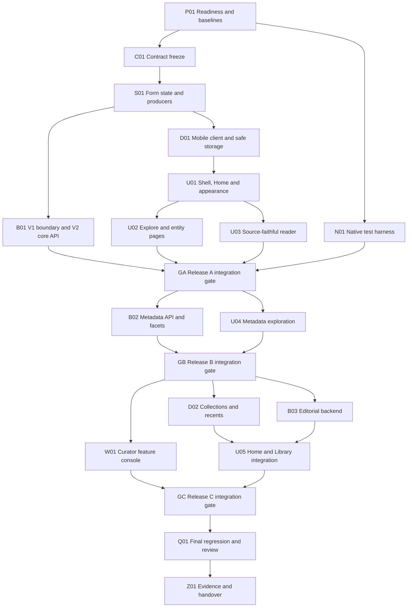

| Metadata | Value |
|:---|:---|
| **Status** | In progress — Plan accepted |
| **Version** | 1.7.1 |
| **Last Updated** | 2026-09-10 |
| **Author** | Sangeetha Grantha Team |

# Track: Rasika — Discovery and Reading Experience

---

**ID:** TRACK-140

**Status:** In progress — Plan accepted

**Owner:** Seshadri

**Created:** 2026-09-09

**Updated:** 2026-09-09

## Goal

Evolve the working Rasika mobile app into a polished Carnatic music companion: a welcoming landing page, connected composition and reference discovery, a deeply readable lyric experience, and a useful personal library on Android and iOS.

## Context

- [TRACK-138](./TRACK-138-rasika-mobile-app.md) remains the foundation and retains its outstanding verification work. This track neither closes it nor claims its unfinished device journeys passed.
- [Experience proposal and current-code audit](../../application_documentation/05-frontend/mobile/rasika-discovery-experience.md) contains the reviewable product direction, screen journeys, staged scope, and technical gaps.
- [Existing visual identity](../../application_documentation/05-frontend/mobile/track-138-visual-design.md) remains canonical until an accepted implementation changes its tokens in place.

## Intent

**Status:** Accepted

**Accepted by:** Seshadri

**Accepted at:** 2026-09-09

**Acceptance evidence:** “accept this direction as TRACK-140’s Intent … Go ahead with detailed Spec.” The same instruction explicitly requests a light-mode preview and a Settings control to toggle appearance. Those are incorporated below; acceptance is for Intent, not Spec or Plan.

### Problem

The user's request: “We have a working multiplatform mobile application and a Curator Console web application.” The mobile app “for now is just basic and rudimentary.” Reimagine it as a “polished best in class Sangeetha Grantha Rasika mobile with full fledged features,” starting with “a Landing Page, Krithi, Raga and Other meta data search,” and an interface “blending Classical nature of the carnatic music.”

Source inspection confirms the gap: Search is the initial destination; Browse exposes raga/composer lists and associated works; Search does not expose combined filters or pagination despite client API support; rich raga/composer detail contracts exist but the Browse screen presents lists. The visual foundation already includes Fraunces, Work Sans, saffron/teal/cream, painted cornice, and Trinity artwork.

### Proposed outcome

1. **Home:** an immediate search entry, a deliberate editorial feature, browse shortcuts, and conditional continue-reading. First launch is useful without a login or setup wizard.
2. **Explore:** one search context with Krithis, Ragas, Composers, and Other categories. Other covers Talas, Deities, Temples/Kshetras, Languages, and Musical forms. Visible filter chips, combined filtering, genuine totals, pagination, and recoverable states.
3. **Connected reference pages:** raga identity, aliases, documented scales/relationships and related works; composer profiles and works; metadata pages linking back to filtered compositions.
4. **Reader:** compact contextual header, readable stored lyrics, distinct script and source-reading selection, section navigation, connected metadata, and a consistent bookmark action.
5. **Library:** retain existing favourites, then add lightweight named collections and optional recent-reading pointers. Catalogue and lyric content remain server-fetched.
6. **Finish:** coherent light/dark appearance, screen-reader journeys, scalable Indic text, platform navigation, network recovery, and measured device performance.

### Affected users and systems

- Rasikas discovering music; students locating and revisiting compositions; experienced musicians reading exact source variants.
- Shared Compose presentation and mobile data, Android/iOS hosts, public catalogue DTOs/OpenAPI/backend.
- Curator Console only where publishing home features or new public reference content needs an editorial workflow. Its existing editing/authentication boundary remains intact.

### Constraints

- Extend existing KMP architecture and shared design tokens; no framework rewrite or second palette.
- Published-only public reads; no admin credentials or raw ingestion/editorial payloads in mobile.
- Preserve original language, stored script/source variants, ordered/repeated Ragamalika membership, distinct raga identities, and musical-form-specific structure.
- Never generate missing lyrics, translations, scales, biographies, canonical equivalences, popularity claims, or completeness claims for presentation.
- Keep online catalogue/lyrics, explicit search submission, anonymous usage boundaries, and lightweight local bookmarks from TRACK-138 unless a later accepted decision changes them.
- Any database changes use Flyway; backend mutations remain audited. No corpus repair or publication is part of design work.
- Design examples are illustrative; prototype counts and records are not live catalogue evidence.

### Open questions

Recommended defaults are recorded for review; these are not separate prerequisites for accepting the Intent.

- Audience: serve curious rasikas first, with scholarly detail progressively disclosed.
- Landing page: interpret this as the in-app Home, not a separate marketing website.
- First delivery: Home + complete krithi/raga/composer discovery + reader finish; follow with the other metadata categories under this same track.
- Personal features: remain usable without an account; collections and recents require explicit storage/privacy design in the Spec.
- Audio, notation, practice tools, offline packs, cross-device sync and AI discovery: retain as later product opportunities, outside the initial delivery commitment.

## Spec

**Status:** Accepted

**Accepted by:** Seshadri

**Accepted at:** 2026-09-09

**Acceptance evidence:** “I accept the detailed Spec. prepare the implementation Plan in a way that it can be implemented in a graph and loop”. This accepts the detailed Spec including M1–M9; the Plan below remains Draft.

### Scope and delivery boundary

Deliver the accepted Home → Explore → Reader → Library experience across the existing Android and iOS hosts. Retain Settings as the fourth tab. This Spec governs three releases within this track: **A — core discovery and reading**, **B — complete metadata exploration**, and **C — personal library and editorial features**. A is useful independently; B and C remain track obligations, not silently deferred extras. The Plan will identify file changes and build order after Spec acceptance.

The initial landing page is in-app Home. English remains the UI language; original composition language and available stored lyric scripts are independent metadata. No mandatory account, offline catalogue, media player, generated music content, notation engine, AI search, store submission, remote deployment or corpus repair is included. Native sharing is deferred until a real public canonical-link destination exists; no nonfunctional Share button will ship.

### Requirements

| ID | Requirement | Release | Acceptance evidence |
|:---|:---|:---|:---|
| R01 | Home, Explore, Library and Settings are stable bottom-tab destinations; Home is the fresh-install entry. Entity/reader pushes preserve originating tab, query, applied filters and scroll on Back. | A | Android system Back and iOS back/gesture journeys; per-tab navigation/state tests |
| R02 | Home provides search before editorial material, one published feature at most, and raga/composer/metadata shortcuts. Empty/failed feature loading leaves navigation and search usable. | A | Empty, one-record, withdrawn-feature and failed-request states on both hosts |
| R03 | Explore searches Krithis, Ragas and Composers under one visible query with explicit submission; category changes retain the committed query and fetch that category. | A | Title/incipit, alias, literal-wildcard, empty-query and category-switch tests |
| R04 | Apply raga and composer filters by UUID with AND semantics; preserve ordered/repeated raga memberships while deduplicating composition results. | A | Secondary-raga, homonym, repeated-membership and combined-filter fixtures |
| R05 | Every list has bounded paging, correct server total, stable ordering, loading/retry/end states; failed next pages preserve existing items. | A/B | Multi-page datasets, tied titles, cancellation and page-failure tests |
| R06 | Raga/composer pages use real detail DTOs and link to filtered works; raga aliases/relations preserve identity and source distinctions. | A | Identity-aware detail → works → reader → Back journeys |
| R07 | Reader shows only one selected stored reading, with original language, musical form, source context, ordered section jumps and metadata links. | A | Same-script multi-source, unsegmented text, repeated Charanam sections, Ragamalika (including a ragamalika whose raga sequence repeats a raga), Varnam and Swarajathi cases; a composition whose musical form is unestablished |
| R08 | Preserve existing favourites and preferences without loss; bookmark state is consistent across Home, results, reader and Library. | A | Upgrade/restart, add/remove, unavailable-record and storage-failure journeys |
| R09 | Settings exposes mutually exclusive **System / Light / Dark** choices. Selection updates the entire app immediately, persists across restart and preserves reading/search state. | A | Detailed appearance scenarios below on Android and iOS |
| R10 | Complete all core flows with screen readers, large text, reduced motion and both appearances; Indic text, long titles and controls remain usable. | A/B/C | TalkBack/VoiceOver and narrow-phone/large-text matrix |
| R11 | Other metadata supports Talas, Deities, Temples/Kshetras, Languages and Musical forms with public directories, typed identities and associated published works. | B | Each category search/detail/filter journey; empty metadata and ambiguous-name cases |
| R12 | Krithi search supports tala, deity, temple, original-language and musical-form filters alongside query/raga/composer. | B | All facet pairs, an all-facets case, unknown/missing metadata (including unestablished musical form), totals and stable paging |
| R13 | Library supports local named collections and optional bounded recent-reading pointers, with clear management controls and no stored catalogue/lyrics. | C | Create/rename/reorder/remove, migration, bounds, opt-out, expiry and storage inspection |
| R14 | Curators can publish ordered, sourced home features through an authorized, audited workflow; withdrawal cannot leave draft/unpublished works exposed. | C | Authorized/unauthorized mutations, invalid targets, stale edits, publication/withdrawal and audit tests |
| R15 | Anonymous endpoints remain published-only for compositions; source/variant ownership and public reference allowlists are enforced server-side. Curator draft editing continues to work. | A/B/C | Public visibility and authenticated curator regression tests |
| R16 | Network failure, cancellation, missing content and preference-write failures are actionable. Old responses cannot overwrite newer screen state. | A/B/C | Deterministic presenter/client fault tests and device network interruption |
| R17 | Online-only content, HTTPS release transport and anonymous usage boundaries remain intact; appearance changes never fetch content or count as a search/view. | A/B/C | Request traces, persistence inspection and usage-recorder tests |
| R18 | Each release includes reproducible Android/iOS build evidence and native journeys; outstanding TRACK-138 verification is carried forward explicitly. | A/B/C | Device/runtime/build identifiers, command exits and requirement-to-proof ledger |

### Design: navigation and discovery

Use shared Compose and immutable presenter state. Keep separate state ownership for Home, Explore, each entity page, Library, Reader and Settings. Preserve typed per-tab stacks; selecting an already selected root tab does not trigger duplicate content requests. On process restart restore preferences and lightweight library records, not HTTP responses or an unbounded navigation history. Restore transient scroll/navigation after tab changes and platform configuration changes while the process remains alive.

Home search starts a fresh Krithis query and clears old applied facets; the submitted text remains visible with Ragas/Composers category choices. This avoids a hidden previous raga filter suppressing a new Home search. Explore submission stays within its selected category. Only submit/Apply/category selection/explicit refresh or page request reaches the corresponding catalogue endpoint; typing does not. A category switch uses the same committed query, not unsubmitted input. Show both the active category and whether there are unapplied edits.

The filter sheet separates draft choices from applied choices. Apply commits all changes once and resets page/scroll; Cancel discards draft changes; Reset clears draft fields until Apply. Removing an active chip immediately commits that single change. One exact value per facet; different facets combine with AND. Inapplicable krithi facets are hidden and suspended in other categories, preserved on return to Krithis. The main category strip wraps or otherwise remains accessible at large text sizes.

Release A Home calls the public discovery contract described below. With no editorial feature configured, the server may choose the first published composition in the catalogue's existing stable title/UUID order and label it **From the collection**. This is a deterministic browse invitation, not a daily, popular or personalized recommendation. A null feature is valid. Search and static browse shortcuts render independently of its request. No illustration is required when appropriate, rights-cleared artwork is unavailable. Do not associate Trinity artwork indiscriminately with unrelated composers.

Release B Other begins with category entries, then a queryable directory for each type. Language/form pages display a label and associated works; do not manufacture biographies for enums. Temples show a stored place context where available. A kshetra alias can match a documented temple association, but the UI must not invent a standalone kshetra ID, merge different temples in the same city, or claim that a city filter exists. A separate geographical entity model is outside this Spec.

Raga/composer detail initially uses the current public detail fields. Show documented name/aliases and related works; optional scale, parent/melakarta, dates and place appear only where stored and public. Preserve distinct raga UUIDs even when names or nomenclature links match. A relation link opens the related identity explicitly; it does not expand an exact filter or combine catalogue counts.

### Design: appearance and accessibility

The [current preference implementation](../../modules/shared/presentation/src/commonMain/kotlin/com/sangita/grantha/shared/presentation/preferences/PreferencesScreen.kt) and [preference storage](../../modules/shared/mobile-data/src/commonMain/kotlin/com/sangita/grantha/shared/mobile/storage/LocalSettingsCodec.kt) already support `SYSTEM`, `LIGHT`, `DARK`. Reuse these values and migrate existing selections unchanged. A switch with only on/off states is insufficient to express all three choices; present an accessible segmented/radio group labelled **Appearance**, with **System**, **Light**, **Dark**, and a selected indicator that is not colour alone.

- **System:** fresh-install default; follows the device appearance, including changes while the app is active or when it returns to foreground.
- **Light:** pins the shared cream/paper/saffron/teal palette even when the device is dark.
- **Dark:** pins the shared dark-paper palette even when the device is light.
- Apply on selection, without a Save button, restart, login or API request. Persist the explicit enum, not only the resolved light/dark value. If storage fails, retain/revert to the last successfully stored choice and show a retryable notice; do not claim the change was saved.
- Cover Home, cards, text fields, chips, filters, all detail/reader states, Library, Settings, dialogs, selection/focus indicators and native system-bar icon contrast. Keep the chosen script, current variant, text size, scroll position and committed search intact.
- Settings includes a short lyric style sample so text-size/appearance effects are visible. Small/Medium/Large/Extra large text preferences and preferred stored script remain available. No theme toggle belongs in reader chrome in addition to Settings.
- The conversation concept opens in Light at the user's request; that demonstration default does **not** change the native fresh-install System default. Its Settings controls change the concept locally and do not claim persistence across conversation reloads.

Use [the existing shared visual tokens](../../application_documentation/05-frontend/mobile/track-138-visual-design.md); any approved size/contrast correction updates the canonical token definitions and corresponding documentation, not a parallel design system. Proposed minimum base sizes: 16sp main body/controls, 13sp metadata, 12sp navigation labels, and the existing comfortably spaced lyric role with script-safe fallback. Use minimum 48dp shared touch targets, wrap long titles, and keep all actions reachable at a 320dp phone width with 200% system text scaling. Test actual supported platform maximum accessibility text sizes and document any layout adaptation. No fixed-height reader hero may truncate title or text.

Acceptance scenarios for R09: start with a dark device → select Light → visit Home, filtered Explore, Reader and Library; select Dark from a light device; force-close/reopen each explicit choice; select System and change device appearance while foreground/background; perform all choices with TalkBack/VoiceOver; simulate a storage-write failure; verify no new catalogue request or lost reading/search state. Appearance-selection tests are native evidence, not inferred from the HTML concept.

### Design: public API and data contracts

All paths below are **proposed extensions**, except the existing krithi/raga/composer endpoints. Specify final wire schemas in OpenAPI and shared serializable DTOs before implementation consumers depend on them. Keep existing request/response fields compatible; add new optional fields with safe defaults. Do not reuse administrative DTOs or expose notes, author IDs, raw extraction evidence, private URLs or workflow internals.

| Endpoint | Contract |
|:---|:---|
| `GET /v1/catalogue/discovery` | No personal/session query parameters. `{ feature: null | { selection: CATALOGUE_ORDER or EDITORIAL, heading, summary, krithi }, editorialRevision: null or string }`; `krithi` is a public summary. Maximum one resolved feature; heading ≤80 and summary ≤240 Unicode code points. In A, only deterministic selection is available. |
| `GET /v1/catalogue/krithis` | Preserve `query`, `ragaId`, `composerId`, `page`, `pageSize`; add `talaId`, `deityId`, `templeId`, `language`, `musicalForm`. All supplied predicates combine with AND. Query searches supported title/incipit normalization, not arbitrary lyric full text. |
| `GET /v1/catalogue/krithis/{id}` | Preserve reader metadata/variant inventory; add optional public deity/temple references. Keep raga order/repetitions and original language. Add an optional `sectionId` on each raga reference binding it to a stored lyric section (M1); absence means UNKNOWN. Musical form is nullable/unestablished-capable (M2). Nullable metadata is never filled from inference. |
| `GET /v1/catalogue/krithis/{id}/lyrics/{variantId}` | Preserve selected-variant ownership and stored sections/text. Add an optional reading-level completeness value only where evidence supports it; absent evidence means UNKNOWN. |
| `GET /v1/catalogue/ragas`, `/ragas/{id}` | Reuse current directory/detail contract, bounded paging, public aliases and nomenclature links. Related works use exact `ragaId`. |
| `GET /v1/catalogue/composers`, `/composers/{id}` | Reuse current directory/detail contract and exact `composerId` filtering. No fabricated biography/mudra field. |
| `GET /v1/catalogue/talas`, `/talas/{id}` | Directory: UUID, name, documented public aliases if any, published composition count. Detail: those fields plus nullable documented `beatCount`/`angaStructure` and a public source label if recorded. |
| `GET /v1/catalogue/deities`, `/deities/{id}` | Directory/detail: UUID, canonical name, documented public alternate names/context if any, published count. Do not infer association from the composition title or the temple's deity. |
| `GET /v1/catalogue/temples`, `/temples/{id}` | Directory/detail: UUID, canonical public name, documented alternate names, public location context and published count; nullable public deity reference only if explicitly stored. Location is context, not a new exact geographical filter. |
| `GET /v1/catalogue/languages`, `/musical-forms` | Bounded searchable directories of supported enum code, UI label and published composition count. Language values use the existing `LanguageCodeDto` names; form choices are the established `MusicalFormDto` values. M2 adds an internal unestablished state, not a new musical-form choice. Related works use code filters; no separate detail endpoint is needed. |

All directory endpoints accept `query`, `page`, `pageSize` and return `items`, `total`, `page`, `pageSize`. Retain default page 0, default size 30, maximum size 100, and query limit 200 Unicode code points. Validate UUIDs/enums/unknown parameters and disallow repeated scalar query keys instead of silently selecting one. Missing filter parameter means any value; a valid but unmatched ID returns an empty search; an invalid ID/code is a validation error. A missing or unestablished original-language/tala/temple/**musical-form** value never satisfies a specific facet; see M2. Detail requests with nonexistent/ineligible IDs return the same public 404 shape; reject unpublished/wrong-owner lyric access identically. Retain `Cache-Control: no-store` and existing release HTTPS/debug-host rules.

New tala/deity/temple directory eligibility is association with at least one currently published composition. Their detail pages use the same eligibility; count only published composition UUIDs. Existing raga/composer reference visibility is retained, including legitimate zero-work reference entries, without revealing draft associations. Languages/forms are the supported domain enumerations with zero counts allowed. Do not publish a private reference field solely because its composition is public; explicit DTO allowlisting remains mandatory.

All composition totals count distinct composition IDs under exactly the same predicates as results. Raga filtering uses ordered junction membership, including secondary/repeated ragas. New deity/temple filtering uses explicit stored composition associations; do not derive deity matching from `temple.deityId` or infer a temple from geographical text. Do not add or repair associations to increase coverage. Order krithis by the existing normalized title plus UUID ordering; directory order is normalized display name plus UUID/code. Return final hydrated data in that order. Adjacent pages share the same committed query/facets; remove duplicate IDs defensively if publication changes between page requests. This is stable ordering for unchanged data, not a promise of a transaction snapshot across requests.

Do not implement a merged/federated search endpoint or per-keystroke suggestions in this scope. Use one scoped category request at a time. Approved raga/composer aliases and existing normalization are retained; no automatic alias creation or fuzzy identity merging. New reference names match only documented stored names/aliases with the same literal-input treatment. Query behaviour across arbitrary Indic transliterations is not promised beyond existing normalization; unavailable transliteration capability must not be implied by placeholder text.

### Design: reader fidelity

The selected reading is identified by variant UUID. Original language stays visible separately from script and reading language. Preferred script selects an available stored variant, never creates a transliteration. If it is unavailable, use the server default/established deterministic fallback and explain the fallback. Multiple variants in the same script remain separately selectable using source, label, language, sampradaya or transliteration scheme only where these fields are publicly available. Never choose between different same-script readings by implying one is musically authoritative merely because it is marked primary.

Switching readings replaces the complete displayed text atomically; loading/error cannot leave old lyrics labelled as a new reading. Repeated/numbered sections have stable section IDs and stored order. Jumps use those IDs; switching to a reading without the prior section returns to the first available section rather than guessing alignment. Preserve exact source line breaks, Unicode, subsection labels and unsegmented text. No client reparsing or completion of missing sections.

Keep original Ragamalika sequence, including repeat occurrences and optional stored section associations, subject to the binding prohibition in M1. A stored scale is an attributed description, not sufficient proof of raga equivalence or a generated note diagram. Tala details display only documented values; do not derive kalai, eduppu, per-section tala, performance tempo or a beat animation from a base tala name/count. Varnam/Swarajathi show their form label and explain that available lyrics do not constitute a notation view.

Reader completeness is scoped to the selected reading and evidence. The existing composition-level completeness field cannot certify every variant or establish completeness of notation/the whole composition. Without reading-level evidence show “Completeness not established” or omit a completeness badge; with known missing text show the documented partial state. Missing lyrics are unavailable, not an invented empty Pallavi. Missing or contradictory metadata remains unasserted and is recorded for curator review without mutation by the reader.

### Design: musicological presentation integrity

These amendments (M1–M9) were added after the musicological review recorded in the Progress Log. They bind every surface — Home feature, Explore result cards, entity detail, Reader and Library — unless a clause names one.

**M1 — Ragamalika raga-to-section binding must be explicit, never positional. (blocking)** The stored raga reference carries `orderIndex` and a `section` *type* enum (PALLAVI/CHARANAM/…), which is not a reference to a lyric section. For any ragamalika with more than one Charanam there is therefore no stored edge from a raga to a particular section; the junction table's own comment records this as future work. The Reader MUST NOT infer a raga-to-section association from ordinal position, list length, or section-type match. Render the ragamalika sequence as an ordered list attached to the composition header only. A per-section raga label appears only where an explicit stored association to that lyric `sectionId` exists; its absence is UNKNOWN and is displayed as nothing, not as a guess. Add the optional `sectionId` to the public raga reference contract. A synthetic proof case must include repeated Charanams, repeated ragas and differently segmented source readings; the UI must not zip those independent lists together.

**M2 — Musical form must be able to be unestablished. (blocking)** `musical_form` is `NOT NULL DEFAULT 'KRITHI'` in the schema and `MusicalFormDto` has no unestablished member, so a defaulted classification can look established without evidence. This is a schema risk, not proof that any particular current record is misclassified. Making the public DTO nullable alone cannot recover lost classification intent. Introduce an explicit `UNESTABLISHED` domain state, change new unclassified-record defaults to that state, render no musical-form badge for it, and exclude it from all specific form facets. Ordinary unfiltered searches may include these published compositions in the new contract. It is not a fourth musical form and does not appear beside Krithi/Varnam/Swarajathi in the form directory.

An enum addition is not backward-compatible for older clients that cannot decode it. Before the first UNESTABLISHED row is exposed, provide an explicit versioned public catalogue contract for the new client (recommended `/v2/catalogue`), including discovery and nested summaries; preserve the existing `/v1/catalogue` enum vocabulary. V1 excludes unestablished compositions from lists/counts/features and returns public 404 for their reader/lyrics; it must never substitute KRITHI to make decoding succeed. Its reference counts follow the same eligibility rule. The Plan must map all paths in the contract table to the chosen new version and test an old-client decoder against V1 and a new-client decoder against V2 before enabling the enum. New clients must not fall back silently to V1 if that hides requested functionality.

An additive Flyway migration may introduce the state/default, but it must not guess which existing rows were defaulted. Existing content is preserved. The Plan records a separate curator-owned assessment prerequisite for any suspected existing misclassification; corpus edits require their own authorized curation workflow and are not performed by the UI/schema migration. Unknown coverage is reported, not retroactively claimed as reviewed.

**M3 — Preserve notation and text without inventing alignment.** A section identifier alone does not establish that its payload is beat-aligned notation; in particular `SWARA_SAHITYA` and `MADHYAMA_KALA` may contain sahitya. Preserve stored text and line breaks. Where a source explicitly supplies preformatted swara/solkattu text, preserve spacing in a horizontally scrollable, accessible block with Indic-safe font fallback; do not present that block as a full notation renderer or infer akshara columns from whitespace. Structured notation remains outside this lyrics-reader scope and independent of the lyric DTO. Script selection still selects a complete stored reading: it must never leave a notation/text block from the previous variant mixed into the new one, nor imply generated script conversion or musical alignment.

**M4 — Section labels come from a curated map, never from identifier casing.** Title-casing the enum yields "Muktayi Swara" (correct: **Muktayi Swaram**), "Madhyama Kala" (correct: **Madhyamakala**) and "Ettugada Swara" (conventionally **Ettugada Swaram**). Maintain an explicit reviewed enum-to-display-label map in the presentation layer, form-aware where the same identifier means different things by form (in a Varnam the charanam line is the *pallavi of the charanam*, not "Charanam" as in a krithi). Record one transliteration policy for user-facing musical terminology and apply it consistently.

Stored section labels, numbering and source terminology take precedence over this fallback map. A form-aware explanatory caption may clarify a label; it must not rename a stored Charanam or erase its numbering. The map is for missing labels and application chrome, not source-text normalization.

**M5 — A melakarta number must never be rendered as a melakarta claim for a janya raga.** The raga summary exposes `melakartaNumber` and `parentRagaName` on the same record. Render "Melakarta 22 · Kharaharapriya" only where the raga *is* that melakarta; otherwise render "Janya of Kharaharapriya (Mela 22)". A parent’s mela number must come from that parent’s own stored record, not the child’s `melakartaNumber`. If the relationship is stored but its number is absent, show only the parent name; if the relation itself is absent, show no inferred parent. A genuine melakarta’s own documented number may be shown without a parent relation. *Worked example:* Abhogi displaying a bare "Melakarta 22" chip asserts something false.

**M6 — Scales render in full or not at all.** `arohanam`/`avarohanam` are never truncated, ellipsized or line-clamped; a clipped scale is not a brief scale but a different raga. They wrap and remain selectable at every supported text size, and are omitted from surfaces whose space is bounded rather than shortened there. *Worked example:* Simhendramadhyamam clipped after the panchamam reads as a pentatonic scale; any vakra janya is misrepresented by clipping mid-vakra.

**M7 — Attribute only the fields a source actually supports.** Display the selected reading's stored source as the source of that reading. It does not automatically establish provenance for the composition's composer, raga or tala fields. Use "as given in ⟨source⟩" for an individual metadata assertion only when explicit stored provenance supports that assertion; otherwise present it as catalogue metadata without invented source attribution or authority language. Do not manufacture a disputed/verified flag. Contested attributions are recorded for curator review without mutation.

**M8 — Composition counts are scoped to this library.** A published composition count is phrased as a statement about the corpus ("4 in this library"), never as a statement about the tradition. A zero count on a legitimate reference entry must not read as "no compositions exist".

**M9 — No surface collapses multiple raga memberships to a single raga.** When live metadata is available, show the ordered sequence, shortening only with an explicit "+n more" affordance that is not itself a raga name. Show the Ragamalika label according to the stored flag as clarified below. No surface renders the first raga as the sole raga. This applies to Home features, Explore, the Reader, and any hydrated Library/Continue reading cards.

The stored Ragamalika flag controls that label. Multiple memberships with a false/unknown flag still display their ordered sequence but do not independently establish a change of raga; record the inconsistency for review rather than silently declaring Ragamalika. A "+n more" affordance expands to every stored occurrence. Library/recent pointers contain no cached raga metadata: until a bounded online summary fetch succeeds, show the saved title alone. Never guess its raga or expand persistent bookmark records into a catalogue cache to satisfy this display rule.

Known modelling limits recorded, not solved, by this Spec: the composition's single `talaId` supports only its explicit stored association; R12 does not claim to find every tala occurring within a composition. Per-section tala and kalai/eduppu are not inferred, and no new passthrough for them is committed before release B. Report known coverage gaps without assigning missing tala values.

### Design: library, storage and editorial features

Release A reuses the existing bookmark/preference stores and appearance enum. Bookmark toggles carry UUID plus short display label; list order is newest saved first. Reopening any saved item fetches current public data. A network failure retains it and offers Retry; confirmed unavailability marks it as unavailable but keeps removal possible. Card and reader save actions expose an accessible selected state and use one bookmark icon metaphor.

Release C adds a versioned local document using an explicit migration from the current v1 document. Preserve all existing bookmarks and preferences exactly; never enforce new collection bounds by truncating migrated favourites. Use a single serialized write coordinator so simultaneous preference/bookmark/collection updates cannot overwrite each other. Persist atomically; on failure retain the last good document and provide a visible retry path. Corrupt or unsupported-version input must not be silently replaced with an empty document on the next action; retain recoverable raw local data and surface a recovery choice. No raw local data is uploaded for recovery.

Collections are local and independent of Favourites: up to 50 named collections, names 1–60 Unicode code points after trimming, up to 500 unique composition IDs per collection. Store ID, name, ordered composition UUID/short-label pairs and bookkeeping timestamps only. Reject duplicate names after simple case-insensitive comparison with an actionable validation message; do not silently merge. Removing an item from one collection does not remove its favourite or other memberships. Deleting a collection requires an in-app confirmation and affects only that local collection. Limits are explicit errors before mutation, never silent data loss.

Recent reading is **off by default**, enabled with “Remember recently read compositions” in Settings. When enabled, store at most 20 unique composition pointers, expire entries after 30 days, and retain only composition/variant/section UUIDs, a short title label and last-open timestamp. Never store lyric text, API payloads or raw search queries. Update only after a successful reader open; history clearing and disabling erase recent pointers without affecting favourites/collections. Home Continue reading appears only for a valid recent pointer and always revalidates online. Clear All Recent is available in Settings. Collections/history are device-local; no sync/offline promise.

For release C editorial features, add an authorized Curator Console workflow governed by the existing composition-publication permissions; public mobile has no mutation credentials. Model feature UUID, bounded heading/summary, an ordered target composition UUID, state DRAFT/PUBLISHED and revision. The initial feature type is a composition invitation; thematic collections and long-form learning articles need later content contracts. Permit several ordered published candidates, but serve only the first eligible one. No time scheduling or personalization is required. Limit to 50 feature records and validate target eligibility at publish and at read. If none is eligible, use the release A deterministic fallback or null.

Proposed admin namespace: `/v1/admin/catalogue-features`; list/detail/create/update and explicit publish/unpublish operations. The Plan must align exact route shapes and permission helpers with existing conventions. Every mutation uses a transaction and `AUDIT_LOG`, including feature reordering and state transitions; stale revision writes return conflict rather than overwrite. Publishing requires permission, nonblank bounded text and an eligible published target. User-visible selection label differentiates EDITORIAL from CATALOGUE_ORDER. Features never bypass target/source publication or reveal an ineligible target ID in public responses. Corpus repair, publishing compositions, and sourcing new images are separate curation actions.

### Design: state, reliability, performance and ownership

Every request is scoped by a generation/token and cancelled or ignored when superseded. A new query or Apply clears prior results and resets paging; a failed next page preserves loaded items. Retry reuses the failed logical operation's context while recording the actual attempt. Returning Back or changing theme/size performs no catalogue refetch. Explicit reader reopening and refresh revalidate online. Errors are bounded user-facing messages, never raw HTTP/server text. Local-only Settings works without a network connection.

Use the current shared domain DTO module, mobile-data client/repositories, presentation module, Android host and iOS host. Extend Ktor routes → services → DAL repositories; database reads/mutations remain inside `DatabaseFactory.dbQuery` and return serializable projections, not Exposed entities. Audit source/table readiness before deciding migrations. Any new feature-table/schema change is additive Flyway work; never edit an applied migration, reset the user's database, or mix a corpus backfill into a UI migration. Reference/schema gaps are surfaced as missing content or a prerequisite, not solved by fabricated metadata.

Request budgeting: Home uses at most one discovery fetch per explicit load/refresh; a scoped list uses one page request; entity detail plus its first works page may use two bounded requests; reader metadata then a selected lyric reading may use two. No per-card request, hidden full-catalogue preload or persistent HTTP cache. Reuse in-memory results across tab changes within a bounded session cache; the Plan must set eviction bounds and test revalidation on explicit reopening.

Retain anonymous session/interaction definitions from TRACK-138, distinguish Home/directory opens from committed searches and reader views, and never log raw query/lyric/local-history content or create device fingerprints. Theme selection is a local UI action; it generates no search/view event. New server metrics use bounded route/action/status labels. Establish performance evidence using recorded reference devices, OS/runtime, corpus size and network/service conditions. Provisional targets: first useful Home content within 2 seconds and search results within 1.5 seconds on an agreed warm-service profile; acceptance of this Spec makes measuring/recording these mandatory, not an unmeasured promise on every network. The Plan must fix the measurement profile and sample size before implementation proof.

### Flagged concerns and decisions

| Concern | Required handling |
|:---|:---|
| Spec acceptance versus implementation authorization | Seshadri accepted the detailed Spec on 2026-09-09. The implementation Plan is Draft pending acceptance; no product implementation has started. |
| Existing light/dark support is already present | Improve discoverability and comprehensive verification; do not invent a new settings storage model or report a native feature as newly implemented in this turn. |
| Public metadata capabilities and provenance vary | Extend allowlisted contracts after source/schema readiness checks; never reuse admin endpoints, guess associations or advertise invented coverage. |
| Broader collections/recents change bookmark-only persistence | The explicit bounded, optional local model above is a proposed change to accept with this Spec. Online content and no persistent lyric cache remain mandatory. |
| Curator-managed features require backend/UI work | Release C includes authorized audited feature management, public read revalidation and Flyway schema work if necessary; ordinary mobile readers remain anonymous. |
| Composition-level completeness may mislead across readings | Require reading-level evidence for reading completeness; do not infer it from primary status, section count or the existing composition aggregate. |
| Musicological review | **Performed 2026-09-09** (Progress Log). Two blocking and seven should-fix findings are written into "Design: musicological presentation integrity" as M1–M9. No music data was mutated. |
| M2 needs schema and compatibility work | Plan an additive UNESTABLISHED enum/default migration and versioned new-client contract before exposing the state. Preserve V1 decoding/visibility semantics as specified by M2. Record existing-row curation as a separately authorized prerequisite, not an automatic backfill or completed review. |
| Ragamalika section binding is a corpus gap, not only a UI rule | M1 keeps the UI honest, but per-section raga attribution stays UNKNOWN until the associations are curated. Do not present the gap as solved, and do not backfill associations to improve coverage. |
| TRACK-138 incomplete native proof | Do not mark TRACK-138 done; bring affected Android/iOS journeys into this track's proof ledger and identify inherited gaps. |

### Open questions carried forward and recommended resolutions

The accepted direction resolves audience and navigation: rasika-first progressive detail, an in-app Home and four tabs. Retain no-login, online content and English UI defaults. The user's appearance requirement is explicit and covered by R09.

Resolutions accepted with the Spec: System remains the native default; the demo opens Light; Home uses deterministic published selection until editorial management is ready; one exact selection per facet; recent-reading is opt-in/off by default; collections are local; temple-associated kshetra names do not imply a geographical search engine. Audio, notation, offline packs, sync, AI search, learning articles and public sharing links remain later decisions. These choices are accepted; the implementation Plan is the next review gate.

The musicological review required before acceptance is complete; its amendments are M1–M9 with the integration clarifications recorded in the Progress Log. Before Plan acceptance, implementation discovery must verify public-ready metadata associations and native build/test commands, name the reference performance profile, and map M2 to the new versioned contract/migration and separately owned curation prerequisite. These are technical checks owned by the implementation planner; unknown results must be reported instead of being labelled complete.

### Requirement-to-proof and release acceptance

Musicological amendment proof is part of release acceptance, not just prose review:

| Amendments | Required boundary case |
|:---|:---|
| M1 | Same section type repeated across different lyric sections/variants; no guessed per-section raga label, and no cross-reading association |
| M2 | New unclassified write, explicit known form, old V1 decoder, new V2 decoder, both versions’ public counts/feature/reader/lyrics visibility; no migration relabels existing rows |
| M3–M4 | Madhyamakala sahitya versus explicitly preformatted swara text; exact variant replacement; stored numbering/labels override fallback display names |
| M5–M6 | Genuine melakarta, janya with/without documented parent number, missing relationship, long/vakra stored scale at maximum type size; no clipped/guessed notes |
| M7 | Reading source differs from metadata provenance; only supported field-level attribution is shown |
| M8–M9 | Zero library count, repeated membership and inconsistent Ragamalika flag, title-only offline bookmark, expandable complete live sequence |

Automated proof must exercise rule boundaries, not mirror layout code: filter identity/count predicates, alias ambiguity, literal wildcards, pagination ties, source ownership, cancellation/late results, persistence migration/write races and feature authorization/audit/withdrawal. Use representative fixtures where the live corpus is sparse, label them as fixtures, and separately record live-data gaps. Do not fabricate a larger published corpus for screenshots.

Native evidence on both platforms must include fresh Home → search → raga/composer → reader → stored script/source change → bookmark → Back; actual multi-page search; every release B metadata category; appearance scenarios; large text and screen-reader use; and failure/retry/withdrawal/restart. Release C adds collections/opt-in recents and a Curator Console feature publish/unpublish → public Home journey. No screenshot alone proves interaction, restart persistence, network correctness or native parity.

The eventual Plan maps R01–R18 to exact tests, commands, artifacts and device IDs. Relevant existing checks include mobile JVM tests and both native builds, `make test`, `make test-integration`, frontend checks for curator edits, `make check-docs`, and `git diff --check`. Required stack restarts follow the restart skill after shared/backend Kotlin changes. Run no data reset as verification. This turn runs documentation and concept checks only; it does not claim any of the future native/backend acceptance evidence.

## Plan

**Status:** Accepted

**Accepted by:** Seshadri

**Accepted at:** 2026-09-09

**Acceptance evidence:** “I accept the accept this implementation Plan. Go ahead with the build of impeccable quality and class :)”. Implementation proceeds through the accepted graph and release gates.

**Execution model:** a dependency DAG with an implement → verify → review → repair loop inside each node, and an integration gate for each release. This plans development orchestration; it adds no graph database, AI runtime, background automation or agent framework to Rasika. Product changes start only after Plan acceptance.

The [execution guide](../../application_documentation/09-ai/track-140-agentic-build-guide.md) supplies scheduling, resource locks, evidence, failure handling and kickoff/resume prompts. The [machine-readable graph](./TRACK-140-execution-graph.json) is authoritative for node IDs and dependencies. The table and Mermaid below mirror it; any graph change updates all three together. This track's ledger is the only authoritative node-status record.

### Planning decisions and source readiness

- **Contract version:** map every proposed `/v1/catalogue/...` extension in the Spec table to **`/v2/catalogue/...`**: discovery; krithi list/detail/lyrics; raga and composer list/detail; tala, deity and temple list/detail; language and musical-form directories. All new mobile reads use V2. Existing V1 catalogue responses retain their vocabulary and exclude UNESTABLISHED from composition results, counts, features and reader/lyrics. There is no silent mobile fallback to V1. No new V1 metadata endpoints are necessary.
- **Legacy routes:** inventory `/v1/krithis/search`, `/v1/krithis/{id}`, `/v1/krithis/{id}/notation` and existing reference routes as well as `/v1/catalogue`. Preserve their established authenticated-admin behaviour. Add an explicit public compatibility predicate where a legacy response can expose the new enum; test anonymous/non-admin publication boundaries, direct access and totals. Never silently map UNESTABLISHED to KRITHI.
- **Schema readiness confirmed from source:** composition `talaId`, `deityId`, `templeId`, original language and form exist; raga membership is a junction; `TempleNamesTable` stores documented alternate names. Tala beat count/anga structure, deity name and temple location/primary deity exist. No tala-alias or deity-alias table was found in this path; expose only names and proven fields. Notes/description/source blobs are not automatically public. Missing per-reading completeness or section-binding evidence stays UNKNOWN; optional fields do not authorize a corpus backfill. Parent mela number requires a join to the parent's stored record.
- **Live readiness still unverified:** no live association counts, publication inventory or source-level classification audit is claimed by this planning pass. P01 records public aggregate coverage and safe representative IDs without mutation. Sparse categories remain honest empty states, with rule coverage proven against isolated fixtures. Seshadri/designated curator owns a separate assessment of suspected historical default classifications before any claim that those records are verified. No corpus edit or composition publication is included in this graph; record that assessment as an external content prerequisite, not a completed engineering node.
- **M2 sequencing:** freeze wire contracts first, then update domain/producer/curator defaults and compatibility code in one integration candidate. Allocate new Flyway versions at implementation time. Use separate committed migrations for enum-value addition and changing the column default, avoiding use of a newly added PostgreSQL enum value within its adding transaction. Preserve existing rows and applied migrations. Do not apply the new default to the running user stack until B01 and all decoders/producers are ready and isolated integration checks pass.
- **State budget:** retain at most three 30-item pages per Explore category (90 summaries), ten entity-detail entries by LRU, and one active lyric payload per retained reader destination, with a maximum of four reader destinations across the four tab stacks. Cap each tab stack at eight entries; an attempted ninth push presents an explicit return-to-root action instead of silently discarding Back history. Evict inactive payloads before navigation state; retain query/filter/scroll pointers, not evicted response bodies. Back/theme changes never issue hidden requests; an evicted view offers explicit Reload and restores its pointer after success. Explicit reopening/refresh revalidates. No disk HTTP/catalogue cache or per-card request fan-out; Library uses title-only pointers until data is available from bounded list/detail operations.
- **Persistence:** introduce serialized atomic writes in release A while preserving v1 format/values; release C adds the v2 collection/history document. Interrupted, failed, corrupt and future-version reads/writes preserve recoverable input. All repositories share one coordinator. New bounds apply to new collections/recents, never truncate migrated favourites.
- **Tooling evidence:** `make test-frontend` currently invokes `bun test`, while the package defines `test:unit` as `vitest run`; P01 corrects the Make target before using it as proof. `make mobile-ios` currently permits a generic compile destination and writes TRACK-138 output; N01 adds separate strict runtime verification and configurable output. A generic build remains valid build evidence only.
- **Scope discipline:** use the accepted Fraunces/Work Sans and shared light/dark tokens. No framework/version upgrade or second design system. The optional `isRagamalika` search facet mentioned in the earlier review log is not an R01–R18 requirement and is deferred; a helpful empty-state link to Ragas is included in U02. All accepted releases A, B and C remain mandatory.

### Dependency graph

Dependencies mean verified prerequisite outputs, not merely files being present. U04 and W01 may use the frozen contracts and mocks while their backend sibling is in progress; their release gates require the real backend. Concurrent work is optional and limited to disjoint ownership. A single implementer can execute the same graph sequentially.

### Work packages, ownership and completion criteria

Path aliases below are relative to the repository root; filenames within a row resolve under its named alias. **NEW** means a planned file, not an existing artifact. Tests live in the corresponding module's test source sets. These boundaries name the principal files; expand the row and assess dependency invalidation before touching additional shared files.

| Alias | Source root |
|:---|:---|
| DOMAIN | `modules/shared/domain/src/commonMain/kotlin/com/sangita/grantha/shared/domain/` |
| DAL | `modules/backend/dal/src/main/kotlin/com/sangita/grantha/backend/dal/` |
| API | `modules/backend/api/src/main/kotlin/com/sangita/grantha/backend/api/` |
| DATA | `modules/shared/mobile-data/src/commonMain/kotlin/com/sangita/grantha/shared/mobile/` |
| UI | `modules/shared/presentation/src/commonMain/kotlin/com/sangita/grantha/shared/presentation/` |
| WEB | `modules/frontend/sangita-admin-web/` |
| WORKER | `tools/krithi-extract-enrich-worker/` |

| Node | Depends on | Owner lane | Files / work | Done evidence |
|:---|:---|:---|:---|:---|
| P01 | — | Coordinator | `Makefile` frontend test target; inspect current branch/diff, installed toolchains, test tasks, migrations, device identities, public coverage and TRACK-138 gaps. Create NEW `application_documentation/10-implementations/track-140-rasika-discovery.md` evidence index. | Baselines V1–V6, V9 recorded separately as pass/fail/environment-blocked; fixture/live coverage map and device profile. Existing failures do not become green by omission. |
| C01 | P01 | Contracts | `openapi/sangita-grantha.openapi.yaml`, synchronized `WEB/public/sangita-grantha.openapi.yaml`, `application_documentation/03-api/api-contract.md`, `api-examples.md`, `openapi-sync.md`; `shared/domain/model/import/canonical-extraction-schema.json`; NEW contract fixtures under `shared/domain/model/catalogue/fixtures/`. Freeze V1/V2 DTO field inventory, errors, ownership, facets, usage labels and editorial revisions. | V9; valid machine schemas, documented V1/V2 payload fixtures, all proposed paths mapped, no unsupported public fields. Fixture examples are not live catalogue records. |
| S01 | C01 | Domain/ingestion | DOMAIN `model/krithi/KrithiEnums.kt`, `KrithiDto.kt`, `model/import/CanonicalExtractionDto.kt`, `model/catalogue/CatalogueDtos.kt` and NEW `CatalogueV2Dtos.kt`, `CatalogueFeatureDtos.kt`; DAL `enums/DbEnums.kt`, `tables/CoreTables.kt`; two NEW `database/migrations/V<next>__...sql` files. API `models/KrithiRequests.kt`, `services/KrithiCreationFromExtractionService.kt`, `ImportService.kt`; WORKER `src/schema.py`, `src/extraction_strategies.py`; WEB `src/types.ts`, `src/hooks/useKrithiEditorReducer.ts`, `useKrithiData.ts`, `src/utils/krithi-mapper.ts`, `src/components/krithi-editor/MetadataTab.tsx`, `src/pages/KrithiEditor.tsx`. | V1/V2/V5/V6: Kotlin/Python/schema golden parity; omitted form becomes UNESTABLISHED; explicit known form preserved. Review each hardcoded extraction form for evidence before replacing it. Existing-row values unchanged after migration. Existing assertion that omission means KRITHI is deliberately replaced per M2, not weakened. Candidate is not activated on the user stack yet. |
| B01 | S01 | Backend | DAL `repositories/CatalogueRepository.kt`, `KrithiSearchRepository.kt`, `models/CatalogueDtoMappers.kt`, NEW `CatalogueV2DtoMappers.kt`; API `catalogue/CatalogueParameters.kt`, `services/CatalogueService.kt`, `KrithiService.kt`, `routes/CatalogueRoutes.kt`, NEW `CatalogueV2Routes.kt`, existing `PublicKrithiRoutes.kt`, `plugins/Routing.kt`, `CatalogueUsage.kt`, `services/CatalogueUsageRecorder.kt`, DI as needed. | V1/V2: old decoder against V1 and new decoder against V2; exact eligibility/count/404 checks; deterministic/null discovery; source ownership; strict validation; bounded usage labels. Test both fresh Flyway schema and upgrade from pre-track schema. Together with S01 this makes the candidate safe to migrate/run. |
| D01 | S01 | Mobile data | DATA `network/CatalogueApi.kt`, `KtorCatalogueApi.kt`, `CatalogueFailure.kt`, `MobileHttpClient.kt`, `repository/CatalogueRepository.kt`, `FavouritesRepository.kt`, `PreferencesRepository.kt`, `storage/LocalSettingsCodec.kt`, NEW `LocalDocumentStore.kt`, `usage/MobileSession.kt`; platform `AndroidMobileDependencies.kt` / `IosMobileDependencies.kt` storage adapters; `fixture/CatalogueFixtures.kt`. | V3: V2-only requests; late/cancelled response handling; page totals/errors; request budgets; serialized write race/failure/corruption/upgrade tests; v1 saved values retained; no persisted API bodies or raw queries. |
| U01 | D01 | App shell | UI `RasikaApp.kt`, `navigation/RasikaDestination.kt`, `di/MobileAppContainer.kt`, `theme/RasikaTheme.kt`, `RasikaCopy.kt`, `components/RasikaChrome.kt`, `KrithiCard.kt`, `LoadStateContent.kt`, `preferences/PreferencesScreen.kt`, `PreferencesPresenter.kt`; NEW `home/HomeScreen.kt`, `HomePresenter.kt`, `components/RagaSequence.kt`. Update canonical `track-138-visual-design.md` tokens if adjusted. | V3 and preview review: four tab stacks, Home search independent of feature load, ordered raga cards, System/Light/Dark instant local update with persistence rollback. Shared shell integration owned here; later screen nodes submit route interfaces rather than competing edits. |
| U02 | U01 | Discovery UI | UI `search/SearchScreen.kt`, `SearchPresenter.kt`, `browse/BrowseScreen.kt`, `BrowsePresenter.kt`; NEW `explore/ExploreFilters.kt`, `entities/RagaDetailScreen.kt`, `ComposerDetailScreen.kt`, `EntityDetailPresenter.kt`. | V3: explicit-submit categories, draft/apply/cancel/reset/chips, exact UUID facets, paging and late responses, originating state on Back, library-scoped counts, parent mela semantics, full scales and empty-state Raga navigation. |
| U03 | U01 | Reader UI | UI `reader/KrithiReaderScreen.kt`, `KrithiReaderPresenter.kt`, NEW `reader/SectionLabels.kt`; reviewed musical terminology in `RasikaCopy.kt` through shell owner. | V3: atomic stored-reading replacement, source/script distinction, stable repeated section IDs, stored labels before fallback, UNKNOWN completeness/binding, M1–M9 fixtures. No notation inference or generated text. |
| N01 | P01 | Native/verification | `modules/mobile/androidApp/build.gradle.kts`, Android host `MainActivity.kt`, NEW Android `src/androidTest/.../RasikaJourneyTest.kt`; presentation iOS `MainViewController.kt`; `modules/mobile/iosApp/RasikaApp/RasikaApp.swift`, Xcode project/scheme, NEW `RasikaAppUITests/RasikaJourneyTests.swift`; `tools/mobile/verify-ios.sh`, NEW `tools/mobile/verify-rasika-journeys.sh`; `.github/workflows/ci.yml`, version catalogue only if test dependencies needed. | V4 builds plus demonstrable harness execution against baseline app. Android instrumentation and iOS UI-test targets exist, strict explicit-device runner cannot silently fall back to generic. Preserve Compose resource-copy workaround. Runtime expectations evolve with U01–U03 via coordinator; final journeys are GA, not inferred from harness smoke. |
| GA | B01, U02, U03, N01 | Coordinator/reviewer | Integrate release A; resolve shell/native wiring; run refreshed stack against the compatible schema. Evidence/report updates only unless repair is routed to owning node. | V1–V4, V7–V9; V5/V6 for changed producer/curator code. R01–R10, R15–R18 and M1–M9 satisfied for A on both hosts. Open inherited native gaps remain visible until actually reproven. |
| B02 | GA | Backend | DAL `repositories/CatalogueRepository.kt`, `models/CatalogueV2DtoMappers.kt`; API `catalogue/CatalogueParameters.kt`, `services/CatalogueService.kt`, `routes/CatalogueV2Routes.kt`; established V2 DTOs only through contract owner. Add indexes with NEW Flyway migration only if query-plan evidence warrants them. | V1/V2: all five Other directories, eligible details, exact seven facets, every facet pair/all-facets, correct distinct totals, literal aliases, unknown/missing metadata, zero-count enum directory, no private reference leakage. |
| U04 | GA | Metadata UI | DATA `network/CatalogueApi.kt`, `KtorCatalogueApi.kt`, `repository/CatalogueRepository.kt` metadata methods; UI NEW `metadata/MetadataDirectoryScreen.kt`, `MetadataDetailScreen.kt`, `MetadataPresenter.kt`; `explore/ExploreFilters.kt`, entity/reader metadata links. | V3 against frozen contract: tala/deity/temple/language/form journeys, suspended krithi facets, truthful missing context and exact identities. Shell owner integrates routes. |
| GB | B02, U04 | Coordinator/reviewer | Release B real API/mobile integration and report. | V1–V4, V7–V9: every R11/R12 journey and R05/R10/R15–R18 regression on both hosts; no invented kshetra entity or derived deity relation. |
| D02 | GB | Library | DATA `storage/LocalSettingsCodec.kt`, `LocalDocumentStore.kt`, NEW `repository/CollectionsRepository.kt`, `RecentReadingRepository.kt`; UI `favourites/FavouritesScreen.kt`, `FavouritesPresenter.kt`, NEW `library/CollectionsScreen.kt`, `CollectionDetailScreen.kt`, `LibraryPresenter.kt`; preference history controls. | V3: v1→v2 migration/restart; concurrent writes, corruption and disk failure; 50/500/60-code-point limits; duplicates; collection-delete confirmation; favourites independent; recents default off, 20 entries, 30-day expiry, clear/disable purge and no lyrics/query payloads. |
| B03 | GB | Editorial backend | NEW Flyway feature-table migration; DAL NEW `tables/CatalogueFeatureTables.kt`, `repositories/CatalogueFeatureRepository.kt`, `SangitaDal.kt`; API NEW `services/CatalogueFeatureService.kt`, `routes/AdminCatalogueFeatureRoutes.kt`; `services/CatalogueService.kt`, `plugins/Routing.kt`, DI. | V1/V2: auth, roles, bounded content/count, revision races, transaction/audit atomicity, ordering, eligible selection, target withdrawal and fallback. Public response never leaks ineligible target. |
| W01 | GB | Curator web | WEB `src/api/client.ts`, `src/types.ts`, `src/App.tsx`, `src/components/Sidebar.tsx`; NEW `src/pages/CatalogueFeaturesPage.tsx`, `src/components/catalogue-features/FeatureEditor.tsx`; NEW `e2e/tests/catalogue-features.spec.ts` plus unit tests. Use frozen admin contract until B03 is ready. | V5 with mocked contract: create/edit/order/publish/unpublish, permission errors, stale-revision conflict and retained unsaved text, actionable target-validation errors. GC proves live backend integration. |
| U05 | D02, B03 | Mobile integration | UI `home/HomePresenter.kt`, `HomeScreen.kt`, `RasikaApp.kt`, `di/MobileAppContainer.kt`, reader success hook and library navigation; DATA discovery/library hydration coordination. | V3: recent pointer written only after successful reader open, explicit online revalidation, safe removed variants/sections, title-only pending items, EDITORIAL vs CATALOGUE_ORDER, no per-card network fan-out. |
| GC | W01, U05 | Coordinator/reviewer | Release C real Curator Console → public Home + native Library/Settings journeys; evidence report. | V1–V5, V7–V9; R13/R14 plus all cross-cutting regression, published-feature withdrawal, opt-in history privacy, two-host upgrade proof. Use disposable test compositions; do not publish real corpus content for a test. |
| Q01 | GC | Reviewer/coordinator | Full changed diff against accepted Spec and Plan; three passes from `REVIEW.md`: Bugs, Security, Compliance, including lakshana. Recheck any repaired dependency closure; update docs and proof matrix. | Every R01–R18 and M1–M9 has current evidence; no unresolved correctness/security/lakshana defect. Distinguish isolated fixture coverage, live data coverage, native runtime and build-only checks. V1–V9 as applicable to final integrated candidate. |
| Z01 | Q01 | Coordinator | Final implementation report, mobile documentation indexes, `conductor/tracks.md`, this track ledger/progress; artifact paths and exact reproduction commands. | Android APK and runnable iOS simulator app identified by hash; final proof summary and known corpus limits. Mark this track completed only when every required gate is done. No automatic commit, deployment, store submission or TRACK-138 closure. |

### Editorial route and transaction decisions

Freeze these routes in C01 under `/v1/admin/catalogue-features`, mounted inside the existing `authenticate("admin-auth")` and `requireRole(Roles.ADMIN)` block used by composition administration. There is no invented curator role taxonomy in this track.

| Method / suffix | Behaviour |
|:---|:---|
| `GET /` and `GET /{id}` | Bounded ordered list/detail with revision and state, admin only |
| `POST /` | Create DRAFT with target UUID, heading, summary and server-assigned order; enforce global 50-record limit transactionally |
| `PUT /{id}` | Update text/target with required expected revision; preserve state; a published record's replacement target must already be eligible |
| `POST /{id}/publish` and `POST /{id}/unpublish` | Required expected revision; validate transition, increment revision and write audit atomically |
| `PUT /order` | Exact permutation of current feature UUIDs with each expected revision; reject missing/duplicate/stale IDs and commit full order plus audit atomically |

Register `/order` before `/{id}` where routing requires it. No feature deletion route is needed by this Spec; drafts can be edited and published features unpublished. A missing/stale revision returns a documented validation/conflict response, never last-write-wins. Use a database transaction lock to serialize global count/order changes; public reads select the first ordered eligible published candidate, otherwise deterministic fallback/null. Test simultaneous creates at 49 records, simultaneous reorder/edit, and audit-write failure rollback.

### Proof commands and fixtures

All commands are run after Plan acceptance. P01 records baseline outcomes; they are not claimed as run in this planning turn. Deliberate test/fixture-assertion changes use `SANGITA_ALLOW_TEST_EDITS=1` under `CLAUDE.md`; retain regression coverage. New commands marked **NEW** must be implemented and their tasks discovered in N01 before a gate can rely on them.

| Proof | Commands / evidence | Boundary fixtures |
|:---|:---|:---|
| V1 — backend unit/routes | `make test` | Extend `CatalogueParametersTest`, `CatalogueServiceTest`, `CatalogueRoutesTest`, `CatalogueUsageRouteTest`, `CatalogueUsageCaptureTest`, `CatalogueUsageRecorderTest`; NEW V2/legacy compatibility and feature route/service tests. Test frozen pre-change V1 decoder, V2 decoder, duplicate/unknown query parameters, missing/wrong-owner/unpublished reading, retries vs logical interactions. |
| V2 — database/integration | `make test-integration`; Flyway migrate/validate through existing isolated Testcontainers setup | Extend `CatalogueReaderTest`, `CatalogueSearchTest`, `CatalogueSearchLiteralWildcardTest`, `MigrationsFromScratchTest`; NEW upgrade, V2 metadata and feature concurrency tests. 120 published synthetic compositions plus four drafts for paging, tied names/UUID order, repeated ragas/Charanams, homonyms and UNESTABLISHED states. All fixture data stays in disposable databases. |
| V3 — shared mobile | `make test-mobile` | Extend `CatalogueApiTest`, `LocalSettingsCodecTest`, `RasikaNavigatorTest`, `SearchPresenterTest`, `BrowsePresenterTest`, `KrithiReaderPresenterTest`; NEW Home, storage concurrency, collections/history and metadata presenter tests. Deterministic clock/request scheduler for expiry, cancellation and retries. |
| V4 — native build | `make mobile-android`; `make mobile-ios` with explicit `RASIKA_IOS_DESTINATION` for local proof | Preserve resources/fonts, compile Android and iOS actual storage adapters and host appearance code. A generic simulator compile is labelled build-only and does not satisfy V7. |
| V5 — Curator Console | Corrected `make test-frontend`; from WEB: `bun run typecheck`, `bun run build`, `bun run test:e2e -- tests/catalogue-features.spec.ts` after that test exists | Unknown-form defaults/explicit selection plus editorial workflow; actual browser interaction including conflict/auth errors and publish/unpublish in disposable environment. Existing affected money paths also run when shared editor/client changes touch them. |
| V6 — extraction compatibility | From WORKER: `uv run ruff check .`, `uv run ruff format --check .`, `uv run mypy .`, `uv run pytest`; existing Kotlin `CanonicalExtractionGoldenFixtureTest` via V1 | Python/Kotlin/JSON schema defaults, absent/explicit forms, known-form preservation. No extraction job or corpus import is required. If ingestion is actually exercised in isolation, run `verify-import` for junction/duplicate/variant integrity there. |
| V7 — native runtime/accessibility | **NEW** `bash tools/mobile/verify-rasika-journeys.sh android <serial>` wrapping `:modules:mobile:androidApp:connectedDebugAndroidTest`; **NEW** `bash tools/mobile/verify-rasika-journeys.sh ios <udid>` wrapping `xcodebuild test` with explicit project/scheme/destination | Install/launch actual new binaries; record Android Back and iOS back gesture, pagination, variant/script, failure/retry/withdrawal, bookmarks/appearance/restart; B metadata; C collections/history. Manual TalkBack/VoiceOver and maximum-type/reduced-motion evidence supplements automation. Both appearances on each platform. |
| V8 — performance/privacy | N01 journey instrumentation; profile below; inspect runtime request trace and device-local storage shape without exporting personal contents | Timing samples and request counts, no API request on theme/Back, no per-keystroke search, no raw query/lyric/history logs, no persistent API cache. Forced timeout/offline/store failure proves honest bounded states. |
| V9 — documentation/graph | `make check-docs`; `git diff --check`; graph consistency checks in execution guide; `make agent-evals` only if agent configuration is changed | Source/schema/OpenAPI sync, DAG acyclic, no missing/duplicate nodes, table/dependency/Mermaid/ledger parity and full requirement coverage. |

`make dev-down` followed by `make dev` is coordinator-owned after shared/backend Kotlin or worker Python changes, following the restart skill. Use the configured full-stack launch entry where available; do not start competing detached stacks or leave an old binary serving test traffic. Run `make migrate-status` and, only for the compatible integrated candidate, `make migrate`; never `make db-reset` for this track. Capture health/build identity before live journeys. Local user-stack checks are read-only catalogue journeys; feature mutations and synthetic corpus coverage use the disposable test environment.

### Fixed measurement and device profile

The Plan selects **RG140-WARM-1** as a reproducible engineering profile, with availability verified in P01:

- Android: existing `Rasika_API34` AVD, Pixel 6 configuration, API 34 Google APIs arm64-v8a, 4 virtual cores and 2 GB RAM, confirmed from its configuration. Record actual runtime serial/build and host CPU/RAM in the report. iOS: iPhone 17, iOS 26.5, previously recorded UDID `C0104896-CD64-4533-A919-1E5F22036561`; its current availability is **unverified** because this planning sandbox's CoreSimulator request failed. P01 must confirm it or record a deliberate equivalent-profile amendment before collecting proof. This is not a physical-device or cellular-performance claim.
- Same host, foreground app, idle build tools, no parallel benchmarks. Warm local backend/database, direct development emulator/simulator route, no artificial bandwidth/latency shaping. Record actual route, service revision, OS/runtime, host load and run timestamps. Use a disposable, fixed fixture corpus of 124 compositions (120 published and four drafts) and the same fixture hash on both platforms; all 120 published records match the fixed synthetic timing query, giving four V2 pages of 30. Never insert fixtures into the user's catalogue.
- Ten untimed backend warm-up requests; five untimed app warm-up runs; **30 measured Home trials and 30 measured submitted-search trials per platform per release**. Home trials start from a force-closed process without clearing saved settings; OS/backend remain warm. Search trials clear the relevant in-memory results before explicit submission; no cached response can count. Use monotonic timestamps from launch intent/submit to rendered interactive content: Home search/navigation usable plus feature resolved or legitimate null; search first page/total rendered. Report failures as failures, not dropped samples.
- Report median, p95 (nearest rank: 29th ordered sample of 30), maximum and failure count. Gate: p95 Home ≤2,000 ms and submitted search ≤1,500 ms with zero failed measured trials in the controlled profile. A miss enters repair or requires an explicit accepted target/profile change; no silent redefinition after measurement. Separately measure the real public corpus and report its size/coverage without treating it as the 124-record fixture run.
- Layout/accessibility matrix is separate from timing: normal and 320dp-equivalent narrow viewport, 200% font scaling and actual maximum platform accessibility sizes, light/dark/System including foreground/background device changes, TalkBack/VoiceOver, reduced motion. Record exact settings and all usable adaptations. If the simulator cannot prove a required accessibility interaction, obtain a suitable device/runtime; a screenshot is not a substitute.

### Requirement ownership and release closure

| Requirements / amendments | Implementation nodes | Required gates / proof |
|:---|:---|:---|
| R01 | U01, U02, U03, N01 | GA; V3/V7, then GB/GC regression |
| R02 | B01, U01, B03, U05 | GA and GC; V1/V2/V3/V7 |
| R03–R06 | B01, D01, U02 | GA; V1/V2/V3/V7; R05 repeated in GB |
| R07 / M1–M7 | S01, B01, U02, U03 | GA; V1–V4/V7 and explicit musicological review |
| R08–R09 | D01, U01, N01, D02 | GA and GC upgrade regression; V3/V7/V8 |
| R10 | Every UI node, N01 | GA, GB, GC; V7 accessibility matrix |
| R11–R12 | B02, U04 | GB; V1/V2/V3/V7 |
| R13 | D02, U05 | GC; V3/V7/V8 |
| R14 | B03, W01, U05 | GC; V1/V2/V5/V7 |
| R15 | S01, B01, B02, B03 | GA, GB, GC; V1/V2; V1 old-decoder boundary remains mandatory |
| R16–R17 | B01, D01, all presenters, D02 | GA, GB, GC; V1/V3/V7/V8 |
| R18 | N01, all gates, Q01, Z01 | V4 and V7 separately recorded for Android/iOS; no inherited completion assumption |
| M8–M9 | B01, U01, U02, U03, U04, U05 | Each affected release gate; V1/V2/V3/V7 including repeated raga occurrences and title-only Library |

### Risks, recovery and rejected alternatives

1. **Enum/default compatibility is the critical foundation.** S01 and B01 ship as one tested server/worker/curator integration candidate before the new mobile client. Keep V1 public compatibility throughout. Do not roll back to an old enum decoder after unknown rows exist; use a compatible forward fix or a compatible prior build. PostgreSQL enum removal/data relabelling is not a rollback strategy.
2. **Shared storage writes can lose settings/bookmarks.** D01 proves serialized atomic updates before UI expansion; D02 proves migration and interrupted-write recovery. A future-version/corrupt store is not reset automatically. Appearance reports persistence failure honestly.
3. **Corpus sparsity can disguise gaps.** Isolated fixtures prove joins, paging and musical boundary conditions. Live evidence separately reports what actually exists. Curator-owned content assessment and missing source associations are not solved by UI fallbacks or synthetic screenshots.
4. **Parallel writers can conflict or certify different binaries.** Lock contracts, schema versions, shell, build configuration and shared runtimes. Gate on one identified integrated candidate; invalidate affected evidence after changes. Parallelism is an execution option, never a reason to skip ordering.
5. **Native compile success is insufficient.** N01 adds runtime harnesses; release gates require both hosts, appearance persistence, actual interactions and accessibility. Unavailable simulator services keep the relevant gate blocked while independent nodes continue.
6. Rejected: nullable DTO alone for M2; silently downcasting unknown form; administrative APIs in mobile; inferred section/raga links; a new navigation/framework stack; per-keystroke/federated search; full-catalogue preloading; offline storage expansion; a separate runtime orchestration service. These either violate accepted constraints or add complexity without serving this delivery.

### Execution ledger

[Implementation evidence](../../application_documentation/10-implementations/track-140-rasika-discovery.md) records baseline results and subsequent attempts.

Implementation is authorized. States below reflect observed work; planning checks do not certify product nodes. On implementation, append owner, attempt, prerequisite fingerprints, evidence paths and blockers in the existing row using the guide's record template; do not keep a second status file.

| Node | State | Owner / attempt | Evidence / blocker |
|:---|:---|:---|:---|
| P01 | DONE | Codex / 1 | Baseline report: backend/JVM/Android/frontend/worker pass; iOS script failure assigned N01; live stack stopped. See implementation evidence. |
| C01 | DONE | Codex / 1 | 21 versioned/admin paths, 20 schemas, 225 local refs parsed/resolved; synchronized OpenAPI and synthetic fixtures. |
| S01 | DONE | Cursor / 1 | V1/V5/V6: unit, frontend, worker proofs; user DB not migrated. See implementation evidence. |
| B01 | DONE | Cursor / 1 | V1/V2: unit + Testcontainers; V1 excludes UNESTABLISHED; V2 discovery/search include it. |
| D01 | DONE | Cursor / 1 | V3: V2-only client, discovery, serialized storage races/corruption. |
| U01 | RUNNING | Cursor / 1 | Four-tab Home shell and appearance radios; V3 pass. Native appearance/preview still open. |
| U02 | DONE | Cursor / 1 | V3: Explore categories, draft/apply filters, paging, entity pages, parent-mela captions. `make test-mobile` PASS. |
| U03 | DONE | Cursor / 1 | V3: atomic variant swap, M1 section binding, M2–M4 labels, wrapping header. `make test-mobile` PASS. |
| N01 | RUNNING | Cursor / 3 | Journey script + Android/iOS test targets; extended R18 journeys written (paging, bookmark, script, large-text, reduced-motion). Device runtime not executed. TalkBack/VoiceOver remain manual. |
| GA | PENDING | — | Depends on B01, U02, U03, N01 |
| B02 | PENDING | — | Depends on GA |
| U04 | PENDING | — | Depends on GA |
| GB | PENDING | — | Depends on B02, U04 |
| D02 | PENDING | — | Depends on GB |
| B03 | PENDING | — | Depends on GB |
| W01 | PENDING | — | Depends on GB |
| U05 | PENDING | — | Depends on D02, B03 |
| GC | PENDING | — | Depends on W01, U05 |
| Q01 | PENDING | — | Depends on GC |
| Z01 | PENDING | — | Depends on Q01 |

## Progress Log

- **2026-09-10 — R18 residuals:** Added a 31-row paging fixture for native Explore Load more; bookmark and Latin/Devanagari script journeys; large-text and reduced-motion launches via device settings. TalkBack/VoiceOver stay a manual pass; labelled-control checks were expanded.

- **2026-09-09 — product implementation:** Completed S01, B01 and D01 proofs (`make test`, `make test-integration`, `make test-frontend`, worker pytest, `make test-mobile`). Added the N01 journey harness (explicit device IDs only) and U01 Home / four-tab shell. U02 Explore/entity pages and U03 source-faithful reader compiled and passed `make test-mobile`. User database was not migrated. Device journeys remain open.

- **2026-09-09:** Seshadri accepted the implementation Plan and authorized the build. Started P01 with existing documentation changes preserved; all downstream nodes await their prerequisites.

- **2026-09-09 — Plan verification:** The documented graph validator passed for all 20 nodes: DAG, work-package dependencies, Mermaid, ledger and final-handover ancestry agree. `make check-docs` passed (“doc links OK — every relative Markdown link resolves”); `git diff --check` passed. New documents were included through a temporary git index without staging the real working tree. These are planning checks only; all product nodes remain PENDING.

- **2026-09-09:** Recorded Seshadri’s explicit detailed-Spec acceptance. Prepared Draft Plan v1.4.0 with 20 dependency nodes, three release gates, file ownership, R01–R18/M1–M9 proof mapping, fixed performance profile, machine-readable DAG and resumable verification/review/repair guide. Source inspection confirmed metadata associations and the frontend test-target mismatch. Live corpus coverage and current iOS runtime availability remain unverified. No product code, database or running application changed.

### 2026-09-09 — Musicological review of the Spec (Spec v1.1.0 → v1.2.0)

Ran the musicological (lakshana) review required by the Spec workflow before acceptance, against the Spec design sections, the experience proposal, and Domain Model §6. Report-only: no music data and no application code were changed.

**Verdict:** safe to accept with amendments; the Spec does not need rework. Two findings were classed blocking on the grounds that both are cheap to fix in the contract now and expensive after the Reader is built around the wrong assumption.

Findings verified against the code and schema rather than accepted as reported:

- **B1 → M1** — confirmed. `CatalogueRagaRefDto.section` is a section-*type* enum, not a lyric `sectionId`, so no raga-to-section edge exists for multi-Charanam ragamalikas. `krithi_ragas` in `V02__domain-tables.sql` carries the matching comment "Potential for fine-grained mapping later".
- **B2 → M2** — confirmed, and the reported fix was **corrected**. The review proposed making the public DTO nullable; `musical_form` is `NOT NULL DEFAULT 'KRITHI'` in `V02__domain-tables.sql`, so a nullable DTO would still only ever receive KRITHI. There is no unestablished state anywhere in the stack. B2 therefore becomes a Spec clause plus a scoped Plan work item (additive Flyway migration + curation pass), recorded in Flagged concerns.
- **S1–S7 → M3–M9** — folded in as written; none requires architectural rework or a change to the release split.
- **N1–N4** — the single-`talaId` limit and kalai/eduppu passthrough are recorded as known modelling limits at the end of the new section. The raga-name-in-Krithis-category empty state and an `isRagamalika` facet are discovery improvements, not correctness issues, and are left for the Plan to schedule in release B.

The review also confirmed the reader-fidelity design needs no change on the points it covers: variant identified by UUID, no client-side transliteration, no stitching across readings, stable section IDs with stored order, refusal to treat `isPrimary` as musical authority, refusal to derive kalai/eduppu/tempo from a tala name, distinct raga UUIDs preserved across nomenclature links, and reading-level evidence required for completeness.

**Status at the time of this review: Spec Draft, awaiting acceptance.** The amendments were not themselves an acceptance; Seshadri subsequently accepted the amended Spec as recorded above.

- **2026-09-09:** Created the follow-on track and registered it. Reviewed TRACK-138, current Compose screens/theme/navigation, client interfaces and catalogue DTO/routes. Prepared a product/UX proposal and an in-conversation interactive concept. No product code, database, dependency, runtime configuration, or TRACK-138 completion status changed.
- **2026-09-09:** Concept browser checks passed: title search, reader entry, Latin/Devanagari selection, bookmark and Library, linked raga detail, combined raga/composer filters, zero-result recovery, language-to-composition filtering, light/dark appearance and 320px/360px layouts (including large lyric text in Settings). Fixed embedded-preview search submission during QA. This is concept evidence only; no Android/iOS build or native journey was run. `make check-docs` passed with “doc links OK — every relative Markdown link resolves” using a temporary Git index to include new documents without changing real staging. `git diff --check` passed. Playwright CLI bootstrap was unavailable due to npm registry DNS access; interactive checks used the available in-app browser controls instead.

### 2026-09-09 — Intent acceptance, Spec integration and light preview (v1.3.0)

Recorded Seshadri’s explicit Intent acceptance and request for a detailed Spec plus light mode in Settings. Finished R01–R18, the three-release scope, public API/filter rules, appearance behaviour and proof scenarios, local collection/recents limits, editorial publication controls and native acceptance boundaries. Registry and experience proposal now reflect Intent accepted / Spec Draft.

Continued from Claude’s completed musicological review rather than re-running it. Preserved M1–M9 and clarified their integration: no inferred per-section raga binding, source-labelled sections retain their labels, section enums do not establish beat alignment, reading sources are not automatically metadata sources, stored Ragamalika flags are not inferred from membership count, and title-only local bookmarks do not acquire a catalogue cache. M2 now explicitly requires a compatible versioned public contract and a separate curator-owned assessment prerequisite; no existing corpus row is reclassified by a UI/schema migration. Added amendment-specific proof cases. Claude’s historical review above remains recorded as received; these clarifications describe the final Draft being offered for acceptance.

The conversation concept opens in Light and replaces the appearance dropdown with visible System / Light / Dark choices in Settings. Native code and persisted preferences were not changed; their existing enum/store will be reused during implementation. Spec remains Draft and Plan remains unstarted, as required by the Spec workflow.

Validation: the concept browser showed Light Home by default, mutually exclusive Light/Dark/System selection, immediate surface/status updates, and readable Light Settings at 360px with Extra large text. These checks do not prove native theme persistence or OS-event handling. Documentation links and whitespace are checked with a temporary Git index including the two new documents; no real staging or commits are changed.

Ref: application_documentation/05-frontend/mobile/rasika-discovery-experience.md
